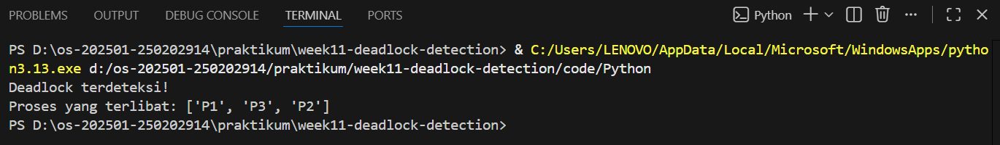

<<<<<<< HEAD

<<<<<<< HEAD
<<<<<<< HEAD
# Laporan Praktikum Minggu 11
Topik:  Simulasi dan Deteksi Deadlock
=======
# Laporan Praktikum Minggu [11]
Topik: ["Simulasi dan Deteksi Deadlock"]
>>>>>>> fbd8316ebf0b48cd8652bea179300f780e5f8a29
=======
# Laporan Praktikum Minggu [11]
Topik: Simulasi dan Deteksi Deadlock
>>>>>>> 4a10d10cc8320ad9a7866e6d4ecbc1d4ce45b3ae
=======
# Tugas Praktikum Minggu 11  
Topik: Simulasi dan Deteksi Deadlock
>>>>>>> befbaf963505fb5abbac60c1e3be2a0e33e0857a

---

## Identitas
<<<<<<< HEAD
<<<<<<< HEAD
<<<<<<< HEAD
- **Nama**  : Aster Rifani
- **NIM**   : 290202915  
- **Kelas** : 1ikrb
=======
- **Nama**  : [Lutfi Khoerunnisa]  
- **NIM**   : [250202947]  
- **Kelas** : [1IKRB]
>>>>>>> fbd8316ebf0b48cd8652bea179300f780e5f8a29
=======
- **Nama**  : Ani Ngismatul Hawa 
- **NIM**   : 250202914
- **Kelas** : 1IKRB
>>>>>>> 4a10d10cc8320ad9a7866e6d4ecbc1d4ce45b3ae

---

## Tujuan
<<<<<<< HEAD
<<<<<<< HEAD
> Membuat program sederhana untuk mendeteksi deadlock.

> Menjalankan simulasi deteksi deadlock dengan dataset uji.

> Menyajikan hasil analisis deadlock dalam bentuk tabel.

> Memberikan interpretasi hasil uji secara logis dan sistematis.

> Menyusun laporan praktikum sesuai format yang ditentukan.
=======
1. Membuat program sederhana untuk mendeteksi deadlock.
2. Menjalankan simulasi deteksi deadlock dengan dataset uji.
3. Menyajikan hasil analisis deadlock dalam bentuk tabel.
4. Memberikan interpretasi hasil uji secara logis dan sistematis.
5. Menyusun laporan praktikum sesuai format yang ditentukan.
>>>>>>> fbd8316ebf0b48cd8652bea179300f780e5f8a29
=======

> -  program sederhana untuk mendeteksi deadlock.
> - Menjalankan simulasi deteksi deadlock dengan dataset uji.
> - Menyajikan hasil analisis deadlock dalam bentuk tabel.
> - Memberikan interpretasi hasil uji secara logis dan sistematis.
> - Menyusun laporan praktikum sesuai format yang ditentukan.
>>>>>>> 4a10d10cc8320ad9a7866e6d4ecbc1d4ce45b3ae

---

## Dasar Teori
<<<<<<< HEAD
<<<<<<< HEAD
Deadlock merupakan sebuah kondisi pada sistem operasi yang terjadi akibat dua atau lebih proses saling menunggu sumber daya yang sedang digunakan oleh proses lain,sehingga tidak ada satu pun proses yang dapat melanjutkan eksekusinya. Kondisi ini umumnya terjadi karena terpenuhinya empat syarat deadlock, yaitu mutual exclusion, hold and wait, no preemption, dan circular wait.

Deteksi deadlock dilakukan dengan memantau keadaan sistem untuk mengidentifikasi adanya siklus ketergantungan antara pross dan sumber daya. Pendekatan ini menggunakan algoritma deeksi yang menganalisis alokasi dan permintaan sumber daya untuk menentukan apakah sistem berada dalam kondisi deadlock. Setelah terdeteksi, sistem dapat mengambi tindakan pemulihan,seperti menghentikan proses tertentu atau mlepaskan sumber daya,agar sistem dapat kembali berjalan normal.
=======
1. Definisi Deadlock: Kondisi di mana sekumpulan proses saling menunggu sumber daya secara permanen sehingga eksekusi terhenti total.

2. Kondisi Coffman: Deadlock hanya terjadi jika empat syarat terpenuhi serentak: Mutual Exclusion, Hold and Wait, No Preemption, dan Circular Wait.

3. Deteksi & RAG: Identifikasi dilakukan menggunakan Resource Allocation Graph (RAG); jika terdapat siklus (cycle) dalam graf alokasi tersebut, maka sistem terdeteksi mengalami deadlock.
>>>>>>> fbd8316ebf0b48cd8652bea179300f780e5f8a29
=======
- Deadlock adalah kondisi ketika beberapa proses saling menunggu sumber daya satu sama lain sehingga tidak ada proses yang bisa berjalan. Akibatnya, sistem seperti “macet”.

- Simulasi deadlock digunakan untuk menggambarkan bagaimana deadlock bisa terjadi. Dengan simulasi, kita dapat melihat urutan permintaan dan penggunaan sumber daya oleh proses, sehingga lebih mudah memahami penyebab deadlock tanpa harus menunggu kejadian nyata di sistem.
>>>>>>> 4a10d10cc8320ad9a7866e6d4ecbc1d4ce45b3ae

---

## Langkah Praktikum
<<<<<<< HEAD
<<<<<<< HEAD
1. **Menyiapkan Dataset**

   Gunakan dataset sederhana yang berisi:
   - Daftar proses  
   - Resource Allocation  
   - Resource Request / Need

   Contoh tabel:

   | Proses | Allocation | Request |
   |:--:|:--:|:--:|
   | P1 | R1 | R2 |
   | P2 | R2 | R3 |
   | P3 | R3 | R1 |

2. **Implementasi Algoritma Deteksi Deadlock**

   Program minimal harus:
   - Membaca data proses dan resource.  
   - Menentukan apakah sistem berada dalam kondisi deadlock.  
   - Menampilkan proses mana saja yang terlibat deadlock.

3. **Eksekusi & Validasi**

   - Jalankan program dengan dataset uji.  
   - Validasi hasil deteksi dengan analisis manual/logis.  
   - Simpan hasil eksekusi dalam bentuk screenshot.

4. **Analisis Hasil**

   - Sajikan hasil deteksi dalam tabel (proses deadlock / tidak).  
   - Jelaskan mengapa deadlock terjadi atau tidak terjadi.  
   - Kaitkan hasil dengan teori deadlock (empat kondisi).

5. **Commit & Push**

   ```bash
   git add .
   git commit -m "Minggu 11 - Deadlock Detection"
   git push origin main
   ```
=======
1. Menyiapkan Dataset Gunakan dataset sederhana yang berisi:
Daftar proses
Resource Allocation
Resource Request / Need
2. Implementasi Algoritma Deteksi Deadlock
Program minimal harus:
Membaca data proses dan resource.
Menentukan apakah sistem berada dalam kondisi deadlock.
Menampilkan proses mana saja yang terlibat deadlock.
3. Eksekusi & Validasi
Jalankan program dengan dataset uji.
Validasi hasil deteksi dengan analisis manual/logis.
Simpan hasil eksekusi dalam bentuk screenshot.
4. Analisis Hasil
Sajikan hasil deteksi dalam tabel (proses deadlock / tidak).
Jelaskan mengapa deadlock terjadi atau tidak terjadi.
Kaitkan hasil dengan teori deadlock (empat kondisi).
5. Commit & Push
git add .
git commit -m "Minggu 11 - Deadlock Detection"
git push origin main

>>>>>>> fbd8316ebf0b48cd8652bea179300f780e5f8a29

=======

## 1. Menyiapkan Dataset

Gunakan dataset sederhana yang berisi:

- Daftar proses
- Resource Allocation
- Resource Request / Need

```Contoh tabel:```

|Proses|	Allocation|	Request|
|----|----|---|
|P1|	R1 |R2|
|P2|	R2	|R3|
|P3|	R3	|R1|

## 2. Implementasi Algoritma Deteksi Deadlock

Program minimal harus:

- Membaca data proses dan resource.
- Menentukan apakah sistem berada dalam kondisi deadlock.
- Menampilkan proses mana saja yang terlibat deadlock.
## 3. Eksekusi & Validasi

- Jalankan program dengan dataset uji.
- Validasi hasil deteksi dengan analisis manual/logis.
- Simpan hasil eksekusi dalam bentuk screenshot.
## 4. Analisis Hasil

- Sajikan hasil deteksi dalam tabel (proses deadlock / tidak).
- Jelaskan mengapa deadlock terjadi atau tidak terjadi.
- Kaitkan hasil dengan teori deadlock (empat kondisi).
## 5. Commit & Push

> ```git add .```
> ```git commit -m "Minggu 11 - Deadlock Detection"```
> ```git push origin main```
>>>>>>> 4a10d10cc8320ad9a7866e6d4ecbc1d4ce45b3ae

---

## Kode / Perintah
<<<<<<< HEAD
<<<<<<< HEAD
- Kode program deteksi deadlock di folder `code/`.  
- Dataset uji di `code/dataset_deadlock.csv`.  
- Screenshot hasil eksekusi di folder `screenshots/`. 
=======
Tuliskan potongan kode atau perintah utama:
## 1. Tabel 

|Proses|	Allocation|	Request|
|----|----|---|
|P1|	R1 |R2|
|P2|	R2	|R3|
|P3|	R3	|R1|


>>>>>>> 4a10d10cc8320ad9a7866e6d4ecbc1d4ce45b3ae

---

## Hasil Eksekusi
<<<<<<< HEAD

=======
Tuliskan potongan kode atau perintah utama:
```bash
praktikum/week11-deadlock-detection/
├─ code/
│  ├─ deadlock_detection.*
│  └─ dataset_deadlock.csv
├─ screenshots/
│  └─ hasil_deteksi.png
└─ laporan.md
```

---

## Hasil Eksekusi Def Detect_Deadlock

>>>>>>> fbd8316ebf0b48cd8652bea179300f780e5f8a29
=======
Sertakan screenshot hasil percobaan atau diagram:
>>>>>>> 4a10d10cc8320ad9a7866e6d4ecbc1d4ce45b3ae


---

## Analisis
<<<<<<< HEAD
<<<<<<< HEAD
Tabel hasil deteksi deadlock :
| Proses | Status   |
| ------ | -------- |
| P1     | Deadlock |
| P2     | Deadlock |
| P3     | Deadlock |
=======
- **Nama**  : [Dyah Retno Wulandari]  
- **NIM**   : [250202934]  
- **Kelas** : [1IKRB]

## A. Deskripsi Singkat
Pada praktikum minggu ini, mahasiswa akan mempelajari **mekanisme deteksi deadlock** dalam sistem operasi.  
Berbeda dengan Minggu 7 yang berfokus pada *pencegahan dan penghindaran deadlock*, pada minggu ini mahasiswa diarahkan untuk **mendeteksi deadlock yang telah terjadi** menggunakan pendekatan algoritmik.

Mahasiswa akan membuat **program simulasi sederhana deteksi deadlock**, menjalankan dataset uji, serta menyajikan hasil analisis dalam bentuk tabel dan interpretasi logis.

---

## B. Tujuan
Setelah menyelesaikan tugas ini, mahasiswa mampu:
1. Membuat program sederhana untuk mendeteksi deadlock.  
2. Menjalankan simulasi deteksi deadlock dengan dataset uji.  
3. Menyajikan hasil analisis deadlock dalam bentuk tabel.  
4. Memberikan interpretasi hasil uji secara logis dan sistematis.  
5. Menyusun laporan praktikum sesuai format yang ditentukan.

---

## C. Ketentuan Teknis
- Bahasa pemrograman **bebas** (Python / C / Java / lainnya).  
- Program berbasis **terminal**, tidak memerlukan GUI.  
- Fokus penilaian pada **logika algoritma deteksi deadlock**, bukan kompleksitas bahasa.

Struktur folder (sesuaikan dengan template repo):
```
praktikum/week11-deadlock-detection/
├─ code/
│  ├─ deadlock_detection.*
│  └─ dataset_deadlock.csv
├─ screenshots/
│  └─ hasil_deteksi.png
└─ laporan.md
```

---

## D. Langkah Pengerjaan
1. **Menyiapkan Dataset**

   Gunakan dataset sederhana yang berisi:
   - Daftar proses  
   - Resource Allocation  
   - Resource Request / Need

   Contoh tabel:

   | Proses | Allocation | Request |
   |:--:|:--:|:--:|
   | P1 | R1 | R2 |
   | P2 | R2 | R3 |
   | P3 | R3 | R1 |

2. **Implementasi Algoritma Deteksi Deadlock**

   Program minimal harus:
   - Membaca data proses dan resource.  
   - Menentukan apakah sistem berada dalam kondisi deadlock.  
   - Menampilkan proses mana saja yang terlibat deadlock.

3. **Eksekusi & Validasi**

   - Jalankan program dengan dataset uji.  
   - Validasi hasil deteksi dengan analisis manual/logis.  
   - Simpan hasil eksekusi dalam bentuk screenshot.

4. **Analisis Hasil**

   - Sajikan hasil deteksi dalam tabel (proses deadlock / tidak).  

   | No | Proses Terlibat | Status | Keterangan |
   |:--:|:--:|:--:|:--:|
   | 1 | P1, P2, P3 | Deadlock | Terjadi circular wait|
   | 2 | P1, P2 | Tidak Deadlock | Resource dapat dilepas|
   | 3 | P2, P3, P4 | Deadlock | Saling menunggu resource|


   - Jelaskan mengapa deadlock terjadi atau tidak terjadi.  
   Jawab : *Kasus Deadlock*

     Deadlock terjadi karena setiap proses memegang minimal satu resource  dan menunggu resource lain yang sedang dipegang proses lain, sehingga tidak ada proses yang bisa lanjut.

        *Kasus Tidak Deadlock*

        Tidak terjadi deadlock karena:

        Ada proses yang dapat menyelesaikan eksekusi dan melepas resource

        Tidak terbentuk siklus tunggu (no circular wait)

   - Kaitkan hasil dengan teori deadlock (empat kondisi).

        Jawab : Deadlock terjadi karena empat kondisi deadlock terpenuhi :
   1. Mutual Exclusion

      Resource hanya bisa digunakan satu proses dalam satu waktu.

   2. Hold and Wait

      Proses memegang resource sambil menunggu resource lain.

   3. No Preemption

      Resource tidak bisa diambil paksa dari proses.

   4. Circular Wait

      Terdapat siklus proses yang saling menunggu resource.


                    import java.io.BufferedReader;
                    import java.io.FileReader;
                    import java.io.IOException;
                    import java.util.*;

                    public class deadlock_detection {

            public static void main(String[] args) {

                String fileName = "dataset_deadlock.csv";

                // Menyimpan data allocation dan request
                Map<String, String> allocation = new HashMap<>();
                Map<String, String> request = new HashMap<>();
                List<String> processes = new ArrayList<>();

                // ===== 1. MEMBACA DATA PROSES & RESOURCE =====
                try (BufferedReader br = new BufferedReader(new FileReader(fileName))) {
                    String line;
                    br.readLine(); // lewati header

                    while ((line = br.readLine()) != null) {
                        String[] data = line.split(",");

                        String process = data[0];
                        String alloc = data[1];
                        String req = data[2];

                        processes.add(process);
                        allocation.put(process, alloc);
                        request.put(process, req);
                    }
                } catch (IOException e) {
                    System.out.println("Gagal membaca file dataset!");
                    return;
                }

                // ===== 2. MEMBANGUN WAIT-FOR GRAPH =====
                Map<String, List<String>> waitForGraph = new HashMap<>();

                for (String p1 : processes) {
                    waitForGraph.put(p1, new ArrayList<>());
                    for (String p2 : processes) {
                        if (!p1.equals(p2)) {
                            if (request.get(p1).equals(allocation.get(p2))) {
                                waitForGraph.get(p1).add(p2);
                            }
                        }
                    }
                }

                // ===== 3. DETEKSI DEADLOCK =====
                Set<String> visited = new HashSet<>();
                Set<String> stack = new HashSet<>();
                Set<String> deadlockProcesses = new HashSet<>();

                for (String process : processes) {
                    if (!visited.contains(process)) {
                        dfs(process, waitForGraph, visited, stack, deadlockProcesses);
                    }
                }

                // ===== 4. OUTPUT =====
                if (!deadlockProcesses.isEmpty()) {
                    System.out.println("Sistem dalam keadaan deadlock!");
                    System.out.println("Proses yang terlibat:");
                    for (String p : deadlockProcesses) {
                        System.out.println(p);
                    }
                } else {
                    System.out.println("Tidak terjadi deadlock.");
                }
            }

            // DFS untuk mendeteksi cycle
            private static boolean dfs(
                    String process,
                    Map<String, List<String>> graph,
                    Set<String> visited,
                    Set<String> stack,
                    Set<String> deadlockProcesses) {

                visited.add(process);
                stack.add(process);

                for (String neighbor : graph.get(process)) {
                    if (!visited.contains(neighbor)) {
                        if (dfs(neighbor, graph, visited, stack, deadlockProcesses)) {
                            deadlockProcesses.add(process);
                            return true;
                        }
                    } else if (stack.contains(neighbor)) {
                        deadlockProcesses.add(process);
                        deadlockProcesses.add(neighbor);
                        return true;
                    }
                }

                stack.remove(process);
                return false;
            }
            }


   
5. **Commit & Push**

   ```bash
   git add
   git commit -m "Minggu 11 - Deadlock Detection"
   git push origin main
   ```

---

## E. Tugas & Quiz
### Tugas
1. Buat program simulasi deteksi deadlock.  
2. Jalankan program dengan dataset uji.  
3. Sajikan hasil analisis dalam tabel dan narasi.  
4. Tulis laporan praktikum pada `laporan.md`.

### Quiz
Jawab pada bagian **Quiz** di laporan:
1. Apa perbedaan antara *deadlock prevention*, *avoidance*, dan *detection*?  
   a)	Prevention : aturan ketat diterapkan sebelum proses berjalan, deadlock pasti tidak terjadi, mengorbankan efisiensi sistem
   
   b)	Avidance : membutuhkan informasi kebutuhan maksimum proses, deadlock dihindari, bukan dicegah mutlak

   c)	Detection : deadlock boleh terjadi, sistem bertindak setelah deadlock terdeteksi

2. Mengapa deteksi deadlock tetap diperlukan dalam sistem operasi?  
Jawab: Deadlock diperlukan karena :
   a)	Prevention dan avoidance tidak selalu efisien atau memungkinkan
   
   b)	Deadlock tetap bisa terjadi pada sistem kompleks

   c)	Deteksi memungkinkan pemanfaatan resource yang optimal

   d)	Menjadi dasar untuk melakukan recovery


3. Apa kelebihan dan kekurangan pendekatan deteksi deadlock?

   Kelebihan :


   a.	 Pemanfaatan resource maksimal
   
   b.	Lebih fleksibel untuk sistem dinamis

   c.	Implementasi lebih realistis

   d.	Tidak menyebabkan starvation sejak awal proses

   Kekurangan :

   
   a.	Deadlock sudah terjadi saat terdeteksi

   b.	Overhead deteksi memerlukan waktu dan sumber daya

   c.	Recovery berisiko, menghentikan proses/rollback dapat menyebabkan kehilangan data, inkosistensi sistem

   d.	Pemilihan korban (Victim selection) sulit menetukan proses mana yang harus dihentikan tidak sederhana atau salah pilih dapat merugikan proses penting
		
>>>>>>> befbaf963505fb5abbac60c1e3be2a0e33e0857a

Berdasarkan hasil simulasi, seluruh proses berada dalam kondisi deadlock karena setiap proses memegang satu resource dan menunggu resource lain yang sedang digunakan oleh proses lain, sehingga tidak ada proses yang dapat melanjutkan eksekusi. Proses P1 memegang R1 dan menunggu R2, P2 memegang R2 dan menunggu R3, serta P3 memegang R3 dan menunggu R1, yang membentuk circular wait P1 → P2 → P3 → P1. Kondisi ini memenuhi keempat syarat deadlock, yaitu mutual exclusion, hold and wait, no preemption, dan circular wait, sehingga sistem dinyatakan berada dalam kondisi deadlock.
=======
1. Analisis Hasil Deteksi

| Proses | Status| Keterangan|
| :--- | :---: | ---: |
|P1| Deadlock|Terlibat dalam siklus karena memegang R2 dan meminta R1. |
|P2| Deadlock| Terlibat dalam siklus karena memegang R3 dan meminta R2. |
|P3 | Deadlock| Terlibat dalam siklus karena memegang R1 dan meminta R3.|

2. Analisis Penyebab Deadlock
Deadlock terjadi karena sistem berada dalam kondisi di mana setiap proses menunggu sumber daya yang sedang dipegang oleh proses lain dalam sebuah rantai yang tidak terputus. Berdasarkan output terminal, program mendeteksi adanya jalur siklus: R1 -> P1 -> R2 -> P2 -> R3 -> P3 -> R1. Karena setiap sumber daya dalam simulasi ini bersifat tunggal dan tidak dapat digunakan bersama, maka tidak ada satu pun proses yang dapat menyelesaikan tugasnya, menyebabkan sistem berhenti total (stagnan).

3. Hasil simulasi pada file def detect.png membuktikan teori deadlock melalui terbentuknya siklus R1 -> P1 -> R2 -> P2 -> R3 -> P3 -> R1, yang memenuhi syarat Circular Wait. Kondisi ini terjadi karena setiap proses memegang satu sumber daya sambil menunggu sumber daya lain (Hold and Wait) yang bersifat eksklusif (Mutual Exclusion) dan tidak dapat diambil paksa (No Preemption). Akibat terpenuhinya keempat syarat Coffman tersebut secara simultan, sistem mengalami kebuntuan permanen karena tidak ada proses yang dapat menyelesaikan eksekusinya.
>>>>>>> fbd8316ebf0b48cd8652bea179300f780e5f8a29
=======
## Tabel Analisis Hasil
>>>>>>> 4a10d10cc8320ad9a7866e6d4ecbc1d4ce45b3ae

|Proses	|Status|
|---|----|
|P1	|Deadlock|
|P2	|Deadlock|
|P3	|Deadlock|
---

<<<<<<< HEAD
## Kesimpulan
<<<<<<< HEAD
<<<<<<< HEAD
Berdasarkan hasil simulasi deteksi deadlock, sistem teridentifikasi berada dalam kondisi deadlock karena adanya ketergantungan melingkar antar proses dalam penggunaan resource.
=======
## F. Output yang Diharapkan
- Kode program deteksi deadlock di folder `code/`.  
- Dataset uji di `code/dataset_deadlock.csv`.  
- Screenshot hasil eksekusi di folder `screenshots/`.  
- Laporan lengkap di `laporan.md`.  
- Semua hasil telah di-*commit* ke GitHub.
>>>>>>> befbaf963505fb5abbac60c1e3be2a0e33e0857a

Algoritma deteksi deadlock berhasil mengidentifikasi proses-proses yang terlibat deadlock sesuai dengan teori deadlock, sehingga dapat disimpulkan bahwa simulasi berjalan dengan benar dan efektif dalam mendeteksi kondisi deadlock pada sistem operasi.
=======
1. Validasi Teori Circular Wait: Praktikum membuktikan bahwa deadlock terjadi ketika terbentuk siklus alokasi sumber daya yang tertutup (P1 → R2 → P2 → R3 → P3 → R1), yang memenuhi kondisi Circular Wait dari syarat Coffman.

2. Efektivitas Deteksi Graf: Penggunaan Resource Allocation Graph (RAG) terbukti efektif untuk mendeteksi kebuntuan sistem secara otomatis dengan cara mengidentifikasi adanya siklus antar proses dan sumber daya yang saling menunggu.

3. Kondisi Stagnasi Sistem: Hasil deteksi menunjukkan bahwa ketika deadlock terjadi, semua proses yang terlibat (P1, P2, P3) akan berhenti secara permanen karena tidak ada sumber daya yang dapat dilepaskan untuk memutus rantai ketergantungan tersebut.
>>>>>>> fbd8316ebf0b48cd8652bea179300f780e5f8a29
=======
- Sistem terbukti mengalami deadlock. Hal ini terjadi karena setiap proses memegang satu resource dan pada saat yang sama menunggu resource lain yang sedang digunakan oleh proses lain. Akibatnya, semua proses saling menunggu dan tidak ada yang bisa berjalan.
>>>>>>> 4a10d10cc8320ad9a7866e6d4ecbc1d4ce45b3ae

- Hasil dari program yang dijalankan sesuai dengan analisis secara logika, yaitu proses P1, P2, dan P3 semuanya terjebak deadlock. Kondisi ini menunjukkan bahwa sistem memenuhi syarat terjadinya deadlock, terutama adanya lingkaran tunggu antar proses. Dengan praktik ini, dapat dipahami bahwa deadlock bisa terjadi jika pengelolaan resource tidak diatur dengan baik.
---

<<<<<<< HEAD
## Quiz
<<<<<<< HEAD
<<<<<<< HEAD
1. Apa perbedaan antara *deadlock prevention*, *avoidance*, dan *detection*?  
   **Jawaban:**  
   - *Deadlock prevention* mencegah deadlock dengan menghilangkan salah satu syarat deadlock sejak awal.
   - *Deadlock avoidance* menghindari deadlock dengan memastikan sistem selalu berada dalam kondisi aman sebelum resource dialokasikan.
   - *Deadlock detection* membiarkan deadlock terjadi lalu mendeteksinya dan melakukan pemulihan.
2. Mengapa deteksi deadlock tetap diperlukan dalam sistem operasi?  
   **Jawaban:**  karena tidak semua deadlock dapat dicegah atau dihindari sebelumnya, sehingga sistem perlu mengenali deadlock yang telah terjadi agar dapat melakukan tindakan pemulihan dan menjaga sistem tetap berjalan.
3. Apa kelebihan dan kekurangan pendekatan deteksi deadlock?  
   **Jawaban:**  
   - Kelebihan:
      Pendekatan deteksi deadlock lebih fleksibel karena sistem tidak perlu mencegah atau menghindari deadlock sejak awal, sehingga penggunaan resource dapat lebih efisien.
=======
1. [Apa perbedaan antara deadlock prevention, avoidance, dan detection?]  
   **Jawaban:a. Deadlock Prevention (Pencegahan): Strategi ini bekerja sangat dini dengan cara memastikan bahwa setidaknya satu dari empat kondisi Coffman (seperti Hold and Wait atau Circular Wait) tidak akan pernah terpenuhi. Metodenya sangat restriktif, misalnya mewajibkan proses meminta semua sumber daya sekaligus di awal.
   b. Deadlock Avoidance (Penghindaran): Strategi ini lebih dinamis dibandingkan pencegahan karena sistem memeriksa setiap permintaan sumber daya secara real-time. Sistem akan menghitung apakah pemberian sumber daya akan membawa sistem ke dalam "State Tidak Aman" (Unsafe State) yang berisiko deadlock; jika ya, permintaan tersebut ditunda (contohnya menggunakan Algoritma Banker).
   c.Deadlock Detection (Deteksi): Strategi ini bersifat reaktif, di mana sistem membiarkan deadlock terjadi, lalu secara periodik menjalankan algoritma untuk memeriksa apakah ada siklus pada graf alokasi sumber daya (Resource Allocation Graph). Seperti yang terlihat pada simulasi Anda (def detect.png), deteksi berfungsi mengidentifikasi proses mana yang sudah terjebak agar bisa dilakukan tindakan pemulihan (recovery).**  
2. [Mengapa deteksi deadlock tetap diperlukan dalam sistem operasi?]  
   **Jawaban:Deteksi deadlock diperlukan karena memberikan keseimbangan antara efisiensi penggunaan sumber daya dan fleksibilitas sistem dibandingkan metode pencegahan yang terlalu kaku. Strategi ini membiarkan sistem bekerja maksimal dan hanya melakukan intervensi saat kebuntuan benar-benar terjadi, sehingga utilisasi sumber daya tetap tinggi. Selain itu,deteksi sangat penting untuk mengidentifikasi proses dan sumber daya spesifik yang terlibat dalam siklus agar tindakan pemulihan dapat dilakukan tanpa menghentikan seluruh sistem.**  
3. [Apa kelebihan dan kekurangan pendekatan deteksi deadlock?]  
   **Jawaban:a.Kelebihan Meningkatkan utilisasi sumber daya karena sistem tidak dibatasi aturan pencegahan yang kaku, sehingga proses berjalan lebih fleksibel. Intervensi hanya dilakukan saat masalah benar-benar terjadi, memungkinkan identifikasi proses spesifik yang terjebak untuk pemulihan yang tepat sasaran.
   b.Kekurangan Menimbulkan beban komputasi (overhead) karena algoritma deteksi harus berjalan rutin. Selain itu, pemulihan sering kali menyebabkan hilangnya data akibat penghentian proses paksa, serta berisiko menimbulkan starvation pada proses tertentu yang terus-menerus dikorbankan.**  
>>>>>>> fbd8316ebf0b48cd8652bea179300f780e5f8a29
=======
1. Apa perbedaan antara deadlock prevention, avoidance, dan detection?

   **Jawaban:**  

- Deadlock Prevention: Mencegah deadlock dari awal dengan aturan ketat.

- Deadlock Avoidance: Menghindari deadlock dengan perhitungan kondisi aman.

- Deadlock Detection: Membiarkan deadlock terjadi lalu mendeteksinya dan memperbaiki.
2. Mengapa deteksi deadlock tetap diperlukan dalam sistem operasi?

   **Jawaban:**  
Deteksi deadlock tetap diperlukan karena tidak semua deadlock bisa dicegah atau dihindari.
Dengan deteksi deadlock, sistem dapat menemukan kondisi macet yang sudah terjadi dan mengambil tindakan (misalnya menghentikan proses), sehingga sistem bisa kembali berjalan normal.

3. Apa kelebihan dan kekurangan pendekatan deteksi deadlock?  
   **Jawaban:**  
**A. Kelebihan deteksi deadlock:**

* Resource digunakan lebih efisien
* Tidak membatasi proses sejak awal
* Cocok untuk sistem yang kompleks

**B. Kekurangan deteksi deadlock:**

* Deadlock boleh terjadi terlebih dahulu
* Sistem bisa macet sementara
* Perlu biaya tambahan untuk mendeteksi dan memulihkan
>>>>>>> 4a10d10cc8320ad9a7866e6d4ecbc1d4ce45b3ae

   - Kekurangan:
      Pendekatan ini memerlukan mekanisme tambahan untuk mendeteksi dan memulihkan deadlock, serta berisiko mengganggu proses yang sedang berjalan saat dilakukan pemulihan.
---

## Refleksi Diri
Tuliskan secara singkat:
- Apa bagian yang paling menantang minggu ini?  
- Bagaimana cara Anda mengatasinya?  

---

**Credit:**  
_Template laporan praktikum Sistem Operasi (SO-202501) – Universitas Putra Bangsa_
=======
## G. Referensi
1. Silberschatz, A., Galvin, P., Gagne, G. *Operating System Concepts*, 10th Ed.  
2. Tanenbaum, A. *Modern Operating Systems*, 4th Ed.  
3. OSTEP – Deadlock Detection.
>>>>>>> befbaf963505fb5abbac60c1e3be2a0e33e0857a
