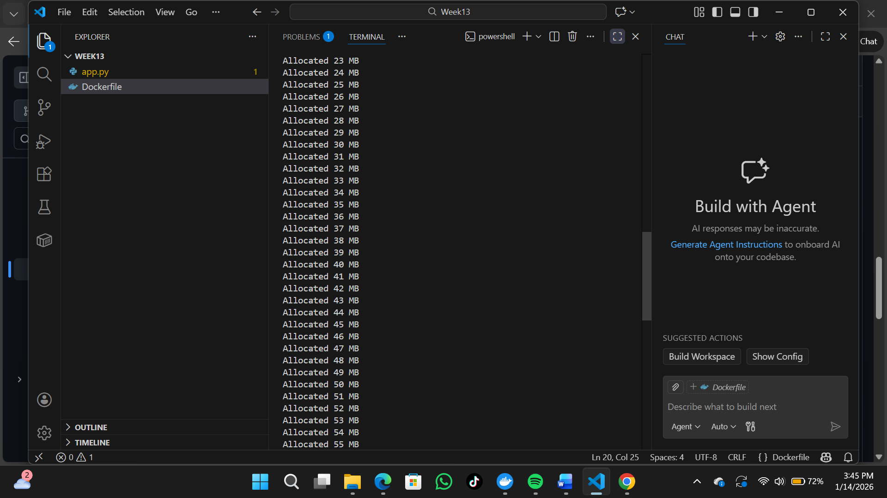
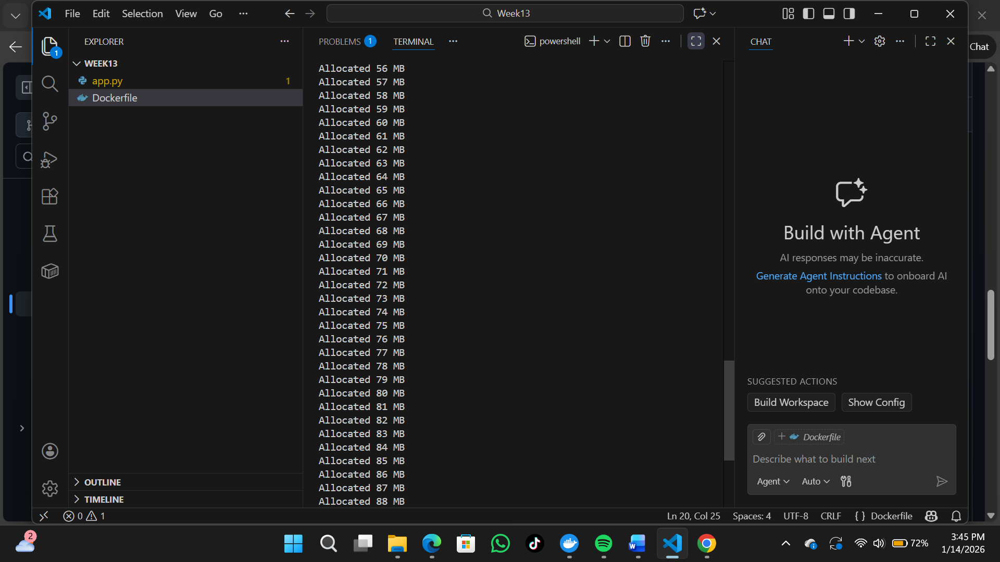
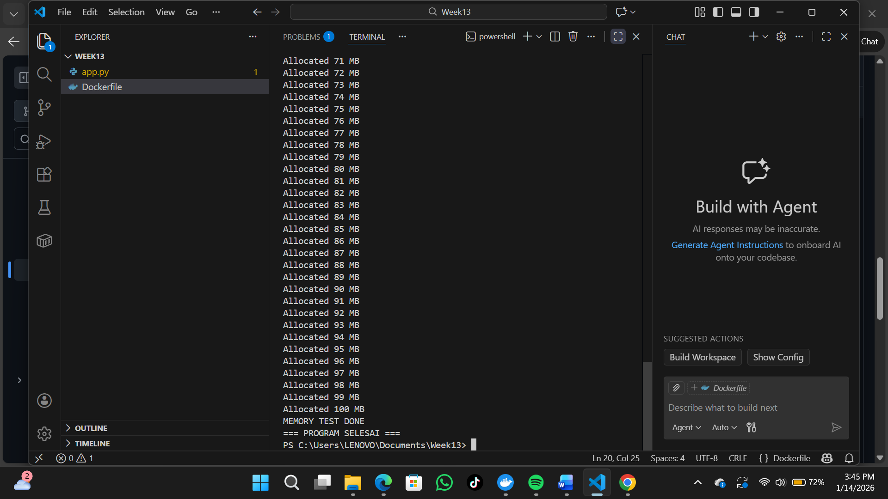
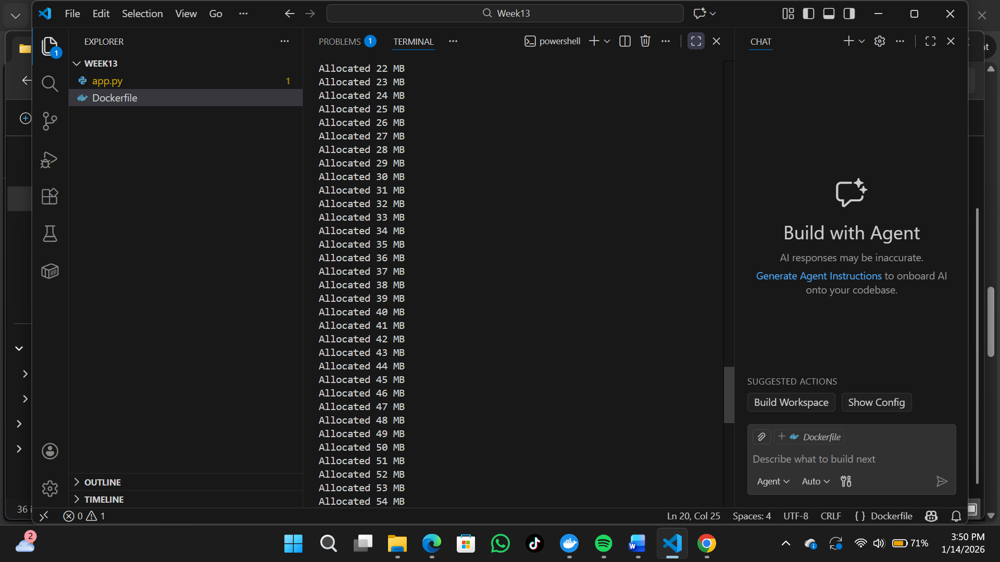
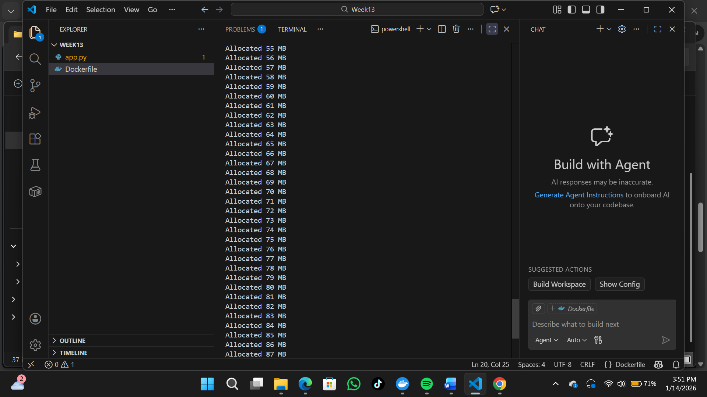

<<<<<<< HEAD

<<<<<<< HEAD
<<<<<<< HEAD
# Laporan Praktikum Minggu 13
Topik: Docker – Resource Limit (CPU & Memori)
=======
# Laporan Praktikum Minggu [13]
Topik: ["Docker – Resource Limit (CPU & Memori)"]
>>>>>>> fbd8316ebf0b48cd8652bea179300f780e5f8a29
=======
# Laporan Praktikum Minggu [13]
Topik: Docker – Resource Limit (CPU & Memori)
>>>>>>> 4a10d10cc8320ad9a7866e6d4ecbc1d4ce45b3ae
=======
# Tugas Praktikum Minggu 13  
Topik: Docker – Resource Limit (CPU & Memori)
>>>>>>> befbaf963505fb5abbac60c1e3be2a0e33e0857a

---

## Identitas
<<<<<<< HEAD
<<<<<<< HEAD
<<<<<<< HEAD
- **Nama**  : Aster Rifani
- **NIM**   : 250202915 
- **Kelas** : 1IKRB

---

## Tujuan 
> Menulis Dockerfile sederhana untuk sebuah aplikasi/skrip.

> Membangun image dan menjalankan container.

> Menjalankan container dengan pembatasan CPU dan memori.

> Mengamati dan menjelaskan perbedaan eksekusi container dengan dan tanpa limit resource.

> Menyusun laporan praktikum secara runtut dan sistematis.
=======
- **Nama**  : [Lutfi Khoerunnisa]  
- **NIM**   : [250202947]  
- **Kelas** : [250202947]
=======
- **Nama**  : Ani Ngismatul Hawa 
- **NIM**   : 250202914
- **Kelas** : 1IKRB
>>>>>>> 4a10d10cc8320ad9a7866e6d4ecbc1d4ce45b3ae

---

## Tujuan
<<<<<<< HEAD
1. Menulis Dockerfile sederhana untuk sebuah aplikasi/skrip.
2. Membangun image dan menjalankan container.
3. Menjalankan container dengan pembatasan CPU dan memori.
4. Mengamati dan menjelaskan perbedaan eksekusi container dengan dan tanpa limit resource.
5. Menyusun laporan praktikum secara runtut dan sistematis.
>>>>>>> fbd8316ebf0b48cd8652bea179300f780e5f8a29
=======
> Menulis Dockerfile sederhana untuk sebuah aplikasi/skrip.

>Membangun image dan menjalankan container.

>Menjalankan container dengan pembatasan CPU dan memori.

>Mengamati dan menjelaskan perbedaan eksekusi container dengan dan tanpa limit resource.

>Menyusun laporan praktikum secara runtut dan sistematis.
>>>>>>> 4a10d10cc8320ad9a7866e6d4ecbc1d4ce45b3ae

---

## Dasar Teori
<<<<<<< HEAD
<<<<<<< HEAD
Container adalah unit standar software yang mengemas kode dan semua dependensinya sehingga aplikasi dapat berjalan dengan cepat dan handal dari satu computing environment ke environmeny lainnya.

Docker menggunakan cgroups(control groups) dari linux kernel untuk membatasi,mengatur,dan mengisolasi penggunaan resource seperti CPU,memori,disk I/O,dan network.
=======
- Mekanisme Control Groups (cgroups): Docker memanfaatkan fitur kernel Linux bernama cgroups untuk mengisolasi dan membatasi penggunaan sumber daya fisik (CPU, Memori, I/O) bagi setiap kontainer agar tidak mengganggu performa server utama (host).
- Batas Memori (Hard & Soft): Pengendalian RAM dilakukan melalui Hard Limit untuk menetapkan batas maksimal penggunaan memori yang tidak boleh dilampaui, serta Soft Limit sebagai reservasi memori minimum guna menjaga stabilitas sistem saat beban kerja tinggi.
- Manajemen Kuota CPU: Docker mengatur waktu akses prosesor dengan menentukan berapa banyak siklus CPU yang boleh digunakan oleh sebuah kontainer, sehingga distribusi daya komputasi tetap adil dan mencegah terjadinya kelebihan beban (overload) pada perangkat keras.

>>>>>>> fbd8316ebf0b48cd8652bea179300f780e5f8a29
=======
1. Docker dan Containerization: platform yang digunakan untuk menjalankan aplikasi dalam bentuk container
2. Resource Management pada Sistem Operasi: mengatur penggunaan sumber daya seperti CPU dan memori agar setiap proses berjalan secara adil dan tidak saling mengganggu.
3. Control Groups (cgroups): Cgroups adalah fitur kernel Linux yang memungkinkan pembatasan, pemantauan, dan pengelompokan penggunaan resource oleh suatu proses.
4. Pembatasan CPU pada Docker: Bertujuan untuk mengatur porsi waktu CPU yang dapat digunakan oleh container.
5. Pembatasan Memori pada Docker: Pembatasan memori digunakan untuk mengontrol jumlah RAM maksimum yang boleh digunakan container.
6. Dampak Resource Limit terhadap Aplikasi: Penerapan resource limit memberikan dampak langsung pada performa aplikasi
>>>>>>> 4a10d10cc8320ad9a7866e6d4ecbc1d4ce45b3ae

---

## Langkah Praktikum
<<<<<<< HEAD
<<<<<<< HEAD
1. **Persiapan Lingkungan**
=======
1. Persiapan Lingkungan

- Pastikan Docker terpasang dan berjalan.
- Verifikasi:
```docker version```
```docker ps```
2. Membuat Aplikasi/Skrip Uji

Buat program sederhana di folder code/ (bahasa bebas) yang:

- Melakukan komputasi berulang (untuk mengamati limit CPU), dan/atau
- Mengalokasikan memori bertahap (untuk mengamati limit memori).
3. Membuat Dockerfile

- Tulis Dockerfile untuk menjalankan program uji.
- Build image:
```docker build -t week13-resource-limit .```
4. Menjalankan Container Tanpa Limit

- Jalankan container normal:
```docker run --rm week13-resource-limit```
- Catat output/hasil pengamatan.
5. Menjalankan Container Dengan Limit Resource

- Jalankan container dengan batasan resource (contoh):

```docker run --rm --cpus="0.5" --memory="256m" week13-resource-limit```
- Catat perubahan perilaku program (mis. lebih lambat, error saat memori tidak cukup, dll.).

6. Monitoring Sederhana

- Jalankan container (tanpa --rm jika perlu) dan amati penggunaan resource:
```docker stats```
- Ambil screenshot output eksekusi dan/atau docker stats.
7. Commit & Push

```git add .```
```git commit -m "Minggu 13 - Docker Resource Limit"```
```git push origin main```

>>>>>>> 4a10d10cc8320ad9a7866e6d4ecbc1d4ce45b3ae

   - Pastikan Docker terpasang dan berjalan.
   - Verifikasi:
     ```bash
     docker version
     docker ps
     ```

2. **Membuat Aplikasi/Skrip Uji**

   Buat program sederhana di folder `code/` (bahasa bebas) yang:
   - Melakukan komputasi berulang (untuk mengamati limit CPU), dan/atau
   - Mengalokasikan memori bertahap (untuk mengamati limit memori).

3. **Membuat Dockerfile**

   - Tulis `Dockerfile` untuk menjalankan program uji.
   - Build image:
     ```bash
     docker build -t week13-resource-limit .
     ```

4. **Menjalankan Container Tanpa Limit**

   - Jalankan container normal:
     ```bash
     docker run --rm week13-resource-limit
     ```
   - Catat output/hasil pengamatan.

5. **Menjalankan Container Dengan Limit Resource**

   Jalankan container dengan batasan resource (contoh):
   ```bash
   docker run --rm --cpus="0.5" --memory="256m" week13-resource-limit
   ```
   Catat perubahan perilaku program (mis. lebih lambat, error saat memori tidak cukup, dll.).

6. **Monitoring Sederhana**

   - Jalankan container (tanpa `--rm` jika perlu) dan amati penggunaan resource:
     ```bash
     docker stats
     ```
   - Ambil screenshot output eksekusi dan/atau `docker stats`.

7. **Commit & Push**

   ```bash
   git add .
   git commit -m "Minggu 13 - Docker Resource Limit"
   git push origin main
   ```
=======
1. Persiapan Lingkungan
   - Pastikan Docker terpasang dan berjalan.
   - Verifikasi
>>>>>>> fbd8316ebf0b48cd8652bea179300f780e5f8a29

   ```bash
   docker version
   docker ps
   ```
2. Membuat Aplikasi/Skrip Uji
   - Buat program sederhana di folder ```code/ ```bash(bahasa bebas) yang:
   - Melakukan komputasi berulang (untuk mengamati limit CPU), dan/atau
   - Mengalokasikan memori bertahap (untuk mengamati limit memori).
3. Membuat Dockerfile
   - Tulis ```Dockerfile``` untuk menjalankan program uji.
   - Build image:
   ```bash
   docker build -t week13-resource-limit .
   ```
4. Menjalankan Container Tanpa Limit
   - Jalankan container normal:
   ```bash
   docker run --rm week13-resource-limit
   ```
   - Catat output/hasil pengamatan.
5. Menjalankan Container Dengan Limit Resource
Jalankan container dengan batasan resource (contoh):
   ```bash
   docker run --rm --cpus="0.5" --memory="256m" week13-resource-limit
   ```
Catat perubahan perilaku program (mis. lebih lambat, error saat memori tidak cukup, dll.).
6. Monitoring Sederhana
   - Jalankan container (tanpa ```--rm``` jika perlu) dan amati penggunaan resource:
   ```bash
   docker stats
   ```
   - Ambil screenshot output eksekusi dan/atau docker stats.
7. Commit & Push
   ```bash
   git add .
   git commit -m "Minggu 13 - Docker Resource Limit"
   git push origin main
   ```
---

## Kode / Perintah
<<<<<<< HEAD
<<<<<<< HEAD
```
docker version
docker ps
```
```
docker build -t week13-resource-limit .
```
```
docker run --rm week13-resource-limit
```
```
docker run --rm --cpus="0.5" --memory="256m" week13-resource-limit
```
```
=======
Tuliskan potongan kode atau perintah utama:
```bash
docker version
docker ps
=======
- **Nama**  : [Dyah Retno Wulandari]  
- **NIM**   : [250202934]  
- **Kelas** : [1IKRB]
 
## A. Deskripsi Singkat
Pada praktikum minggu ini, mahasiswa mempelajari konsep **containerization** menggunakan Docker, serta bagaimana sistem operasi membatasi pemakaian sumber daya proses melalui mekanisme isolasi dan kontrol resource (mis. *cgroups* pada Linux).

Fokus praktikum adalah:
1. Membuat **Dockerfile sederhana** untuk menjalankan aplikasi/skrip.
2. Menjalankan container dengan **pembatasan resource** (CPU dan memori).
3. Mengamati dampak pembatasan resource melalui output program dan monitoring sederhana.

---

## B. Tujuan
Setelah menyelesaikan tugas ini, mahasiswa mampu:
1. Menulis Dockerfile sederhana untuk sebuah aplikasi/skrip.
2. Membangun image dan menjalankan container.
3. Menjalankan container dengan pembatasan **CPU** dan **memori**.
4. Mengamati dan menjelaskan perbedaan eksekusi container dengan dan tanpa limit resource.
5. Menyusun laporan praktikum secara runtut dan sistematis.

---

## C. Ketentuan Teknis
- Sistem operasi host bebas (Windows/macOS/Linux). Disarankan memakai **Docker Desktop** (atau Docker Engine di Linux).
- Program berbasis **terminal**.
- Fokus penilaian pada **keberhasilan build & run container**, **penerapan resource limit**, serta **kualitas analisis**.

Struktur folder (sesuaikan dengan template repo):
```
praktikum/week13-docker-resource-limit/
├─ code/
│  ├─ Dockerfile
│  └─ app.*
├─ screenshots/
│  └─ hasil_limit.png
└─ laporan.md
>>>>>>> befbaf963505fb5abbac60c1e3be2a0e33e0857a
```
```bash
docker build -t week13-resource-limit .
```
```bash
docker run --rm week13-resource-limit
```
```bash
docker run --rm --cpus="0.5" --memory="256m" week13-resource-limit
```
```bash
>>>>>>> fbd8316ebf0b48cd8652bea179300f780e5f8a29
docker stats
```
---

## Hasil Eksekusi
<<<<<<< HEAD
1. Membuat Dockerfile :

2. Menjalankan Container Tanpa Limit


=======
1. Membuat Dockerfile : 

2. Menjalankan Container Tanpa Limit


3. Menjalankan Container Dengan Limit

4. Monitoring Sederhana

>>>>>>> fbd8316ebf0b48cd8652bea179300f780e5f8a29

2. Menjalankan Container Dengan Limit Resource


3. Monitoring Sederhana :

---

## Analisis
<<<<<<< HEAD
Pengujian menunjukkan bahwa container yang dijalankan tanpa batasan resource dapat menggunakan CPU dan memori secara bebas sehingga program berjalan lebih cepat dan stabil. Namun, ketika container diberi limit CPU dan memori, waktu eksekusi program menjadi lebih lambat dan alokasi memori dapat terhenti atau menimbulkan error. Hal ini membuktikan bahwa Docker mampu mengontrol penggunaan resource secara efektif untuk mencegah satu container mengganggu kinerja sistem secara keseluruhan. 
=======
Analisis hasil praktikum menunjukkan bahwa penggunaan image Docker berbasis Python 3.11-slim berhasil menciptakan isolasi aplikasi yang efisien. Tanpa pembatasan, kontainer terdeteksi mengonsumsi memori secara terus-menerus hingga 50 MB, yang berisiko menguras sumber daya host. Namun, penerapan Resource Limit (CPU 0.5 dan RAM 256MB) terbukti efektif mengunci penggunaan sumber daya pada batas aman. Hal ini divalidasi oleh data monitoring yang menunjukkan konsumsi CPU hanya 8.00% dan RAM 32.57 MiB, sehingga stabilitas infrastruktur tetap terjaga.
>>>>>>> fbd8316ebf0b48cd8652bea179300f780e5f8a29
=======
1. Tuliskan potongan kode atau perintah utama:
```docker version ```

```docker ps``` 

```docker build -t week13-resource-limit .```

```docker run --rm --cpus="0.5" --memory="256m" week13-resource-limit```

```docker stats```

---

<<<<<<< HEAD
## Hasil Eksekusi
Sertakan screenshot hasil percobaan atau diagram:
=======
## D. Langkah Pengerjaan
1. **Persiapan Lingkungan**

   - Pastikan Docker terpasang dan berjalan.
   - Verifikasi:
     ```bash
     docker version
     docker ps
     ```
      

2. **Membuat Aplikasi/Skrip Uji**

   Buat program sederhana di folder `code/` (bahasa bebas) yang:
   - Melakukan komputasi berulang (untuk mengamati limit CPU), dan/atau
   - Mengalokasikan memori bertahap (untuk mengamati limit memori).

3. **Membuat Dockerfile**

   - Tulis `Dockerfile` untuk menjalankan program uji.
   - Build image:
     ```bash
     docker build -t week13-resource-limit .
     ```

4. **Menjalankan Container Tanpa Limit**

   - Jalankan container normal:
     ```bash
     docker run --rm week13-resource-limit
     ```
   - Catat output/hasil pengamatan.

5. **Menjalankan Container Dengan Limit Resource**

   Jalankan container dengan batasan resource (contoh):
   ```bash
   docker run --rm --cpus="0.5" --memory="256m" week13-resource-limit
   ```
   Catat perubahan perilaku program (mis. lebih lambat, error saat memori tidak cukup, dll.).

6. **Monitoring Sederhana**

   - Jalankan container (tanpa `--rm` jika perlu) dan amati penggunaan resource:
      


      
     ```bash
     docker stats
     ```
   - Ambil screenshot output eksekusi dan/atau `docker stats`.


7. **Commit & Push**

   ```bash
   git add .
   git commit -m "Minggu 13 - Docker Resource Limit"
   git push origin main
   ```
>>>>>>> befbaf963505fb5abbac60c1e3be2a0e33e0857a










---

<<<<<<< HEAD
## Analisis
Percobaan menunjukkan bahwa pembatasan resource pada Docker sangat mempengaruhi kinerja aplikasi. Tanpa limit, container dapat menggunakan CPU dan memori secara bebas sehingga program berjalan normal. Dengan adanya limit CPU, proses menjadi lebih lambat karena waktu eksekusi dibatasi. Sementara itu, pembatasan memori menyebabkan aplikasi berhenti atau mengalami error saat penggunaan memori melebihi batas. Hal ini membuktikan bahwa Docker resource limit efektif dalam mengontrol penggunaan sumber daya dan menjaga kestabilan sistem. 
>>>>>>> 4a10d10cc8320ad9a7866e6d4ecbc1d4ce45b3ae

---

## Kesimpulan
<<<<<<< HEAD
<<<<<<< HEAD
Dari hasil pengujian dapat disimpulkan bahwa pembatasan resource pada container Docker sangat penting untuk menjaga efisiensi dan stabilitas sistem. Dengan menerapkan limit CPU dan memori, administrator dapat mengontrol penggunaan resource tiap container, mencegah overload, serta memastikan beberapa aplikasi dapat berjalan secara bersamaan tanpa saling mengganggu.
=======
1. Keberhasilan Isolasi Sistem: Proses build image menggunakan Python 3.11-slim berhasil menciptakan lingkungan aplikasi yang terisolasi dan siap untuk diuji.

2. Risiko Tanpa Pembatasan: Pengujian tanpa limitasi membuktikan bahwa kontainer akan mengonsumsi memori secara terus-menerus (mencapai 50 MB), yang berisiko menguras sumber daya host jika tidak dikendalikan.

3. Efektivitas Pengendalian: Penerapan batas CPU 0.5 dan memori 256 MB terbukti efektif menjaga stabilitas sistem, dengan realisasi penggunaan CPU hanya sebesar 8.00% dan memori 32.57 MiB berdasarkan data monitoring.
>>>>>>> fbd8316ebf0b48cd8652bea179300f780e5f8a29
=======
Docker resource limit merupakan fitur penting untuk mengatur pemakaian CPU dan memori pada container. Dengan pembatasan ini, aplikasi dapat berjalan lebih terkendali, sistem lebih stabil, dan penggunaan resource menjadi lebih efisien.
>>>>>>> 4a10d10cc8320ad9a7866e6d4ecbc1d4ce45b3ae

---

## Quiz
<<<<<<< HEAD
<<<<<<< HEAD
1. Mengapa container perlu dibatasi CPU dan memori? 
   **Jawaban:**  Container perlu dibatasi CPU dan memori agar satu aplikasi tidak menggunakan seluruh resource sistem yang dapat mengganggu aplikasi lain. Pembatasan ini menjaga kestabilan sistem, meningkatkan efisiensi penggunaan resource, serta mencegah terjadinya overload atau crash pada host.
2. Apa perbedaan VM dan container dalam konteks isolasi resource?
   **Jawaban:**  Virtual Machine (VM) melakukan isolasi resource dengan menjalankan sistem operasi lengkap di atas hypervisor, sehingga penggunaan resource lebih besar. Sementara itu, container hanya mengisolasi aplikasi dan dependensinya dengan berbagi kernel host, sehingga lebih ringan, cepat dijalankan, dan penggunaan resource lebih efisien.
3. Apa dampak limit memori terhadap aplikasi yang boros memori?
   **Jawaban:**  Limit memori dapat menyebabkan aplikasi yang boros memori mengalami penurunan performa, error (seperti MemoryError), atau bahkan dihentikan secara paksa oleh Docker jika penggunaan memori melebihi batas. Namun, pembatasan ini mencegah aplikasi tersebut merusak stabilitas sistem secara keseluruhan.
=======
1. [Mengapa container perlu dibatasi CPU dan memori?]  
   **Jawaban:** Pembatasan CPU dan memori diperlukan untuk mencegah satu kontainer menghabiskan seluruh sumber daya host (noisy neighbor effect), yang dapat menyebabkan sistem tidak stabil atau freeze. Dengan menetapkan batas (limit), administrator dapat memastikan ketersediaan sumber daya bagi layanan lain sekaligus menjalankan strategi keamanan (hardening) untuk memitigasi risiko serangan yang menguras daya komputasi infrastruktur. 
2. [Apa perbedaan VM dan container dalam konteks isolasi resource?]  
   **Jawaban:**  VM mengisolasi sumber daya pada level perangkat keras, di mana setiap VM menjalankan sistem operasi (OS) tamu lengkap di atas hypervisor, sehingga penggunaan CPU dan memori benar-benar terpisah secara fisik namun memakan overhead yang besar. Sebaliknya, kontainer melakukan isolasi pada level sistem operasi (OS) dengan berbagi kernel yang sama menggunakan fitur cgroups. Hal ini membuat kontainer jauh lebih ringan dan cepat dalam alokasi sumber daya, namun memerlukan konfigurasi manual seperti --cpus atau --memory agar satu kontainer tidak mengganggu host atau kontainer lainnya.
3. [Apa dampak limit memori terhadap aplikasi yang boros memori?]  
   **Jawaban:**  Dampak utama limit memori terhadap aplikasi yang boros memori adalah terjadinya kondisi Out Of Memory (OOM) Kill. Jika aplikasi terus melakukan alokasi memori hingga melampaui batas yang ditentukan (seperti limit 256MB pada pengujian Anda), sistem Docker akan secara otomatis menghentikan (kill) proses tersebut untuk melindungi stabilitas host. Hal ini berbeda dengan pengujian tanpa limit, di mana aplikasi dapat terus membengkak (mencapai 50 MB dan seterusnya) tanpa hambatan, yang jika dibiarkan pada aplikasi asli yang lebih berat, dapat menyebabkan seluruh server menjadi tidak responsif atau freeze.
>>>>>>> fbd8316ebf0b48cd8652bea179300f780e5f8a29
=======
1. Mengapa container perlu dibatasi CPU dan memori? 

   **Jawaban:**  
   Container perlu dibatasi CPU dan memori agar penggunaan sumber daya sistem tetap terkendali. Pembatasan ini mencegah satu container menggunakan CPU atau memori secara berlebihan yang dapat mengganggu container lain maupun sistem host.
2. Apa perbedaan VM dan container dalam konteks isolasi resource?

   **Jawaban:**  
   Perbedaan VM dan container dalam konteks isolasi resource adalah bahwa VM memiliki isolasi penuh karena setiap VM menjalankan sistem operasi sendiri di atas hypervisor, sehingga penggunaan resource lebih terpisah namun lebih berat. Sedangkan container berbagi kernel sistem operasi host, sehingga lebih ringan dan cepat, dengan isolasi resource yang diatur menggunakan mekanisme seperti *cgroups*.

3. Apa dampak limit memori terhadap aplikasi yang boros memori?

   **Jawaban:** 
   **Dampak limit memori terhadap aplikasi yang boros memori:**

* Aplikasi menjadi lambat karena sering gagal mengalokasikan memori.
* Aplikasi bisa crash / berhenti sendiri (*out of memory*).
* Pada container, proses bisa langsung dihentikan (OOMKilled) oleh sistem.
* Data yang sedang diproses bisa hilang atau tidak selesai.

>>>>>>> 4a10d10cc8320ad9a7866e6d4ecbc1d4ce45b3ae

---

## Refleksi Diri
Tuliskan secara singkat:
- Apa bagian yang paling menantang minggu ini?  
- Bagaimana cara Anda mengatasinya?  

---

**Credit:**  
_Template laporan praktikum Sistem Operasi (SO-202501) – Universitas Putra Bangsa_
=======
## E. Tugas & Quiz
### Tugas
1. Buat Dockerfile sederhana dan program uji di folder `code/`.


2. Build image dan jalankan container **tanpa limit**.


3. Jalankan container dengan limit **CPU** dan **memori**.


4. Sajikan hasil pengamatan dalam tabel/uraian singkat di `laporan.md`.

Tabel Perbandingan Hasil
<table>
<th>
<tr>
<td>Kondisi</td>	
<td>CPU</td>	
<td>Memori</td>	
<td>Perilaku Program</td>
</tr>
</th>
<tr>
<td>Tanpa Limit</td>	
<td>Bebas</td>	
<td>Bebas</td>
<td>Berjalan cepat dan stabil</td>
</tr>
<tr>
<td>Dengan Limit</td>	
<td>±50%	</td>
<td>256 MB </td>	
<td>Lebih lambat, resource terbatas</td>
</tr>
</table>


### Quiz
Jawab pada bagian **Quiz** di laporan:
1. Mengapa container perlu dibatasi CPU dan memori?

   Jawab : 
   -  Mencegah satu container menghabiskan seluruh resource host, yang dapat menyebabkan container lain atau sistem host menjadi lambat atau crash.

   - Menjaga stabilitas sistem, terutama saat banyak container berjalan bersamaan.
   - Mendukung manajemen resource yang adil, sehingga setiap aplikasi mendapat jatah sesuai kebutuhan.
Mengurangi risiko gangguan layanan (Denial of Service) akibat aplikasi yang tidak terkontrol.

2. Apa perbedaan VM dan container dalam konteks isolasi resource?

   Jawab:

   •	Virtual Machine (VM) menggunakan isolasi berbasis hardware virtual, di mana setiap VM memiliki guest OS sendiri. Isolasi resource lebih kuat, tetapi membutuhkan resource lebih besar.

   •	Container menggunakan isolasi berbasis kernel host, berbagi kernel yang sama dengan host OS. Isolasi resource lebih ringan dan efisien, namun tidak sekuat VM.

3. Apa dampak limit memori terhadap aplikasi yang boros memori?

   Jawab:  Jika aplikasi boros memori diberi limit memori:

   •	Aplikasi dapat mengalami OOM (Out Of Memory) dan dihentikan secara otomatis.

   •	Performa aplikasi menurun karena tidak mendapatkan memori yang cukup.

   •	Sistem host tetap terlindungi dari crash, karena penggunaan memori dibatasi.

---

## F. Output yang Diharapkan
- File `Dockerfile` dan kode program uji di `praktikum/week13-docker-resource-limit/code/`.
- Screenshot hasil eksekusi/monitoring di `praktikum/week13-docker-resource-limit/screenshots/`.
- Laporan lengkap pada `praktikum/week13-docker-resource-limit/laporan.md`.
- Semua hasil telah di-*commit* ke GitHub.

---

## G. Referensi
1. Docker Documentation – Resource constraints (CPU/Memory).  
2. Linux Kernel Docs – Control Groups (cgroups) dan namespaces.  
3. OSTEP – Virtualization / Resource Management.
>>>>>>> befbaf963505fb5abbac60c1e3be2a0e33e0857a
