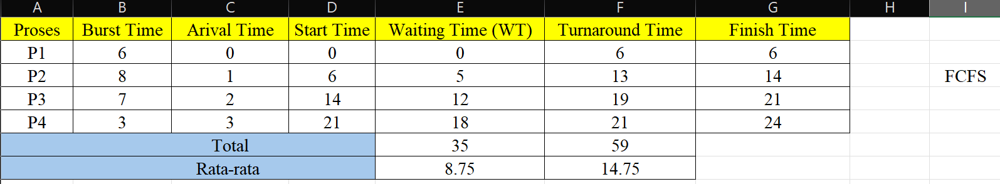
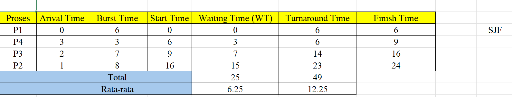

<<<<<<< HEAD
<<<<<<< HEAD
# Laporan Praktikum Minggu 14
Topik: Penyusunan Laporan Praktikum Format IMRAD "Scheduling (FCFS/SJF)"
=======
# Laporan Praktikum Minggu [14]
>>>>>>> 4a10d10cc8320ad9a7866e6d4ecbc1d4ce45b3ae

Topik: Penyusunan Laporan Praktikum Format IMRAD "Scheduling (FCFS/SJF)"
---

## Identitas
<<<<<<< HEAD
- **Nama**  : Aster Rifani  
- **NIM**   : 250202915  
- **Kelas** : 1IKRB

---

## Pendahuluan (Introduction)
### A. Latar Belakang
   Dalam sistem operasi modern,banyak proses yang dapat berada dalam keadaan siap untuk dieksekusi secara bersamaan.Kondisi ini menuntut adanya menkanisme pengaturan yang tepat agar pengguna CPU menjadi efisien dan adil.

   Penjadwalan CPU berperan penting untuk menentukan urutan eksekusi proses sehingga kinerja sistem dapat dioptimalkan, khususnya dalam meminimalkan *waiting time* dan *turnaround time*.

   Algoritma penjadwalan CPU memiliki karakteristik yang berbeda-beda.Algoritma **First Come First Served (FCFS)** merupakan algoritma yang paling mudah dan sederhana untuk diimplementasikan, namun sering kali kurang efisien ketika terdapat proses dengan waktu eksekusi yang panjang. Sebaliknya, Algoritma **Shortest Job First (SJF)** mampu meningkatkan efisiensi dengan mengeksekusi proses berdurasi pendek mampu meningkatkan efisiensi dengan mengeksekusi proses berdurasi pendek terlebih dahulu, tetapi berpotensi menimbulkan masalah *starvation* pada proses berdurasi panjang.

   Oleh karena itu, diperlukan pemahaman dan pengujian langsung terhadap kedua algoritma tersebut agar dapat diketahui perbedaan kinerja serta kondisi penggunaan yang paling sesuai.Praktikum ini dilakukan untuk membandingkan algoritma FCFS dan SJF melalui perhitungan dan analisis parameter kinerja sistem.
### B. Tujuan
Tujuan dari praktikum ini adalah:
   > Mempelajari konsep dasar penjadwalan CPU menggunakan algoritma FCFS dan SJF.

   > Menghitung nilai *waiting time* dan *turnaround time* pada masing-masing algoritma.

   > Membadingkan kinerja algoritma FCFS dan SJF.

   > Mengetahui kelebihan dan kekurangan masing-masing algoritma penjadwalan.

---

## Metode (Methods)
### A. Data Proses
   | Proses | Burst Time | Arrival Time |
   |--------|------------|--------------|
   |   P1   |      6     |       0      |
   |   P2   |      8     |       1      |
   |   P3   |      7     |       2      |
   |   P4   |      3     |       3      |
### B. Langkah Eksperimen
   1. Mengurutkan proses sesuai dengan aturan algoritma :
      - FCFS : berdasarkan *arrival time*.
      - SJF : berdasarkan *burst time* terpendek.
   2. Menghitung :
      - Waiting Time (WT) = waktu mulai eksekusi - arrival time
      - Turnaround Time (TAT) = WT + burst time
   3. Menghitung nilai rata-rata WT dan TAT.
   4. Membuat tabel hasil dan Gantt Chart.

---

## Hasil (Results)
### A. Hasil FCFS

   - Rata-rata Waiting Time (WT): **8,75**
   - Rata-rata Turnaround Time (TAT): **14,75**
   - Gantt Chart FCFS :
   ```
    |  P1  |     P2     |    P3    | P4 |
   0       6            14         21   24
   ```
### B. Hasil SJF

   - Rata-rata Waiting Time (WT): **6,25**
   - Rata-rata Turnaround Time (TAT): **12,25**
### C. Perbandingan antara **SJF** dan **FCFS*

 | **Algoritma** | **Avg Waiting Time** | **Avg Turnaround Time** | **Kelebihan** | **Kekurangan** |
   |---|---|---|---|---|
   | FCFS | 8,75 |14,75| Sederhana dan mudah diterapkan | Tidak efisien untuk proses panjang |
   | SJF | 6,25 | 12,25 | Optimal untuk job pendek | Menyebabkan *starvation* pada job panjang |
=======
# Laporan Praktikum Minggu [14]
Topik: ["Penyusunan Laporan Praktikum Format IMRAD"]

---

## Identitas 
- **Nama**  : [Lutfi Khoerunnisa]  
- **NIM**   : [250202947]  
- **Kelas** : [1IKRB]

---

## 1. Pendahuluan (Introduction)
## 1.1 Latar Belakang
   Manajemen memori merupakan aspek krusial dalam sistem operasi yang berfungsi untuk mengelola memori utama agar dapat digunakan secara optimal oleh berbagai proses yang berjalan. Dalam sistem memori virtual, keterbatasan fisik RAM sering kali menjadi tantangan ketika banyak proses meminta ruang alokasi secara bersamaan, sebagaimana terlihat pada fenomena alokasi memori bertahap dalam pengujian kontainer. Untuk mengatasi hal ini, sistem operasi menggunakan teknik paging dan mekanisme page replacement.

   Algoritma page replacement diperlukan ketika terjadi page fault, yaitu kondisi di mana data yang dibutuhkan tidak ditemukan di RAM sehingga sistem harus memilih satu halaman (page) untuk dikeluarkan dan diganti dengan halaman baru. Tanpa pengelolaan dan batasan yang tepat, konsumsi memori yang tidak terkendali dapat menyebabkan degradasi performa sistem secara keseluruhan. Dua metode yang paling umum digunakan adalah First-In-First-Out (FIFO) yang bekerja berdasarkan urutan waktu kedatangan, dan Least Recently Used (LRU) yang bekerja berdasarkan riwayat penggunaan terakhir halaman tersebut.

## 1.2 Rumusan Masalah
1. Antara algoritma FIFO dan LRU, manakah yang lebih baik dalam mengelola memori agar tidak terjadi banyak kesalahan (fault)?
2. Apa yang akan terjadi pada sistem jika sebuah aplikasi dibiarkan memakai RAM tanpa batasan?
3. Apakah pemberian batas CPU dan RAM pada Docker benar-benar efektif melindungi komputer dari beban berlebih?

### 1.3 Tujuan
1. Mengimplementasikan algoritma page replacement FIFO dalam program.
2. Mengimplementasikan algoritma page replacement LRU dalam program.
3. Menjalankan simulasi page replacement dengan dataset tertentu.
4. Membandingkan performa FIFO dan LRU berdasarkan jumlah page fault.
5. Menyajikan hasil simulasi dalam laporan yang sistematis.

---

## 2. Metode (Methods)
## 2.1 Lingkungan Pengujian

Pengujian dilakukan dengan lingkungan sebagai berikut : 

   - Sistem Operasi : Windows
   - Metode Pengujian : Simulasi Manajemen Memori - Page Replacement (FIFO 7 LRU)
   - Jumlah Frame Memori : 3 Frame
   - Dataset : Isi String Tidak Selalu Tetap Tergantung Algoritma
   - Dokumentasi : Screenshot Hasil Eksekusi

Lingkungan pengujian dibuat seragam untuk memastikan hasil yang diperoleh bersifat objektif dan dapat dibandingkan.

## 2.2 Skenario Pengujian
Tujuannya adalah untuk membandingkan efisiensi dua metode penggantian halaman data dalam memori yang terbatas.

   1. Menyiapkan Dataset Yang Berisi Reference String Berikut :

      ``` 7, 0, 1, 2, 0, 3, 0, 4, 2, 3, 0, 3, 2```

   2. Menentukan Jumlah Frame Yang Terdiri Dari 3 Frame.
   3. Menjalankan Simulasi Penggantian Halaman Menggunakan Algoritma FIFO Catat Setiap Page Hit Dan Page Fault.
Hitung Total Page Fault.
   4. Menjalankan Simulasi Penggantian Halaman Menggunakan Algoritma LRU Catat Setiap Page Hit Dan Page Fault.
Hitung total page fault.
   5. Menjalankan Program Untuk FIFO dan LRU Secara Konsisten.
   6. Menghitung Hasil FIFO Dan LRU Tersebut.

## 2.3 Variabel Pengukuran
Variabel yang digunakan dalam praktikum ini meliputi:
   - Variabel Bebas (Independent): Jenis algoritma yang digunakan (FIFO dan LRU)
   - Variabel Terikat (Dependent): Jumlah Page Fault (kegagalan memori) dan jumlah Page Hit (keberhasilan memori).
   - Variabel Kontrol: Reference String (Deret data) , Kapasitas Memori

## 2.4 Langkah Eksperimen
1. Menyiapkan reference string dan 3 frame memori.

   ```7, 0, 1, 2, 0, 3, 0, 4, 2, 3, 0, 3, 2```

2. Menjalankan simulasi algoritma FIFO kemudian catat dan hitung page fault.
3. Menghitung total page fault FIFO.
4. Menjalankan simulasi algoritma LRU dengan dataset yang sama.
5. Mencatat page hit dan page fault pada algoritma LRU.
6. Membandingkan hasil kedua algoritma.
7. Menyimpan bukti hasil eksekusi dalam bentuk screenshot.
8. Commit & Push
---

## 3. Hasil (Result)
## 3.1 Hasil Eksekusi Program
1. Algoritma Fifo


2. Algoritma LRU 


## 3.2 Tabel Perbandingan Hasil 
| Algoritma | Jumlah Page Fault | Keterangan |
| :--- | :---: | ---: |
|1. | 10  | Mengganti halaman berdasarkan urutan waktu masuk pertama kali. |
|2.  | 9 |  Mengganti halaman yang paling lama tidak digunakan berdasarkan riwayat akses|

## 3.3 Temuan Hasil Tabel
Berdasarkan hasil simulasi, algoritma LRU terbukti lebih efisien dengan mencatat 9 Page Fault, sedangkan FIFO mencatat 10 Page Fault. Hal ini disebabkan karena FIFO mengganti halaman hanya berdasarkan urutan waktu masuk tanpa melihat riwayat pemakaian. Sebaliknya, LRU mampu menghasilkan 4 Page Hit karena mempertahankan data yang baru saja diakses, unggul satu poin dibandingkan FIFO yang hanya menghasilkan 3 Page Hit. Temuan ini menunjukkan bahwa LRU lebih optimal dalam meminimalkan kesalahan memori pada kapasitas 3 frame.


## 4. Pembahasan (Discussion)
## 4.1 Interpretasi Hasil
Berdasarkan hasil simulasi dengan 3 frame memori, algoritma LRU terbukti lebih efisien daripada FIFO. Algoritma FIFO mencatat 10 page fault karena mengganti halaman hanya berdasarkan urutan waktu masuk tanpa melihat riwayat pemakaian. Sebaliknya, LRU mampu menekan kegagalan menjadi 9 page fault dengan mempertahankan data yang baru saja diakses, sehingga menghasilkan 4 page hit atau satu poin lebih baik daripada FIFO. Selisih ini membuktikan bahwa LRU lebih optimal dalam memanfaatkan kapasitas memori yang terbatas untuk dataset tersebut.

## 4.2 Keterbatasan 
Eksperimen ini memiliki keterbatasan pada jumlah kapasitas memori (frame) yang hanya dipatok sebanyak 3 slot, sehingga efisiensi algoritma belum teruji pada skala memori yang lebih besar. Selain itu, panjang data input hanya terbatas pada 13 angka, yang menyebabkan perbedaan performa antara FIFO dan LRU hanya terpaut 1 angka fault (10 vs 9). Pada sisi pengujian Docker, pembatasan sumber daya masih berada di zona aman karena aplikasi hanya menggunakan 8.00% CPU dari batas 50% yang diberikan, sehingga perilaku sistem saat terjadi lonjakan beban ekstrem belum dapat teramati secara penuh melalui data ini.

## 4.3 Perbandingan Teori
- Prinsip Kerja dan Efisiensi: Secara teori, FIFO hanya mengganti halaman berdasarkan urutan waktu masuk sehingga menghasilkan 10 page fault, sedangkan LRU lebih cerdas dengan memantau riwayat akses yang terbukti lebih efisien dengan hanya 9 page fault.

- Akurasi Data (Hit Rate): FIFO memiliki kelemahan karena sering menghapus data yang sebenarnya masih diperlukan sehingga hanya mendapat 3 hit, sementara LRU mampu mempertahankan data aktif yang menghasilkan 4 hit dan membuktikan bahwa pendekatan berbasis riwayat penggunaan lebih optimal untuk memori terbatas.

---

## 5. Closing (Penutupan)
## 5.1 Kesimpulan 
- Efisiensi Algoritma: Algoritma LRU terbukti lebih unggul dengan mencatatkan 9 Page Fault dan 4 Page Hit, mengalahkan FIFO yang mencatatkan 10 Page Fault dan 3 Page Hit pada dataset yang sama.

- Akurasi Mekanisme: Keunggulan LRU terletak pada kemampuannya mempertahankan data yang sering diakses berdasarkan riwayat penggunaan, sementara FIFO memiliki kelemahan karena membuang data (seperti Page 0) hanya berdasarkan urutan waktu masuk.

- Stabilitas Sistem: Pengujian limitasi sumber daya pada Docker menunjukkan sistem berjalan sangat stabil dengan beban CPU hanya 8.00% dan RAM 32.57 MiB, yang membuktikan bahwa batasan sumber daya berhasil menjaga performa tetap di bawah limit yang ditentukan.

## 5.2 Saran
- Menambah Variasi Parameter
- Melakukan Stress Test
- Eksperimen Algoritma Lain

## 5.3 Quiz
1. [Mengapa format IMRAD membantu membuat laporan praktikum lebih ilmiah dan mudah dievaluasi?]
**Jawaban:** Format IMRAD (Introduction, Methods, Results, and Discussion) membantu membuat laporan praktikum lebih ilmiah dan mudah dievaluasi karena memberikan struktur logis yang konsisten untuk menyampaikan alur pikir penelitian.
2. [Apa perbedaan antara bagian Hasil dan Pembahasan?]
**Jawaban:** Bagian Hasil hanya menyajikan data objektif apa adanya, seperti temuan 9 page fault pada LRU dan 10 page fault pada FIFO. Sementara itu, Pembahasan menjelaskan alasan di balik angka tersebut, yakni mengapa LRU lebih efisien karena mempertimbangkan riwayat akses data dibandingkan FIFO yang hanya berdasarkan urutan waktu masuk. Singkatnya, Hasil menyajikan fakta angka, sedangkan Pembahasan memberikan analisis teoritisnya.
3. [Mengapa sitasi dan daftar pustaka penting, bahkan untuk laporan praktikum?]
**Jawaban:** Sitasi dan daftar pustaka sangat penting karena berfungsi sebagai bukti orisinalitas dan bentuk penghargaan terhadap teori yang digunakan, seperti algoritma FIFO dan LRU yang bukan merupakan temuan pribadi praktikan. Secara teknis, sitasi memperkuat kredibilitas laporan dengan menunjukkan bahwa analisis Anda didasarkan pada landasan ilmiah yang valid, bukan sekadar asumsi. Selain itu, daftar pustaka memudahkan pembaca atau dosen untuk melacak sumber asli jika ingin memverifikasi data atau memperdalam materi manajemen memori yang dibahas.
>>>>>>> fbd8316ebf0b48cd8652bea179300f780e5f8a29

---
## Pembahasan (Discussion)
   Berdasarkan hasil percobaan, algoritma SJF menghasilkan nilai rata-rata *waiting time* dan *turnaround time* yang lebih kecil dibandingkan FCFS. Hal ini terjadi karena SJF memprioritaskan proses dengan *burst time* pendek sehingga antrean proses dapat diselesaikan lebih cepat.

<<<<<<< HEAD
   Namun, SJF memiliki kelemahan berupa potensi *starvation* pada proses dengan waktu eksekusi panjang, terutama jika sistem terus menerima proses pendek. Sebaliknya, FCFS lebih menjamin keadilan karena setiap proses dijalankan sesuai urutan kedatangan, meskipun efisiensinya lebih rendah.
=======
- **Nama**  : Ani Ngismatul Hawa  
- **NIM**   : 250202914  
- **Kelas** : 1IKRB

---
## Pendahuluan
### A. Latar Belakang
CPU scheduling merupakan mekanisme penting dalam sistem operasi untuk mengatur urutan eksekusi proses yang berjalan pada CPU. Penjadwalan yang tepat berpengaruh langsung terhadap efisiensi sistem, khususnya pada waktu tunggu dan waktu penyelesaian proses. Oleh karena itu, pemilihan algoritma penjadwalan menjadi hal yang krusial.

Algoritma First Come First Served (FCFS) dan Shortest Job First (SJF) merupakan dua algoritma dasar dalam penjadwalan CPU. FCFS mengeksekusi proses berdasarkan urutan kedatangan, sedangkan SJF memprioritaskan proses dengan waktu eksekusi terpendek. Melalui praktikum ini, dilakukan perhitungan dan perbandingan kedua algoritma tersebut untuk memahami perbedaan kinerja serta kelebihan dan kekurangan masing-masing dalam pengelolaan proses CPU.

### B. Tujuan
> Menghitung waiting time dan turnaround time untuk algoritma FCFS dan SJF.

> Menyajikan hasil perhitungan dalam tabel yang rapi dan mudah dibaca.

> Membandingkan performa FCFS dan SJF berdasarkan hasil analisis.

>Menjelaskan kelebihan dan kekurangan masing-masing algoritma.

> Menyimpulkan kapan algoritma FCFS atau SJF lebih sesuai digunakan.

---
## Metode
### A. Data Proses

|Proses|	Burst Time|	Arrival Time|
|----|------|-----|
|P1|	6|	0|
|P2|	8|	1|
|P3|	7|	2|
|P4|	3|	3|

---
### B. Langkah Eksperimen
1. Menyiapkan data proses yang terdiri dari Process ID, Arrival Time, dan Burst Time.

2. Menentukan urutan eksekusi proses menggunakan algoritma FCFS berdasarkan waktu kedatangan.

3. Menghitung waiting time dan turnaround time untuk setiap proses pada algoritma FCFS.

4. Menentukan urutan eksekusi proses menggunakan algoritma SJF berdasarkan burst time terpendek.

5. Menghitung waiting time dan turnaround time untuk setiap proses pada algoritma SJF.

6. Membandingkan hasil perhitungan FCFS dan SJF dalam bentuk tabel untuk menganalisis perbedaan kinerja.
---

## Hasil
### A. Hasil FCFS


### B. Hasil SJF


### C. Hasil Perbandingan *FCFS* dan *SJF* 


### D. Tabel Analisis Perbandingan

|Algoritma	|Avg Waiting Time	|Avg Turnaround Time	|Kelebihan	|Kekurangan|
|-----|-----|----|-----|----|
|FCFS|	8,75|	14,75|Sederhana dan mudah diterapkan|Tidak efisien untuk proses panjang|
|SJF|	6,25|	12,25|Optimal untuk job pendek|Menyebabkan starvation pada job panjang|

---

## Pembahasan
Hasil eksperimen menunjukkan bahwa algoritma FCFS mengeksekusi proses berdasarkan urutan kedatangan sehingga proses dengan waktu eksekusi panjang dapat meningkatkan waktu tunggu proses lain. Sebaliknya, algoritma SJF lebih efisien karena memprioritaskan proses dengan burst time terpendek, yang berdampak pada rata-rata waiting time dan turnaround time yang lebih kecil. Namun, SJF berpotensi menyebabkan proses berdurasi panjang harus menunggu lebih lama, sehingga pemilihan algoritma penjadwalan perlu disesuaikan dengan kondisi dan kebutuhan sistem.
>>>>>>> 4a10d10cc8320ad9a7866e6d4ecbc1d4ce45b3ae

---

## Kesimpulan
<<<<<<< HEAD
   1. Algoritma SJF lebih dibandingkan dengan Algoritma FCFS berdasarkan nilai rata-rata WT dan TAT.
   2. FCFS lebih unggul dalam kesederhanaan dan keadilan.
   3. Pemilihan algoritma harus disesuaikan dengan kebutuhan sistem.
=======
1. Penjadwalan CPU berperan penting dalam menentukan efisiensi eksekusi proses pada sistem operasi.

2. FCFS mengutamakan urutan kedatangan proses, namun kurang optimal ketika proses memiliki waktu eksekusi yang bervariasi.

3. SJF lebih efektif dalam menekan waktu tunggu proses, meskipun berisiko menunda proses berdurasi panjang.

---
>>>>>>> 4a10d10cc8320ad9a7866e6d4ecbc1d4ce45b3ae

---

## Quiz
<<<<<<< HEAD
1. Mengapa format IMRAD membantu membuat laporan praktikum lebih ilmiah dan mudah dievaluasi? 
   **Jawaban:**  Format IMRAD menyusun laporan secara sistematis mulai dari latar belakang, metode, hasil, hingga analisis. Struktur ini memudahkan pembaca dan dosen untuk memahami tujuan praktikum, menilai ketepatan metode, serta mengevaluasi hasil dan pembahasan secara objektif dan konsisten.
2. Apa perbedaan antara bagian **Hasil** dan **Pembahasan**? 
   **Jawaban:**  Bagian Hasil menyajikan data atau temuan praktikum secara objektif dalam bentuk tabel, grafik, atau perhitungan, tanpa interpretasi. Sedangkan Pembahasan berisi analisis dan interpretasi hasil, penjelasan alasan terjadinya hasil tersebut, serta perbandingan dengan teori atau ekspektasi.
3. Mengapa sitasi dan daftar pustaka penting, bahkan untuk laporan praktikum?
   **Jawaban:**  Sitasi dan daftar pustaka penting untuk menunjukkan bahwa laporan didukung oleh sumber ilmiah yang valid, menghindari plagiarisme, serta meningkatkan kredibilitas dan keabsahan laporan praktikum.

---
## Daftar Pustaka
   Silberschatz, A., Galvin, P., Gagne, G. Operating System Concepts, 10th Ed.

   Tanenbaum, A. Modern Operating Systems, 4th Ed.
=======
## Daftar Pustaka
1. Silberschatz, A., Galvin, P. B., & Gagne, G. (2018). Operating System Concepts (10th ed.). Wiley.
2. Merkel, D. (2014). Docker: Lightweight Linux Containers for Consistent Development and Deployment. Linux Journal, 2014(239).
>>>>>>> fbd8316ebf0b48cd8652bea179300f780e5f8a29
=======
1. Mengapa format IMRAD membantu membuat laporan praktikum lebih ilmiah dan mudah dievaluasi?  
   **Jawaban:** 

   Format IMRAD membuat laporan lebih ilmiah karena menyajikan penelitian secara terstruktur dari tujuan, metode, hasil, hingga pembahasan, sehingga mudah dipahami, direplikasi, dan dievaluasi.

2. Apa perbedaan antara bagian Hasil dan Pembahasan? 
   **Jawaban:**  

   Bagian **Hasil** menyajikan data atau temuan eksperimen secara objektif, sedangkan **Pembahasan** menjelaskan, menganalisis, dan menafsirkan hasil tersebut.

3. Mengapa sitasi dan daftar pustaka penting, bahkan untuk laporan praktikum? 
   **Jawaban:**  
   Sitasi dan daftar pustaka penting untuk menghargai sumber asli, menghindari plagiarisme, dan memperkuat keabsahan laporan praktikum dengan dasar teori yang jelas.

>>>>>>> 4a10d10cc8320ad9a7866e6d4ecbc1d4ce45b3ae

---
## Daftar Pustaka
1. Silberschatz, A., Galvin, P. B., & Gagne, G. (2018). Operating System Concepts (10th ed.). Wiley.

2. Tanenbaum, A. S., & Bos, H. (2015). Modern Operating Systems (4th ed.). Pearson Education.

3. Arpaci-Dusseau, R. H., & Arpaci-Dusseau, A. C. (2018). Operating Systems: Three Easy Pieces. Arpaci-Dusseau Books.

---
## Refleksi Diri
Tuliskan secara singkat:
- Apa bagian yang paling menantang minggu ini? Membuat Laporan Imrad
- Bagaimana cara Anda mengatasinya?  Mencoba Dan Terus Mencoba

---

**Credit:**  
_Template laporan praktikum Sistem Operasi (SO-202501) – Universitas Putra Bangsa_
