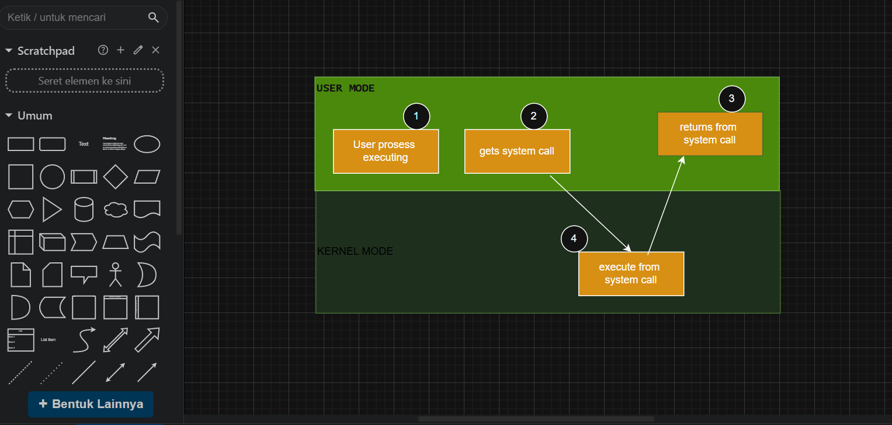

# Laporan Praktikum Minggu [2]
<<<<<<< HEAD
Topik: "Struktur System Call dan Fungsi Kernel"
=======
Topik:  "Syscall Structure"]
>>>>>>> befbaf963505fb5abbac60c1e3be2a0e33e0857a

---

## Identitas
<<<<<<< HEAD
<<<<<<< HEAD
<<<<<<< HEAD
- **Nama**  : Aster Rifani 
- **NIM**   : 250202915  
- **Kelas** : 1IKRB
=======
- **Nama**  : [Lutfi Khoerunnisa]  
- **NIM**   : [250202947]  
- **Kelas** : [1IKRB]
>>>>>>> fbd8316ebf0b48cd8652bea179300f780e5f8a29
=======
- **Nama**  : [Ani Ngismatul Hawa]  
- **NIM**   : [250202914]  
- **Kelas** : [1IKRB]
>>>>>>> 4a10d10cc8320ad9a7866e6d4ecbc1d4ce45b3ae

---

## Tujuan
<<<<<<< HEAD
<<<<<<< HEAD
Tuliskan tujuan praktikum minggu ini.  
Contoh:  
>    Menjelaskan konsep dan fungsi system call.

>    Mengidentifikasi jenis-jenis system call dan fungsinya.

>    Mengamati alur perpindahan mode user ke kernel saat system call terjadi.

>    Menggunakan perintah Linux untuk menampilkan dan menganalisis system call.
=======
=======
>>>>>>> 4a10d10cc8320ad9a7866e6d4ecbc1d4ce45b3ae
=======
- **Nama**  : [Dyah Retno Wulandari]  
- **NIM**   : [250202934]  
- **Kelas** : [1IKRB]
 
---

## A. Deskripsi Singkat
Pada praktikum minggu ini, mahasiswa akan mempelajari **mekanisme system call dan struktur sistem operasi**.  
System call adalah antarmuka antara program aplikasi dan kernel yang memungkinkan aplikasi berinteraksi dengan perangkat keras secara aman melalui layanan OS.

Mahasiswa akan melakukan eksplorasi terhadap:
- Jenis-jenis system call yang umum digunakan (file, process, device, communication).
- Alur eksekusi system call dari mode user menuju mode kernel.
- Cara melihat daftar system call yang aktif di sistem Linux.

---

## B. Tujuan
Setelah menyelesaikan tugas ini, mahasiswa mampu:
>>>>>>> befbaf963505fb5abbac60c1e3be2a0e33e0857a
1. Menjelaskan konsep dan fungsi system call dalam sistem operasi.
2. Mengidentifikasi jenis-jenis system call dan fungsinya.
3. Mengamati alur perpindahan mode user ke kernel saat system call terjadi.
4. Menggunakan perintah Linux untuk menampilkan dan menganalisis system call.
<<<<<<< HEAD
<<<<<<< HEAD
>>>>>>> fbd8316ebf0b48cd8652bea179300f780e5f8a29
=======
>>>>>>> 4a10d10cc8320ad9a7866e6d4ecbc1d4ce45b3ae

---

## Dasar Teori
<<<<<<< HEAD
  Menurut Silberschatz, Galvin, dan Gagne (2018), system call merupakan antarmuka utama antara _program pengguna (user programs)_ dan kernel sistem operasi. Tanpa mekanisme ini, aplikasi di ruang pengguna akan memiliki akses langsung terhadap perangkat keras atau memori sistem, yang dapat menimbulkan risiko serius terhadap integritas dan kerahasiaan data.System call bertindak sebagai "penjaga gerbang" (gatekeeper) yang mengontrol setiap permintaan dari aplikasi ke sumber daya kernel, seperti berkas, jaringan, atau memori.
  
  Dengan demikian, system call menjadi komponen penting dalam model keamanan OS berbasis proteksi lapisan (layered protection). Kernel hanya menjalankan fungsi-fungsi yang sah dan terverifikasi, sehingga mencegah program jahat mengakses area memori kernel atau melakukan operasi berbahaya seperti manipulasi tabel proses. Tanenbaum dan Bos (2015) menekankan bahwa kontrol ini merupakan inti dari _mekanisme isolasi_ antara pengguna dan sistem, di mana setiap system call harus melewati proses validasi hak akses (permission checking) sebelum dijalankan. Oleh karena itu, system call bukan hanya sarana komunikasi teknis, tetapi juga _mekanisme pertahanan utama_ terhadap eksploitasi sistem.
  
  Transisi dari _user mode_ ke _kernel mode_ merupakan titik kritis dalam arsitektur keamanan sistem operasi. Berdasarkan Tanenbaum & Bos (2015), sistem operasi modern memastikan keamanan transisi ini dengan menggunakan _instruksi perangkat keras khusus_ seperti trap atau interrupt. Saat program pengguna memanggil system call, CPU secara otomatis berpindah ke kernel mode melalui jalur yang telah ditentukan oleh _Interrupt Descriptor Table (IDT)_ atau mekanisme serupa.
  
  Selama proses ini, alamat instruksi dan konteks pengguna disimpan, lalu kontrol dialihkan hanya ke bagian kode kernel yang aman dan diawasi. Kernel juga memeriksa parameter yang dikirim oleh pengguna, untuk memastikan tidak ada upaya menyusup ke ruang memori kernel (misalnya melalui pointer manipulation)._Silberschatz et al. (2018)_ menambahkan bahwa OS modern menerapkan privilege levels dan memory protection unit (MMU) untuk memastikan bahwa kode pengguna tidak dapat menulis ke area kernel, bahkan jika terjadi kesalahan atau serangan. Hanya setelah pemeriksaan selesai dan hak akses valid, kernel mengeksekusi fungsi yang diminta, kemudian mengembalikan kontrol ke mode pengguna.
  
  Contoh System Call Umum di Linux :
 1. **read()** dan **write()** – untuk membaca dan menulis data pada berkas atau perangkat I/O.
 2. **open()** dan **close()** – untuk membuka dan menutup berkas.
 3. **fork()** – membuat proses baru dengan menyalin proses induk.
 4. **exec()** – mengeksekusi program baru dalam proses yang ada.
 5. **wait()** – menunggu proses anak selesai.
 6. **exit()** – mengakhiri proses dengan aman.
 7. **getpid()** – memperoleh ID proses saat ini.
 
  Semua system call ini bekerja melalui transisi terkontrol antara ruang pengguna dan kernel, memastikan keamanan, isolasi, serta stabilitas sistem.
=======
1. berfungsi sebagai gerbang kontrol akses yang mencegah program pengguna mengakses sumber daya sensitif secara langsung.
System call berperan penting dalam menjaga keamanan sistem operasi melalui beberapa mekanisme utama. Pertama, kontrol akses memastikan bahwa aplikasi tidak dapat secara langsung mengakses file, perangkat keras, atau sumber daya sistem lainnya. Semua akses harus dilakukan melalui system call seperti read(), write(), atau open(), dan kernel akan memeriksa izin berdasarkan hak akses pengguna serta kebijakan keamanan sistem sebelum mengizinkan operasi tersebut. Kedua, terdapat validasi parameter, di mana kernel akan memverifikasi setiap argumen yang dikirim oleh aplikasi saat melakukan system call. Langkah ini mencegah aplikasi mencoba mengakses memori yang tidak sah atau memanipulasi data penting milik sistem. Selanjutnya, pemisahan hak istimewa diterapkan dengan membedakan antara mode pengguna (user mode) dan mode kernel (kernel mode). Aplikasi berjalan dalam mode pengguna dengan hak akses terbatas, sementara kernel memiliki kendali penuh terhadap perangkat keras dan sumber daya sistem. Agar dapat melakukan operasi yang memerlukan hak istimewa, aplikasi harus memintanya melalui system call, dan kernel akan menanganinya dengan aman. Terakhir, mekanisme ini juga berfungsi sebagai pencegahan gangguan antarproses. Dengan mengontrol semua permintaan terhadap sumber daya melalui kernel, system call mencegah satu program mengganggu program lain atau merusak sistem secara keseluruhan, sehingga meningkatkan stabilitas dan keamanan sistem operasi.
2. Sistem operasi (OS) memastikan transisi yang aman antara mode pengguna (user mode) dan mode kernel (kernel mode) dengan menggunakan serangkaian mekanisme yang didukung oleh perangkat keras (hardware). Proses ini memastikan bahwa aplikasi pengguna yang tidak terpercaya tidak dapat mengakses atau memodifikasi sumber daya sistem yang sensitif, seperti perangkat keras dan memori inti, sehingga menjaga stabilitas dan keamanan sistem secara keseluruhan. 
3. `open()`, `read()`, `write()` ,`close()` ,`fork()` , `exit()`
>>>>>>> 4a10d10cc8320ad9a7866e6d4ecbc1d4ce45b3ae
=======

---

## C. Langkah Pengerjaan
1. **Setup Environment**
   - Gunakan Linux (Ubuntu/WSL).
   - Pastikan perintah `strace` dan `man` sudah terinstal.
   - Konfigurasikan Git (jika belum dilakukan di minggu sebelumnya).

2. **Eksperimen 1 – Analisis System Call**
   Jalankan perintah berikut:
   ```bash
   strace ls
   ```
   > Catat 5–10 system call pertama yang muncul dan jelaskan fungsinya.  
   Simpan hasil analisis ke `results/syscall_ls.txt`.

3. **Eksperimen 2 – Menelusuri System Call File I/O**
   Jalankan:
   ```bash
   strace -e trace=open,read,write,close cat /etc/passwd
   ```
   > Analisis bagaimana file dibuka, dibaca, dan ditutup oleh kernel.
   Jawab:
  - Membuka file (open)

   Kernel menerima permintaan dari program cat untuk membuka file /etc/passwd.
Kernel mencari file tersebut di sistem berkas, membuat file descriptor (biasanya nomor 3), lalu mengembalikannya ke proses.


- Membaca file (read)

Program cat meminta kernel membaca isi file melalui read(fd, buffer, size).
Kernel menyalin data dari page cache atau langsung dari disk ke memori proses, lalu mengembalikan jumlah byte yang dibaca (misalnya 1502 byte).

- Menulis ke layar (write)

Data hasil baca dikirim ke stdout (layar terminal) dengan write(1, buffer, size).
Kernel menyalin data dari memori proses ke perangkat terminal.

- Menutup file (close)

Setelah selesai, program memanggil close(fd).
Kernel menandai bahwa file descriptor tersebut tidak dipakai lagi dan melepaskan sumber dayanya.


4. **Eksperimen 3 – Mode User vs Kernel**
   Jalankan:
   ```bash
   dmesg | tail -n 10
   ```
   > Amati log kernel yang muncul. Apa bedanya output ini dengan output dari program biasa?

   Jawab : Output dmesg seperti yang kamu tampilkan berisi pesan internal dari kernel Linux tentang aktivitas sistem, sedangkan output program biasa adalah hasil dari program yang dijalankan oleh pengguna di user space, seperti menampilkan file atau teks.


5. **Diagram Alur System Call**
   - Buat diagram yang menggambarkan alur eksekusi system call dari program user hingga kernel dan kembali lagi ke user mode.
   - Gunakan draw.io / mermaid.
   - Simpan di:
     ```
     praktikum/week2-syscall-structure/screenshots/syscall-diagram.png
     ```

6. **Commit & Push**
   ```bash
   git add .
   git commit -m "Minggu 2 - Struktur System Call dan Kernel Interaction"
   git push origin main
   ```
>>>>>>> befbaf963505fb5abbac60c1e3be2a0e33e0857a

1. Sistem Operasi (SO): Perantara dan Pengelola Sumber Daya 
SO berfungsi sebagai lapisan perantara antara aplikasi pengguna dan perangkat keras (hardware). Fungsi utamanya adalah mengelola dan mengalokasikan sumber daya sistem secara efisien dan adil, termasuk CPU, memori, dan perangkat I/O. SO menyediakan antarmuka (interface) yang konsisten agar program dapat berjalan tanpa perlu mengetahui detail hardware spesifik.

2. Kernel: Inti Pelaksana Tugas Kritis (Jantung SO) 
Kernel adalah inti (core) sistem operasi, selalu berada di memori. Ia bertanggung jawab untuk menjalankan fungsi-fungsi penting tingkat rendah seperti:
- Penjadwalan Proses (Scheduling): Menentukan proses mana yang akan dijalankan CPU.
- Manajemen Memori: Mengalokasikan ruang memori ke berbagai program.
- Akses Hardware: Mengatur komunikasi dengan perangkat keras melalui driver.

3. Mode Operasi: Pemisahan Keamanan (User vs. Kernel) 
Sistem memisahkan eksekusi ke dalam dua mode untuk keamanan dan stabilitas:
Kernel Mode (Mode Privileged): Mode di mana kernel beroperasi. Memiliki akses penuh dan tak terbatas ke semua hardware dan memori.
User Mode (Mode Terbatas): Mode tempat aplikasi pengguna berjalan. Aksesnya dibatasi; untuk melakukan operasi sensitif (hardware), aplikasi harus meminta layanan kernel melalui System Calls.
---

<<<<<<< HEAD
## Langkah Praktikum
<<<<<<< HEAD
1. Setup Environtmen
   - Menggunakan Clud Shell untuk Terminal Linux.
   - Pastikan perintah ``strace`` dan ``man`` sudah terinstal.
   - Konvigurasi Git
2. Eksperimen 1-Analisis System Call
     Menjalankan perintah:
       ``strace ls``
3. Eksperimen 2-Menelusuri System Call File I/O
     Menjalankan perintah:
       ``strace -e trace=open,read,write,close cat /etc/passwd``
4. Eksperimen 3-Mode User vs Kernel
     Menjalankan perintah:
       ``dmesg | tail -n 10``
               atau
       ``sudo dmesg``
5. Diagram Alur Syscall
    - Membuatkan diagra yang menggambarkan alur eksekusi system call dari program user hingga kernel dan kembali lagi ke user mode.
    - Menggunakan draw.io
    - Simpan di:
      ``praktikum/week2-syscall-structure-/screenshots/syscall-diagram.png``
6. Commit & Push
    ``git add .
      git commit -m "Minggu 2 - Structure System Call dan Kernel Interaction"
      git push origin main ``
---
=======
## D. Tugas & Quiz
### Tugas
1. Dokumentasikan hasil eksperimen `strace` dan `dmesg` dalam bentuk tabel observasi. 

2. Buat diagram alur system call dari aplikasi → kernel → hardware → kembali ke aplikasi.  

3. Tulis analisis 400–500 kata tentang:
   # Mengapa system call penting untuk keamanan OS?  
 - Karena berfungsi sebagai gerbang penghubung antara program pengguna (user space) dan inti sistem operasi (kernel space). System call adalah mekanisme keamanan utama yang memastikan setiap interaksi antara program dan kernel berlangsung terkendali, tervalidasi, dan tercatat, sehingga melindungi OS dari penyalahgunaan atau serangan dari aplikasi pengguna.

- Kontrol Akses ke Kernel
System call membatasi interaksi langsung antara aplikasi dan kernel. Program bisa meminta layanan OS seperti membaca file atau mengirim data ke jaringan. Ini mencegah aplikasi jahat mengakses kernel secara langsung.

- Validasi dan Keamanan Input
Kernel memeriksa parameter yang dikirim oleh program sebelum mengeksekusi system call. Misalnya, OS memeriksa apakah proses memiliki hak akses untuk membaca file tertentu, sehingga mencegah akses ilegal.

- Isolasi antara User Space dan Kernel Space
Dengan memisahkan dua ruang ini, system call mencegah aplikasi di user space mengubah atau merusak memori kernel yang berisi kode dan data penting.

- Audit dan Logging Keamanan
Aktivitas system call dapat dipantau menggunakan alat seperti strace atau auditd, sehingga OS (dan administrator) bisa melacak perilaku mencurigakan seperti upaya akses tidak sah.

   # Bagaimana OS memastikan transisi user–kernel berjalan aman?

 - Memanfaatkan dukungan perangkat keras (CPU) — CPU otomatis mengubah mode eksekusi dan melompat ke alamat handler kernel yang telah ditentukan OS.
	Melakukan validasi parameter — kernel memeriksa setiap data, pointer, dan izin yang dikirim dari user space agar tidak mengakses memori kernel atau data ilegal.

-	Menggunakan tabel system call yang terlindungi — hanya fungsi-fungsi kernel yang sah dan terdaftar yang bisa dipanggil.

-	Mengembalikan kontrol dengan aman ke user mode — setelah system call selesai, CPU memastikan kembali ke user mode sehingga program tidak bisa tetap menjalankan kode kernel.

-	Control akses, OS menerapkan control akses wajib melalui kebijakan seperti Linux yang membatasi hak Istimewa bahkan untuk proses di mode kernel sehingga mengurangi resika hak istimewa

# Sebutkan contoh system call yang sering digunakan di Linux.  
Kontrol Proses

•	fork(): Membuat proses baru yang merupakan salinan dari proses yang memanggilnya. Ini adalah dasar untuk menjalankan program baru.

•	execve(): Mengganti citra proses saat ini dengan program yang baru. Biasanya digunakan setelah fork() untuk menjalankan program yang berbeda dari proses induk.

•	wait(): Menyebabkan proses induk menunggu hingga proses anak selesai.

•	exit(): Mengakhiri proses yang sedang berjalan dan mengembalikan kode status. 


Manajemen Berkas

•	open(): Membuka berkas dan mengembalikan file descriptor yang digunakan untuk operasi selanjutnya pada berkas tersebut.

•	read(): Membaca data dari file descriptor ke dalam sebuah buffer.

•	write(): Menulis data dari sebuah buffer ke file descriptor.

•	close(): Menutup file descriptor yang telah terbuka untuk melepaskan sumber daya yang terkait.

•	stat(): Mendapatkan informasi tentang berkas, seperti ukuran, waktu modifikasi, dan izin. 

Manajemen Informasi

•	getpid(): Mengembalikan ID proses (PID) dari proses yang sedang berjalan.

•	getppid(): Mengembalikan ID proses induk (PPID) dari proses yang sedang berjalan.

•	sleep(): Menyebabkan proses tertunda atau tidur untuk jangka waktu tertentu.

•	alarm(): Menjadwalkan alarm untuk mengirim sinyal setelah jumlah waktu tertentu. 

Manajemen Perangkat

•	ioctl(): Menangani operasi I/O tingkat rendah pada perangkat yang tidak dapat diakses melalui read() atau write(). 

Komunikasi Antar-proses (IPC) 

•	pipe(): Membuat saluran komunikasi satu arah antara dua proses.

•	socket(): Membuat titik akhir untuk komunikasi jaringan.

•	msgsnd() dan msgrcv(): Mengirim dan menerima pesan melalui antrean pesan.


4. Simpan semua hasil di:
   ```
   praktikum/week2-syscall-structure/
   ```

### Quiz
Jawab pertanyaan berikut di bagian **Quiz** laporan:
1. Apa fungsi utama system call dalam sistem operasi?  
Jawaban:
   Fungsi utama system call adalah sebagai antarmuka antara program dan sistem operasi untuk meminta layanan, seperti mengelola proses, berkas, perangkat keras, dan komunikasi antar proses
2. Sebutkan 4 kategori system call yang umum digunakan.  
   Jawaban: 

   a.	 Manajemen Proses: Mengontrol eksekusi dan multitasking program, termasuk membuat, menghentikan, dan menunda proses. 

   b.	Manajemen Berkas: Mengelola akses ke berkas, seperti membuat, membuka, membaca, menulis, dan menutupnya. 

   c.	Manajemen Perangkat: Mengizinkan program untuk mengakses dan berinteraksi dengan perangkat keras seperti printer, scanner, atau disk.

   d.	Manajemen Sumber Daya: Mengalokasikan dan membebaskan sumber daya seperti memori dan waktu CPU kepada proses

3. Mengapa system call tidak bisa dipanggil langsung oleh user program?

Jawab : System call tidak bisa dipanggil langsung oleh program user karena alasan keamanan, proteksi, dan manajemen sumber daya sistem operasi
>>>>>>> befbaf963505fb5abbac60c1e3be2a0e33e0857a

## Kode / Perintah
<<<<<<< HEAD
- Hasil observasi system call dimasukkan ke dalam:
``laporan.md.``
- File screenshots hasil observasi disimpan di:
``screenshots/syscall_ls.png.``
- Diagram alursystemcall disimpan di:
``screenshots/syscall-diagram.png.``
- Laporan lengkap berada di:
``laporan.md.``
=======
```bash
strace ls
strace -e trace=open,read,write,close cat /etc/passwd
dmesg | tail -n 10

=======
1. Setup Environment

Gunakan Linux (Ubuntu/WSL).
Pastikan perintah strace dan man sudah terinstal.
Konfigurasikan Git (jika belum dilakukan di minggu sebelumnya).
Eksperimen 1 – Analisis System Call Jalankan perintah berikut:

strace ls
Catat 5–10 system call pertama yang muncul dan jelaskan fungsinya.
Simpan hasil analisis ke results/syscall_ls.txt.

Eksperimen 2 – Menelusuri System Call File I/O Jalankan:

strace -e trace=open,read,write,close cat /etc/passwd
Analisis bagaimana file dibuka, dibaca, dan ditutup oleh kernel.

Eksperimen 3 – Mode User vs Kernel Jalankan:

dmesg | tail -n 10
Amati log kernel yang muncul. Apa bedanya output ini dengan output dari program biasa?

Diagram Alur System Call

Buat diagram yang menggambarkan alur eksekusi system call dari program user hingga kernel dan kembali lagi ke user mode.
Gunakan draw.io / mermaid.
Simpan di:
praktikum/week2-syscall-structure/screenshots/syscall-diagram.png
Commit & Push

git add .
git commit -m "Minggu 2 - Struktur System Call dan Kernel Interaction"
git push origin main
---

<<<<<<< HEAD
## Kode / Perintah
Tuliskan potongan kode atau perintah utama:
```Hasil observasi system call (strace ls) dimasukkan ke dalam laporan.md.
File screenshot hasil observasi disimpan di screenshots/syscall_ls.png.
Diagram alur system call disimpan di screenshots/syscall-diagram.png.
Laporan lengkap berada di laporan.md.
Semua hasil telah di-commit ke GitHub tepat waktu.
>>>>>>> 4a10d10cc8320ad9a7866e6d4ecbc1d4ce45b3ae
```
>>>>>>> fbd8316ebf0b48cd8652bea179300f780e5f8a29

---

## Hasil Eksekusi
<<<<<<< HEAD
Hasil percobaan observasi system call:
### 1. Eksperimen 1 - Analisis System Call (Menjalankan perintah " Strace ls ")

| No | System Call                        | Fungsi |
|----|------------------------------------|--------|
| 1. | `execve ( " /usr/bin/ls",["ls"]..")` | panggilan system call pertama untuk mengeksekusi Linux. |
| 2. | `brk (null)` | Mengtur batas akhir diheap memori.digunakan untuk manajemen memori.|
| 3. | `mmap (...)` | Memetakan area memori ke dalam ruang alamat proses.Digunakan untuk keprluan internal seperti stack atau pustaka dinamis. |
| 4. | `acces("/etc/ld.so.preload" R_OK)` | Mengecek apakah file preload ada dan data bisa dibaca.File ini bisa digunakan untuk preload library secara paksa. |
| 5. | `openat(AT_FDCWD, "/etc/ld.so.cache",O_RDONLY O_CLOEXEC)` | Membuka file cache pustaka dinamis untuk dibaca,agar sistem bisa menemukan lokasi pustaka (.so) yang dibutuhkan oleh program. |
| 6. | `fstat(3...)` | Mengambil informasi status dari file descriptor 3,yaitu file yang baru dibuka. |
| 7. | `mmap(..)` | Memetakan isi file ke memori agar bisa dibaca lebih efisien. |
| 8. | `openat(AT_FDCWD, "/lib/x86-linux-gnu/libselinux.so.1",...)` | Menutup file descriptor 3 setelah selesai membaca. |
| 9. | `openat(AT_FDCWD, "/lib/x86_64-linux-gnu/libselinux.so.1", ...)` | Membuka pustaka dinamis (libselinux),salah satu library yang dibutuhkan(ls). |
| 10. | `read(3,...)` | Membaca isi awal file (libselinux.so.1) untuk memverifikasi bahwa itu adalah file ELF (Executable and Linkable Format). |
### 2. Eksperimen 2 - Menelusuri System Call File I/O (Menjalankan Perintah " strace -e trace=open, read, write, close cat /etc/psswd ")


 Menganalisis bagaimana file dibuka,dibaca,dan ditutup oleh kernel.
  1. Membuka file [open()/openat()]
      Kernel menemukan dan memverifikasi file, lalu memberi file descriptor.
  2. Membaca isi file [read()]
      Kernel salin isi file ke buffer program.
  3. Menampilkan isi file [write()]
      Kernel kirim data ke layar atau terminal.
  4. Menutup file [close()]
      Kernel mengakhiri akses dan lepas file descriptor.
### 3. Eksperimen 3 - Mode User vs Kernel (Menjalnkan Perintah " dmesg | tail -n 10 ")


 Perbedaan output ini dengan output dari program biasa,yaitu:
  Output dari dmesg berasal dari log kernel yang mencatat aktivitas sistem inti seperti deteksi hardware, 
driver, dan konfigurasi booting. Sedangkan output dari program biasa seperti cat atau ls berasal dari user space, 
yang menunjukkan hasil kerja program atau isi file. Jadi keduanya punya sumber yang berbeda — dmesg dari kernel, program 
biasa dari proses user.

Hasil diagram:

=======
Sertakan screenshot hasil percobaan atau diagram:
<<<<<<< HEAD


 
# Tabel Observasi Strace ls
| system caal | Keterangan|
|:--- | :---|
| execve | Memuat dan menjalankan program ls itu sendiri.|
|mmap atau munmap | Memetakan atau melepaskan peta file atau perangkat ke dalam memori. Ini sering digunakan oleh pustaka C (glibc) untuk memuat pustaka bersama (shared libraries).|
| openat atau open | Membuka file atau direktori. ls akan menggunakan ini untuk membuka direktori yang akan dicantumkan, dan juga untuk membuka file konfigurasi yang mungkin digunakan. |
| fstat atau newfstatat | Mendapatkan informasi status tentang sebuah file descriptor, seperti ukuran, waktu modifikasi, izin, dll. |
| getdents64 | Membaca entri-entri dalam direktori. Ini adalah panggilan sistem utama yang digunakan ls untuk mendapatkan nama-nama file. | 
| write | Menulis data ke file descriptor. ls menggunakan ini untuk menulis nama-nama file yang ditemukan ke Standard Output (stdout), yang biasanya adalah terminal Anda. |
| close | Menutup file descriptor yang sebelumnya dibuka. | 
| exit_group | Menghentikan proses ls ketika sudah selesai. |
>>>>>>> fbd8316ebf0b48cd8652bea179300f780e5f8a29
=======
### 1.Eksperimen 1- Analisis system call (menjalankan perintah "Strace Ls")


|No | System call | fungsi |
|:---| :--- |:---|
|1  | execve("/usr/bin/ls", ["ls"], 0x7ffd88dff500 /* 62 vars */) = 0 | Menjalankan program baru |
|2  | brk(NULL) = 0x5a12aec0d000 | Mengambil alamat akhir dari heap |
|3 | mmap(NULL, 8192, PROT_READ|PROT_WRITE, MAP_PRIVATE|MAP_ANONYMOUS, -1, 0) | Membuat mapping memori baru di ruang alamat proses — di sini untuk stack internal atau data runtime. |
|4 | access("/etc/ld.so.preload", R_OK) = -1 ENOENT | Mengecek apakah `file /etc/ld.so ` `preload ada dan dapat dibaca. |
|5| openat(AT_FDCWD, "/etc/ld.so.cache", O_RDONLY|O_CLOEXEC) = 3 | Membuka `file /etc/ld.so.cache` yang berisi cache lokasi library dinamis agar lebih cepat ditemukan. |
|6| fstat(3, {st_mode=S_IFREG|0644, st_size=35463, ...}) = 0 | Mendapatkan informasi tentang file yang baru dibuka (file descriptor 3). |
|7| mmap(NULL, 35463, PROT_READ, MAP_PRIVATE, 3, 0) | Melakukan memory mapping `file /etc/ld.so.cache` ke memori agar bisa dibaca langsung tanpa `read()` manual.| 
|8| close(3) = 0 | Menutup file descriptor 3 setelah tidak digunakan lagi. |
|9| openat(AT_FDCWD, "/lib/x86_64-linux-gnu/libselinux.so.1", O_RDONLY|O_CLOEXEC) = 3| Membuka library dinamis `libselinux.so.1`, salah satu dependensi `ls` |
|10| read(3, "\177ELF\2\1\1\0...", 832) = 832 | Membaca header ELF (Executable and Linkable Format) dari file library tadi untuk memastikan formatnya benar dan mengetahui bagian mana yang perlu dimuat ke memori | 





>>>>>>> 4a10d10cc8320ad9a7866e6d4ecbc1d4ce45b3ae

# Tabel Observasi strace -e ... cat /etc/passwd
| system caal | Keterangan|
|:--- | :---|
| strace -e ... cat /etc/passwd | Keluaran akan menunjukkan urutan logis dari empat aksi utama: Membuka, Membaca, Menulis, dan Menutup.|
| open | Ini adalah langkah pertama, di mana program cat meminta kernel untuk membuka file /etc/passwd. |
| read | Setelah file terbuka, cat akan memanggil read secara berulang untuk menarik data dari file /etc/passwd ke dalam buffer-nya. |
 |write | Setelah membaca sepotong data, cat akan segera memanggil write untuk mengirimkan data tersebut ke terminal. |
 | close | Ketika semua data telah dibaca dan ditulis, program cat menginstruksikan kernel untuk melepaskan sumber daya file. | 
 # Tabel Observasi dmesg | tail -n 10
| System call | Keterangan |
|:--- | :---|
| dmesg | Fungsi: Menampilkan semua pesan yang tersimpan di Kernel Ring Buffer. Pesan-pesan ini mencakup informasi tentang inisialisasi hardware (CPU, RAM, disk, USB), pemuatan driver, dan setiap peringatan atau kesalahan yang dihasilkan kernel.Keluaran: Output dmesg bisa sangat panjang, mencakup semua hal sejak sistem terakhir kali dinyalakan. |
| | | Fungsi: Mengambil keluaran (output) dari perintah di sebelah kiri (dmesg) dan menjadikannya masukan (input) untuk perintah di sebelah kanan (tail -n 10). |
| tail -n 10 | Fungsi: Mengambil masukan yang diterima dan hanya menampilkan 10 baris terakhir dari masukan tersebut. | 

<<<<<<< HEAD
<<<<<<< HEAD
## Analisis
Percobaan ini bertujuan memahami bagaimana system call dan mekanisme transisi user mode ke kernel mode bekerja dalam sistem operasi. Melalui perintah ``strace`` pada instruksi seperti ``ls`` dan ``cat /etc/passwd``, terlihat bahwa setiap perintah pengguna memicu serangkaian system call seperti ``open()``, ``read()``, ``write()``, dan ``close()``. Misalnya, saat ``cat /etc/passwd`` dijalankan, kernel membuka file, membaca isinya, menulis hasil ke layar, lalu menutupnya. Hal ini menunjukkan bahwa program pengguna tidak berinteraksi langsung dengan perangkat keras, melainkan melalui system call yang berfungsi sebagai jembatan aman antara aplikasi dan kernel.

Menurut _Silberschatz, Galvin, dan Gagne (2018)_, system call adalah mekanisme resmi untuk meminta layanan kernel secara terkontrol, memastikan keamanan dan isolasi antar proses. Hasil percobaan juga memperlihatkan melalui _dmesg_ bahwa kernel berjalan pada mode istimewa, sedangkan aplikasi berada di user mode. Transisi dari user ke kernel mode terjadi ketika CPU mengeksekusi trap untuk menjalankan fungsi kernel. Proses ini menjamin bahwa kode pengguna tidak dapat memodifikasi kernel secara langsung, sebagaimana dijelaskan oleh _Tanenbaum dan Bos (2015)_, yang menekankan pentingnya pemisahan hak akses untuk menjaga stabilitas dan keamanan sistem.

Dari sisi arsitektur, Linux menggunakan _monolithic kernel_ sehingga seluruh layanan inti seperti manajemen proses, file, dan memori berada di ruang kernel. Hal ini membuat system call dapat diamati secara langsung menggunakan strace. Sebaliknya, Windows menggunakan _hybrid kernel_, di mana sebagian layanan berjalan di user space, sehingga aktivitas system call tidak terlihat langsung tanpa alat tambahan seperti Process Monitor. Meskipun berbeda, keduanya mengikuti prinsip yang sama: system call menjaga agar interaksi antara aplikasi dan sistem dilakukan secara aman. Dengan demikian, hasil percobaan ini membuktikan teori bahwa system call dan mekanisme user–kernel mode merupakan inti dari keamanan, kontrol, dan stabilitas sistem operasi modern.  
=======

## Analisis
- Fungsi strace ls adalah Fungsi strace ls

1. Menampilkan semua system call yang dipanggil oleh ls
Misalnya: `open()`, `read()`, `write()`, `stat()`, `close()`
Ini menunjukkan bagaimana ls bekerja “di balik layar” ketika membaca isi direktori dan menulis hasilnya ke terminal.

2. Membantu debugging
Jika suatu program tidak berjalan seperti yang diharapkan (misalnya tidak bisa membuka file), strace bisa menunjukkan di mana kesalahan terjadi.

3. Memantau file dan resource yang diakses program
Kamu bisa melihat file konfigurasi, library, atau path mana saja yang dicoba dibuka oleh ls.

4. Mempelajari cara kerja internal program
Berguna untuk keperluan pendidikan, reverse engineering, atau analisis performa.

- Fungsi strace -e trace=open,read,write,close cat /etc/passwd

Perintah strace -e trace=open,read,write,close cat /etc/passwd berfungsi untuk memantau aktivitas input-output dasar (buka, baca, tulis, tutup) yang dilakukan oleh program cat saat menampilkan isi file /etc/passwd.
Ini membantu memahami mekanisme system call I/O antara user space dan kernel.

- Fungsi dmesg | tail -n 10

Perintah dmesg | tail -n 10 berfungsi untuk menampilkan 10 pesan terakhir dari log kernel Linux, biasanya digunakan untuk memantau aktivitas sistem terbaru atau mendiagnosis masalah perangkat keras dan kernel.
>>>>>>> 4a10d10cc8320ad9a7866e6d4ecbc1d4ce45b3ae

---

## Kesimpulan
<<<<<<< HEAD
Dari hasil percobaan dapat disimpulkan bahwa system call berperan penting sebagai penghubung aman antara program pengguna dan kernel. Setiap perintah yang dijalankan di terminal melewati proses validasi di kernel untuk menjaga keamanan dan stabilitas sistem. 

Transisi antara user mode dan kernel mode memastikan bahwa aplikasi tidak dapat mengakses perangkat keras atau memori secara langsung. Perbandingan antara Linux dan Windows menunjukkan perbedaan arsitektur, tetapi keduanya tetap mengandalkan prinsip dasar yang sama: system call adalah mekanisme inti untuk mengontrol akses dan melindungi sistem operasi dari gangguan atau kesalahan pengguna.
=======
1. untuk menyediakan jembatan yang aman dan terkontrol antara aplikasi pengguna dan kernel sistem operasi
2. untuk menjamin bahwa interaksi antara perangkat lunak dan perangkat keras berlangsung aman, stabil, serta efisien, sehingga integritas dan keandalan sistem secara keseluruhan tetap terjaga.
>>>>>>> 4a10d10cc8320ad9a7866e6d4ecbc1d4ce45b3ae

---

## Quiz
<<<<<<< HEAD
1. Apa fungsi utama system call dalam sistem operasi?
   **Jawaban:**  Sebagai penghubung antara program pengguna dan kernel agar program bisa memakai layanan sistem, seperti membaca file atau membuat proses, dengan cara yang aman.
2. Sebutkan 4 kategori system call yang umum digunakan.  
   **Jawaban:**
    1. Process control:
                      mengatur proses
                      (misal ``fork``, ``exec``)
    2. File management: 
                      mengelola file 
                      (misal ``open``, ``read``, ``write``, ``close``)
    3. Device management:
                     mengakses perangkat I/O
                     (misal: ``read``, ``write``)
    4. Information & communication:
                     mendapat info sistem atau komunikasi antarproses 
                     (misal ``getpid``, ``pipe``)
4. Mengapa system call tidak bisa dipanggil langsung oleh user program?  
   **Jawaban:**  Karena untuk keamanan dan stabilitas sistem — user program tidak boleh langsung mengakses kernel agar tidak merusak atau mengganggu sistem operasi.
=======
## Analisis 400-500 kata ##
System call adalah mekanisme paling krusial yang menjamin keamanan, stabilitas, dan isolasi dalam sebuah OS modern. Mereka bertindak sebagai gerbang kendali tunggal antara program yang berjalan di user space (ruang pengguna) yang tidak tepercaya dengan Kernel (inti OS) yang memiliki hak istimewa (privileged).
1. Model Perlindungan (Isolation)
Konsep inti keamanan OS adalah pemisahan antara user space (mode tanpa hak istimewa, tempat aplikasi berjalan) dan kernel space (mode hak istimewa, tempat OS berjalan).
User Space: Program di sini dibatasi (di-sandboxing). Mereka tidak dapat mengakses hardware secara langsung (seperti disk atau memori proses lain) atau mengubah konfigurasi OS yang vital.
Kernel Space: Kernel adalah satu-satunya entitas yang memiliki akses penuh ke seluruh sumber daya sistem.
Tanpa system call, aplikasi harus memiliki akses langsung ke hardware dan memori, yang akan memungkinkan program jahat (malware) untuk:
Membaca data pribadi dari memori proses lain.
Merusak struktur data kernel, menyebabkan crash atau mengambil alih kendali sistem.
mengubah izin file penting atau menghapus file sistem.

System call memastikan bahwa setiap permintaan penting (misalnya, membuka file, mengirim data lewat jaringan, membuat proses baru) harus melalui prosedur yang diverifikasi dan divalidasi oleh kernel. Hal ini menerapkan prinsip least privilege (hak istimewa paling minimum).
2. Validasi Input dan Kebijakan
Ketika sebuah aplikasi memanggil system call (misalnya, open), kernel tidak langsung menjalankan permintaan tersebut. Sebaliknya, kernel akan:
Validasi Argumen: Memeriksa apakah argumen yang diberikan (misalnya, path file, mode akses) valid.
Pengecekan Izin: Memastikan bahwa pengguna (UID/GID) dan proses yang meminta memiliki hak yang diperlukan untuk melakukan operasi tersebut (misalnya, memeriksa permission bit file).
Jika validasi gagal, kernel akan menolak permintaan tersebut, mengembalikan kode kesalahan (misalnya, Permission Denied), dan mencegah kerentanan keamanan atau penyalahgunaan sumber daya.
Bagaimana OS Memastikan Transisi User–Kernel Berjalan Aman?
Transisi dari user space ke kernel space adalah momen yang paling sensitif, dan harus dilakukan dengan cepat serta aman. Mekanisme ini disebut kernel trap atau interrupt.
1. Mekanisme Transisi (Trap)
OS menjamin keamanan transisi melalui langkah-langkah berikut:
Instruksi Khusus: Program tidak dapat melompat langsung ke kode kernel. Sebaliknya, program harus memicu instruksi CPU khusus (misalnya, syscall atau int 0x80 pada arsitektur lama).
Vector Table: CPU menggunakan Interrupt Descriptor Table (IDT) atau System Call Table untuk memetakan instruksi ini ke titik masuk (entry point) yang telah ditentukan di kernel. Ini memastikan eksekusi selalu dimulai pada kode kernel yang aman, bukan pada kode yang disuntikkan oleh penyerang.
2. Perubahan Konteks dan Mode CPU
Selama transisi yang aman, dua perubahan penting terjadi di CPU:
Perubahan Mode CPU (Ring Level): Level hak istimewa CPU dinaikkan dari Ring 3 (user mode) menjadi Ring 0 (kernel mode). Hanya dalam Ring 0, kernel dapat mengakses instruksi privileged dan seluruh memori sistem.
Pergantian Stack: CPU menyimpan konteks proses pengguna saat ini dan beralih ke Kernel Stack yang terisolasi. Ini mencegah data kernel dicemari oleh data pengguna.

## Quiz
1. [Apa fungsi utama system call dalam sistem operasi?
]  
**Jawaban:Fungsi utama system call adalah sebagai jembatan atau antarmuka antara program aplikasi yang berjalan di ruang pengguna (user mode) dengan kernel sistem operasi untuk meminta layanan atau sumber daya.
2. [Sebutkan 4 kategori system call yang umum digunakan.]  
   **Jawaban:yaitu manajemen proses,manajemen berkas,manajemen perangkat dan komunikasi.
3. [Mengapa system call tidak bisa dipanggil langsung oleh user program?
]  
   **Jawaban: karena program pengguna berjalan di "user mode" , sementara syistem call hanya bisa diakses di "kernel mode"


## Kesimpulan
Strace: Membongkar Ketergantungan Program pada Kernel
Perintah strace secara efektif memperlihatkan blueprint aktivitas program dengan mencatat setiap panggilan sistem yang dilakukannya:
- Siklus Hidup Program (ls): Program ls menunjukkan siklus standar dari sebuah eksekusi: memuat dirinya sendiri (execve), mengelola sumber daya memori dan pustaka (mmap), berinteraksi dengan sistem file untuk mendapatkan daftar file (open/getdents64/fstat), menulis hasilnya ke terminal (write), dan akhirnya menghentikan proses (exit_group). Semua ini adalah fungsi kernel.
- Siklus I/O Sederhana (cat /etc/passwd): Perintah cat (dengan filter -e) mengilustrasikan alur I/O dasar dan terfokus: Membuka file sumber (open), Membaca kontennya ke buffer (read), Menulis konten tersebut ke Standard Output (write), dan Menutup file (close). Ini membuktikan bahwa setiap interaksi data adalah tanggung jawab kernel.

Dmesg: Jendela ke Kesehatan dan Aktivitas Kernel Terbaru
Perintah dmesg | tail -n 10 berfungsi sebagai alat diagnostik cepat untuk status kernel saat ini.
Ia tidak melacak program di ruang pengguna, melainkan mengakses Kernel Ring Buffer—tempat kernel mencatat semua peristiwa tingkat rendah (inisialisasi hardware, pemuatan driver, kesalahan kritis, atau peringatan sistem).

- Penggunaan | tail -n 10 secara spesifik memungkinkan pengguna untuk mengisolasi 10 peristiwa kernel terakhir yang terjadi, menjadikannya alat penting untuk troubleshooting insiden atau mendeteksi hardware yang baru saja tersambung.
Secara keseluruhan, hasil observasi ini menegaskan bahwa kernel adalah jantung sistem Linux yang mengontrol dan memediasi setiap permintaan sumber daya dan komunikasi, baik dari aplikasi yang dieksekusi maupun dari hardware itu sendiri.
>>>>>>> fbd8316ebf0b48cd8652bea179300f780e5f8a29
=======
1. [Apa fungsi utama system call dalam sistem operasi?]  
   **Jawaban:** 
   Fungsi utama system call adalah sebagai antarmuka atau jembatan antara program pengguna (user mode) dan kernel sistem operasi (kernel mode) untuk meminta layanan dan mengelola sumber daya sistem. Ini memungkinkan program untuk melakukan operasi-operasi penting seperti manajemen proses, manajemen berkas, akses ke perangkat keras, dan komunikasi antar-proses, yang tidak dapat dilakukan secara langsung oleh program dalam mode pengguna.  
2. [Sebutkan 4 kategori system call yang umum digunakan.]  
   **Jawaban:** 
   Empat kategori umum system call adalah manajemen proses, manajemen file, manajemen perangkat, dan komunikasi antarproses. Kategori ini mencakup fungsi-fungsi penting seperti membuat dan mengakhiri proses (manajemen proses), serta membuka, membaca, dan menulis file (manajemen file).  
3. [Mengapa system call tidak bisa dipanggil langsung oleh user program?]  
   **Jawaban:**  
   Terdapat dua alasan utama mengapa program pengguna tidak dapat memanggil system call secara langsung, yaitu untuk keamanan dan stabilitas. Program pengguna berjalan dalam mode pengguna (privilese rendah), sedangkan system call dieksekusi dalam mode kernel (privilese tinggi). 
>>>>>>> 4a10d10cc8320ad9a7866e6d4ecbc1d4ce45b3ae

---


## Refleksi Diri
Tuliskan secara singkat:
<<<<<<< HEAD
<<<<<<< HEAD
- Apa bagian yang paling menantang minggu ini?
  bagi saya yang paling menantang pada minggu ini yaitu untuk memahami cara-cara terminal.  
- Bagaimana cara Anda mengatasinya?
  dengan bantuan teman satu kelas dan AI saya bisa mengerjakan di tugas minggu ini.  
=======
- Apa bagian yang paling menantang minggu ini?  
 bingung pengerjaannya
- Bagaimana cara Anda mengatasinya?  
minta tolong
>>>>>>> fbd8316ebf0b48cd8652bea179300f780e5f8a29
=======
- Apa bagian yang paling menantang minggu ini? membutuhkan laptop yang lebih bisa untuk mengakses linux 
- Bagaimana cara Anda mengatasinya?  
membeli laptop
>>>>>>> 4a10d10cc8320ad9a7866e6d4ecbc1d4ce45b3ae

---

**Credit:**  
_Template laporan praktikum Sistem Operasi (SO-202501) – Universitas Putra Bangsa_
=======
## E. Output yang Diharapkan
- Hasil observasi system call (`strace ls`) dimasukkan ke dalam `laporan.md`.  
- File screenshot hasil observasi disimpan di `screenshots/syscall_ls.png`.  
- Diagram alur system call disimpan di `screenshots/syscall-diagram.png`.  
- Laporan lengkap berada di `laporan.md`.  
- Semua hasil telah di-*commit* ke GitHub tepat waktu.

---

## F. Referensi
1. Abraham Silberschatz, Peter Baer Galvin, Greg Gagne. *Operating System Concepts*, 10th Edition, Wiley, 2018.  
2. Andrew S. Tanenbaum, Herbert Bos. *Modern Operating Systems*, 4th Edition, Pearson, 2015.  
3. Linux Manual Pages (`man 2 syscalls`, `man strace`).  
4. OSTEP – *Operating Systems: Three Easy Pieces*, 2018.  
5. https://man7.org/linux/man-pages/man2/syscalls.2.html
>>>>>>> befbaf963505fb5abbac60c1e3be2a0e33e0857a
