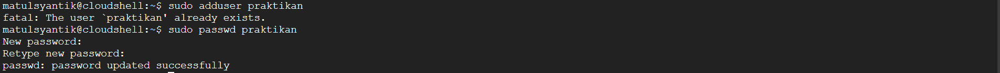
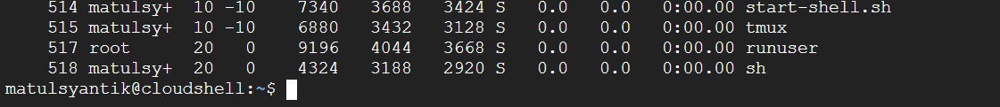
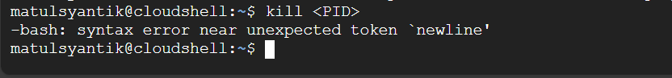

<<<<<<< HEAD
<<<<<<< HEAD
# Laporan Praktikum Minggu 4
Topik: Manajemen Proses dan User di Linux
=======
# Laporan Praktikum Minggu [4]
Topik: [Manajemen Proses dan User di Linux]
>>>>>>> fbd8316ebf0b48cd8652bea179300f780e5f8a29
=======
# Laporan Praktikum Minggu [4]
Topik: [Proses user]
>>>>>>> 4a10d10cc8320ad9a7866e6d4ecbc1d4ce45b3ae

---

## Identitas
<<<<<<< HEAD
<<<<<<< HEAD
- **Nama**  : Aster Rifani  
- **NIM**   : 250202915  
- **Kelas** : 1IKRB

---

## Tujuan 
> Menjelaskan konsep proses dan user dalam sistem operasi Linux.  
> Menampilkan daftar proses yang sedang berjalan dan statusnya.  
> Menggunakan perintah untuk membuat dan mengelola user.  
> Menghentikan atau mengontrol proses tertentu menggunakan PID.  
> Menjelaskan kaitan antara manajemen user dan keamanan sistem.  
=======
- **Nama**  : [Lutfi Khoerunnisa]  
- **NIM**   : [250202947]  
=======
- **Nama**  : [Ani Ngismatul Hawa]  
- **NIM**   : [250202914]  
>>>>>>> 4a10d10cc8320ad9a7866e6d4ecbc1d4ce45b3ae
- **Kelas** : [1IKRB]

---

## Tujuan
<<<<<<< HEAD
Tuliskan tujuan praktikum minggu ini.  
> Menjelaskan konsep proses dan user dalam sistem operasi Linux.
> Menampilkan daftar proses yang sedang berjalan dan statusnya.
> Menggunakan perintah untuk membuat dan mengelola user.
> Menghentikan atau mengontrol proses tertentu menggunakan PID.
> Menjelaskan kaitan antara manajemen user dan keamanan sistem.

>>>>>>> fbd8316ebf0b48cd8652bea179300f780e5f8a29
=======
>Menjelaskan konsep proses dan user dalam sistem operasi Linux.

>Menampilkan daftar proses yang sedang berjalan dan statusnya.

>Menggunakan perintah untuk membuat dan mengelola user.

>Menghentikan atau mengontrol proses tertentu menggunakan PID.

>Menjelaskan kaitan antara manajemen user dan keamanan sistem.
>>>>>>> 4a10d10cc8320ad9a7866e6d4ecbc1d4ce45b3ae

---

## Dasar Teori
<<<<<<< HEAD
<<<<<<< HEAD
Sistem operasi berperan sebagai penghubung antara pengguna dan perangkat keras komputer dengan mengelola sumber daya seperti prosesor, memori, serta perangkat input dan output. Salah satu fungsi utamanya adalah pengelolaan proses, yaitu entitas yang merepresentasikan program yang sedang dieksekusi beserta semua informasi yang diperlukan untuk menjalankannya. Setiap proses memiliki identitas unik dan dapat berada pada beberapa keadaan seperti berjalan, menunggu, atau berhenti. Mekanisme manajemen proses meliputi pembuatan, penjadwalan, komunikasi antarproses, serta penghentian proses untuk menjamin efisiensi dan stabilitas sistem.

Dalam lingkungan multiuser seperti Linux, sistem operasi juga menjalankan fungsi manajemen pengguna untuk memastikan keamanan dan keteraturan akses terhadap sumber daya. Setiap pengguna memiliki identitas berupa user ID dan group ID yang menentukan hak akses terhadap file, direktori, maupun layanan sistem. Pemisahan antara pengguna biasa dan administrator (root) diterapkan untuk mencegah penyalahgunaan wewenang dan menjaga integritas sistem. Melalui pengaturan hak akses dan otorisasi, sistem dapat membatasi tindakan pengguna terhadap komponen penting, sehingga tercipta lingkungan kerja yang aman dan terkendali.

Linux menyediakan berbagai perintah yang digunakan untuk memantau serta mengelola proses dan pengguna. Perintah `ps` menampilkan daftar proses yang sedang berjalan, `top` menampilkan aktivitas proses secara dinamis, dan `kill` digunakan untuk mengirim sinyal ke proses tertentu agar dihentikan. Selain itu, perintah `adduser` digunakan untuk menambahkan akun pengguna baru beserta pengaturan awalnya. Penggunaan perintah-perintah ini memungkinkan administrator untuk mengawasi kinerja sistem, mengatur prioritas proses, serta menjaga kestabilan operasi. Melalui kombinasi antara manajemen proses dan manajemen pengguna, sistem operasi Linux mampu menciptakan lingkungan yang efisien, aman, dan terstruktur dalam menjalankan berbagai aplikasi secara bersamaan.

=======
1. Model Proses (PID & Fork): Setiap program yang berjalan adalah Proses dengan PID unik. Proses baru dibuat secara hierarkis menggunakan fork() (duplikasi induk) dan exec() (memuat program baru), memastikan semua tugas diawasi oleh proses awal (systemd/init).
2. Manajemen Pengguna (UID & GID): Linux adalah sistem multi-user yang memisahkan sumber daya berdasarkan identitas numerik: UID (User ID) untuk pengguna dan GID (Group ID) untuk kelompok. Hal ini menjadi dasar untuk kontrol akses dan keamanan sistem.
3. Hak Akses (rwx): Keamanan file diatur oleh sistem izin, yang menentukan hak baca (r), tulis (w), dan eksekusi (x). Izin ini diterapkan secara terpisah untuk Pemilik, Grup, dan Lainnya, dan dikelola menggunakan perintah chmod dan chown.
>>>>>>> fbd8316ebf0b48cd8652bea179300f780e5f8a29
=======


Teori dasar tentang proses dalam sistem operasi Linux. Proses adalah program yang sedang berjalan dan memiliki identitas unik yang disebut PID (Process ID). Saat perintah sleep 1000 & dijalankan, sistem membuat proses baru di latar belakang, dan dengan perintah ps aux atau grep, kita bisa melihat informasi detail seperti pengguna, status, dan penggunaan sumber daya. Proses dapat berada dalam berbagai status seperti running (berjalan), sleeping (menunggu), stopped, atau zombie. Sistem operasi juga mengatur prioritas proses melalui nilai PR dan NI agar penggunaan CPU tetap efisien. Selain itu, Linux mendukung konsep multiuser dan multitasking, yaitu memungkinkan banyak pengguna dan proses berjalan bersamaan tanpa saling mengganggu. Melalui praktikum ini, kita memahami bagaimana sistem operasi mengelola dan memantau proses yang aktif di dalamnya.

Semua program diatur seperti silsilah keluarga (hierarki proses) di mana setiap proses memiliki nomor identitas unik (PID), seperti terlihat dari perintah pstree. Kedua, untuk berinteraksi atau mengontrol program (misalnya, menghentikannya menggunakan perintah kill), pengguna harus mengikuti aturan bahasa yang ketat (sintaks shell). Kesalahan saat mencoba kill membuktikan bahwa sistem tidak akan bekerja jika perintahnya tidak lengkap, menegaskan bahwa kontrol proses bergantung pada identitas unik (PID) dan format perintah yang benar.
>>>>>>> 4a10d10cc8320ad9a7866e6d4ecbc1d4ce45b3ae

---

## Langkah Praktikum
<<<<<<< HEAD
<<<<<<< HEAD
1. 1. **Setup Environment**
   - Menggunakan CloudShell.  
   - Memastikan sudah login sebagai user non-root.  
   - Menyiapkan folder kerja:
     ```
     praktikum/week4-proses-user/
     ```

2. **Eksperimen 1 – Identitas User**
   -  Menjalankan perintah berikut:
   `whoami`
   `id`
   `groups`
   - Menjelaskan setiap output dan fungsinya.  
   - Membuat user baru (jika memiliki izin sudo):
     `sudo adduser praktikan`
     `sudo passwd praktikan`
   - Uji login ke user baru.

3. **Eksperimen 2 – Monitoring Proses**
   - Menjalankan:
   `ps aux | head -10`
   `top -n 1`
   - Menjelaskan kolom penting seperti PID, USER, %CPU, %MEM, COMMAND.  
   - Menyimpan tangkapan layar `top` ke:
   `praktikum/week4-proses-user/screenshots/top.png`

4. **Eksperimen 3 – Kontrol Proses**
   - Menjalankan program latar belakang:
     `sleep 1000 &`
     `ps aux | grep sleep`
   - Mencatat PID proses `sleep`.  
   - Menghentikan proses:
     `kill <PID>`
   - Memastikan proses telah berhenti dengan `ps aux | grep sleep`.

5. **Eksperimen 4 – Analisis Hierarki Proses**
   - Menjalankan:
   `pstree -p | head -20`
   - Mengamati hierarki proses dan identifikasi proses induk (`init`/`systemd`).  
   - Mencatat hasilnya dalam laporan.

6. **Commit & Push**
   `git add .`
   `git commit -m "Minggu 4 - Manajemen Proses & User"`
   `git push origin main`
=======
1. melakukan usus buntu
2. mulai melakukan eksperimen 1 yaitu.whoami,id,groups
3. ekeperimen 2,yaitu ps aux | head -10,top -n 1
4. eksperimen 3,yaitu sleep 1000 &,ps aux | grep sleep
5. melakukan screnshoot hasil tersebut
6. mengerjakan tugas,quiz,serta kesimpulan
7. mengupload hasil week ke laporan md
>>>>>>> fbd8316ebf0b48cd8652bea179300f780e5f8a29
=======
1. Setup Environment

- Gunakan Linux (Ubuntu/WSL).
- Pastikan Anda sudah login sebagai user non-root.
- Siapkan folder kerja:
`praktikum/week4-proses-user/`
2. Eksperimen 1 –  Identitas User Jalankan perintah berikut:

`whoami
id
groups`

- Jelaskan setiap output dan fungsinya.
- Buat user baru (jika memiliki izin sudo):

`sudo adduser praktikan
sudo passwd praktikan` 
- Uji login ke user baru.
3. Eksperimen 2 – Monitoring Proses Jalankan:

`ps aux | head -10
top -n 1`

Jelaskan kolom penting seperti `PID, USER, %CPU, %MEM, COMMAND.`
- Simpan tangkapan layar `top `ke:
`praktikum/week4-proses-user/screenshots/top.png`
4. Eksperimen 3 – Kontrol Proses

- Jalankan program latar belakang:

`sleep 1000 &
ps aux | grep sleep`

- Catat PID proses sleep.
Hentikan proses:

`Kill <PID>`

- Pastikan proses telah berhenti dengan `ps aux | grep sleep.`

5. Eksperimen 4 – Analisis Hierarki Proses Jalankan:

`pstree -p | head -20`

- Amati hierarki proses dan identifikasi proses induk `(init/systemd).`
- Catat hasilnya dalam laporan.
Commit & Push

`git add .
git commit -m "Minggu 4 - Manajemen Proses & User"
git push origin main`

>>>>>>> 4a10d10cc8320ad9a7866e6d4ecbc1d4ce45b3ae

---

## Kode / Perintah
<<<<<<< HEAD
<<<<<<< HEAD
- Hasil observasi seluruh perintah dimasukkan ke dalam `laporan.md`.  
- Screenshot hasil eksekusi disimpan di folder `screenshots/`.  
- Laporan lengkap tersimpan di `laporan.md`. 
- Eksperimen 1 :  `whoami`
                  `id`
                  `groups`
                  `sudo adduser praktikan`
                  `sudo passwd praktikan`
- Eksperimen 2 :  `ps aux | head -10`
                  `top -n 1`
   Menyimpan tangkapan layar `top` ke:
   `praktikum/week4-proses-user/screenshots/top.png`
- Eksperimen 3 :  `sleep 1000 &`
                  `ps aux | grep sleep`
                  `kill <PID>`
                  `ps aux | grep sleep`
- Eksperimen 4 :  `pstree -p | head -20`
- Commit & Push : `git add .`
                  `git commit -m "Minggu 4 - Manajemen Proses & User"`
                  `git push origin main`
=======
Tuliskan potongan kode atau perintah utama:
- Hasil observasi seluruh perintah dimasukkan ke dalam `laporan.md.`

- Screenshot hasil eksekusi disimpan di folder `screenshots/.`

- laporan lengkap tersimpan di `laporan.md.`
- Semua hasil telah di-commit ke GitHub tepat waktu.
# Eksperimen 1
`whoami
id
groups`

`sudo adduser praktikan
sudo passwd praktikan`

# Eksperimen 2
`ps aux | head -10
top -n 1`

# Eksperimen 3
`Sleep 1000 &
ps aux | grep sleep`
`kill <PID>`

# Eksperimen 4
`pstree -p | head -20`
>>>>>>> 4a10d10cc8320ad9a7866e6d4ecbc1d4ce45b3ae

---

## Hasil Eksekusi
1. Eksperimen 1 – Identitas User

  * Menjalankan Perintah `whoami`,`id`,& `groups`
   

   a. `whoami` : 

         - Output : asterrifani0624
         - Fungsi : memastikan identitas user aktif terutama ketika bekerja dengan hak akses berbeda (misalnya setelah menggunakan `sudo` atau `su`).

   b. `id` : 

         - Output : uid=1000(asterrifani0624) gid=1000(asterrifani0624) groups=1000(asterrifani0624),4(adm),27(sudo),996(docker)
         - Fungsi : untuk mengecek hak akses dan grup 
         keanggotaan seorang user di sistem.

   c. `groups` :

         - Output : asterrifani0624 adm sudo docker 
         - Fungsi :  menampilkan daftar grup yang dimiliki oleh user saat ini dalam format lebih sederhana dibanding `id`.
   * Membuat User Baru 
   

      Percobaan selanjutnya adalah menambahkan pengguna baru dengan nama praktikan menggunakan perintah berikut:
      `sudo adduser praktikan`
      Sistem kemudian menampilkan proses penambahan user baru, termasuk pembuatan grup baru dengan nama yang sama, penentuan UID/GID, serta permintaan pengisian password dan data tambahan seperti nama lengkap dan nomor telepon.
      Setelah proses selesai, user praktikan berhasil ditambahkan ke sistem dengan direktori home /home/praktikan.
      Untuk mengatur atau mengganti password user tersebut dapat digunakan perintah:
      `sudo passwd praktikan`
   * Uji Login User Baru

      Setelah user baru berhasil dibuat, dilakukan pengujian login menggunakan perintah:
      `$ su - praktikan`
      Jika login berhasil, prompt terminal akan berubah menjadi:
      `praktikan@cloudshell:-$`
      Hal ini menandakan bahwa sesi telah berpindah ke akun praktikan, dengan direktori home dan lingkungan kerja yang terpisah dari user sebelumnya.

2. Eksperimen 2 – Monitoring Proses

   * Penjelasan kolom penting seperti PID, USER, %CPU, %MEM, COMMAND.   

   | Kolom | Arti/Fungsi |
   | :--- | ---  |
   | PID	 |Identitas unik proses yang diberikan oleh kernel. Proses dengan PID kecil seperti 1 (bash) dan 9 (syslogd) biasanya merupakan proses sistem yang berjalan sejak awal.|
   | USER |Menunjukkan pemilik proses, misalnya root untuk proses sistem, dan asterri+ untuk proses milik pengguna biasa.|
   | %CPU |Menampilkan persentase penggunaan CPU oleh proses. Nilai 0.0 menunjukkan proses tidak sedang aktif menggunakan CPU.|
   | %MEM |	Menampilkan persentase penggunaan memori fisik (RAM). Semakin besar nilainya, semakin banyak sumber daya yang digunakan.|
   | COMMAND |	Menunjukkan nama program atau perintah yang dijalankan, seperti bash, dockerd, containerd, atau node.|
   * Tangkapan Layar top n- 1
   

3. Eksperimen 3 -  Kontrol Proses

   

   Proses sleep dengan `PID 1364` berhasil dijalankan di latar belakang dan dapat diverifikasi keberadaannya menggunakan kombinasi perintah `ps` dan `grep`. Hal ini menunjukkan bahwa sistem Linux memberikan fasilitas bagi pengguna untuk menjalankan dan memantau proses secara paralel tanpa mengganggu aktivitas terminal utama.
   Perintah `kill` merupakan salah satu mekanisme dasar kontrol proses di Linux. Dengan menggunakan PID sebagai identitas unik, pengguna dapat menghentikan proses tertentu tanpa memengaruhi proses lain yang sedang berjalan.
   Secara default, `kill` mengirimkan sinyal SIGTERM, namun jika proses tidak merespons, pengguna dapat menggunakan sinyal lain seperti:
   `kill -9 <PID>` → mengirim sinyal SIGKILL, menghentikan proses secara paksa.
   `kill -15 <PID>` → sinyal default untuk penghentian normal.
   Setelah menjalankan `kill 1364`, proses `sleep 1000` berhenti dengan normal, terbukti dari pesan “Terminated” dan tidak munculnya lagi proses tersebut pada hasil `ps aux | grep sleep`.

4. Eksperimen 4 – Analisis Hierarki Proses
   
```   
 systemd(1)
├─ sshd(502)
│  └─ bash(508)
│     └─ pstree(1360)
├─ cron(300)
├─ dbus-daemon(250)
├─ dockerd(248)
│  └─ containerd(303)
└─ systemd-journald(170)
```
   Perintah `pstree -p` menampilkan hierarki proses dalam bentuk pohon.
   Dari hasil percobaan, dapat diidentifikasi bahwa:
   * Proses utama (induk) pada sesi Cloud Shell ini adalah `bash(1)`.
   * Beberapa proses turunan penting seperti `dockerd`, `containerd`, `python`, dan `node` berperan dalam menjalankan layanan sistem dan editor.
=======
Tuliskan potongan kode atau perintah utama:
```bash
whoami
id
groups
```
```bash
ps aux | head -10
top -n 1
```
```bash
sleep 1000 &
ps aux | grep sleep
kill <PID>
```
```bash
pstree -p | head -20
```
---

## Hasil Eksekusi
Sertakan screenshot hasil percobaan atau diagram:
<<<<<<< HEAD

.png)
.png)
.png)
.png)
>>>>>>> fbd8316ebf0b48cd8652bea179300f780e5f8a29
=======










# 1. Eksperimen 1 

|Perintah|Fungsi|Output|
|--------|------|-----|
|`whoami`|Menampilkan nama pengguna (username) yang sedang aktif di shell saat ini|`matulsyantik`|
|`id`|Menampilkan informasi identitas pengguna, termasuk:`UID (User ID)`, `GID (Group ID)`, `Groups` (kelompok yang diikuti user)| `uid=1000(matulsyantik) gid=1000(matulsyantik) groups=1000(matulsyantik),4(adm),27(sudo),996(docker)`|
|`groups`|Menampilkan daftar grup yang diikuti oleh pengguna saat ini.|`matulsyantik adm sudo docker`| 

# 2. Eksperimen 2

|Kolom|Keterangan|
|-----|----------|
|PID|menunjukkan nomor unik proses|
|USER|menunjukkan siapa yang menjalankan prosesnya|
|%CPU|Menunjukkan seberapa besar penggunaan prosesor oleh proses tersebut. Nilainya dalam persen (%). Semakin tinggi nilainya, semakin besar beban CPU dari proses itu.|
|%MEM|Menunjukkan berapa persen memori RAM yang digunakan oleh proses tersebut. Ini membantu mengetahui proses mana yang paling banyak memakai memori.|
|COMMAND|menampilkan nama program yang dijalankan.|

# 3. Eksperimen 3

`sleep 1000 &` Perintah ini menjalankan program sleep selama 1000 detik di background (ditandai dengan tanda &).
Sistem kemudian menampilkan [1] 1397, yang berarti ini adalah job number 1 dengan PID (Process ID) 1397. PID ini adalah identitas unik dari proses sleep yang baru saja dibuat.

`ps aux | grep sleep` Perintah ini menampilkan semua proses yang sedang berjalan (ps aux) dan memfilter hasilnya hanya yang berisi kata “sleep” menggunakan grep.

`kill <PID>`
Perintah kill digunakan untuk mengirimkan sinyal kepada sebuah proses, biasanya untuk mengakhirinya. <PID> adalah Placeholder yang seharusnya diganti dengan Process ID (ID Proses) yang valid dari proses yang ingin dihentikan.

`pstree -p | head -20`
Dalam sistem Linux, semua proses, pada akhirnya, adalah turunan dari satu proses induk utama yang dikenal sebagai proses init atau systemd (PID 1).
Dalam lingkungan Linux tradisional, proses dengan PID 1 secara historis adalah proses init (seperti SysVinit, upstart, atau yang paling umum saat ini, systemd). Proses inilah yang pertama kali dijalankan oleh kernel dan merupakan "induk" dari semua proses lain di sistem.

# Diagram Pohon

```
bash(1)

├─ dockerd(247)
│  ├─ containerd(286)
│  │  ├─ {containerd}(299)
│  │  ├─ {containerd}(300)
│  │  ├─ {containerd}(301)
│  │  ├─ {containerd}(303)
│  │  ├─ {containerd}(304)
│  │  └─ {containerd}(307)
│  ├─ {dockerd}(245)
│  ├─ {dockerd}(255)
│  ├─ {dockerd}(256)
│  ├─ {dockerd}(257)
│  ├─ {dockerd}(265)
│  ├─ {dockerd}(270)
│  ├─ {dockerd}(309)
│  ├─ {dockerd}(308)
│  └─ {dockerd}(25906)
│
├─ logger(26)
│
└─ python(25)
   ├─ editor-proxy(289)
   │  └─ runuser(517)
   │     └─ sh(518)
   │        └─ node(535)
   │           ├─ node(1259)
   │           │  └─ cloudcode_cli(1325)
   │           │     ├─ {cloudcode_cli}(…)
   │           │     ├─ {cloudcode_cli}(…)
   │           │     └─ {cloudcode_cli}(…)

```
>>>>>>> 4a10d10cc8320ad9a7866e6d4ecbc1d4ce45b3ae

---

## Analisis
<<<<<<< HEAD
<<<<<<< HEAD
   1. Identitas User
   
   Perintah `whoami`, `id`, dan `groups` menunjukkan bahwa pengguna aktif adalah `asterrifani0624`.
   `id` memberikan informasi lengkap tentang UID, GID, dan grup yang dimiliki user, sedangkan groups menyajikan daftar grup secara lebih ringkas.
   Penambahan user baru (praktikan) berhasil dilakukan dan dapat diuji melalui perintah `su - praktikan`, menandakan sistem memberikan kontrol penuh terhadap hak akses dan sesi pengguna.

   2. Monitoring Proses
   
   Kolom penting seperti PID, USER, %CPU, %MEM, dan COMMAND membantu memantau aktivitas proses di sistem.
   PID kecil biasanya menunjukkan proses sistem, sedangkan proses yang dijalankan pengguna memiliki PID lebih besar.
   Monitoring proses memberikan informasi tentang konsumsi sumber daya sistem (CPU dan RAM) serta kepemilikan proses.

   3. Kontrol Proses
   
   Sistem Linux memungkinkan pengguna menjalankan proses di latar belakang (`sleep`) dan memantau keberadaannya.
   Perintah `kill` memungkinkan penghentian proses baik secara normal (`SIGTERM`) maupun paksa (`SIGKILL`).
   Hal ini menunjukkan kemampuan manajemen proses secara fleksibel tanpa mengganggu aktivitas terminal utama.

   4. Hierarki Proses

   Perintah `pstree -p` menampilkan hubungan induk-anak antarproses.
   Di Cloud Shell, proses induk utama adalah `bash(1)` sementara proses turunan meliputi `dockerd`, `containerd`, `python`, dan `node`.
   Struktur ini berbeda dengan sistem Linux lokal, yang biasanya memiliki `systemd(1 se)`bagai proses induk.Analisis hierarki proses membantu memahami alur eksekusi proses dan interaksi antarproses di lingkungan Linux.
=======
- Jelaskan hubungan antara user management dan keamanan sistem Linux.

> User management dan keamanan sistem Linux saling berhubungan karena pengaturan pengguna membantu melindungi sistem. Setiap pengguna punya akun dan izin sendiri untuk mengakses file atau menjalankan perintah. Dengan begitu, hanya pengguna tertentu (seperti root) yang bisa mengubah bagian penting sistem. Pembagian pengguna dan grup juga membuat izin lebih mudah diatur dan aktivitas bisa diawasi. Jadi, pengelolaan pengguna yang baik membantu mencegah akses ilegal dan menjaga sistem tetap aman.

Dari praktikum ini, bisa disimpulkan bahwa sistem operasi Linux memiliki cara yang teratur dalam mengelola proses dan pengguna. Saat perintah sleep 1000 & dijalankan, sistem membuat proses baru di latar belakang dengan PID tertentu, yang menunjukkan bagaimana Linux memberi identitas unik untuk setiap proses. Melalui perintah seperti ps aux dan grep, kita dapat memantau proses, melihat siapa penggunanya, serta mengetahui statusnya. Hal ini menunjukkan bahwa Linux tidak hanya mengatur jalannya proses, tetapi juga menjaga keamanan dengan membatasi hak akses tiap pengguna. Jadi, praktikum ini memperlihatkan hubungan antara manajemen proses dan manajemen pengguna dalam menjaga sistem tetap teratur dan aman.

Praktikum ini juga menganalisis dua interaksi penting di Linux: melihat struktur program dan mencoba mengontrolnya. Analisis pohon proses (pstree) berhasil menunjukkan bahwa sistem menjalankan layanan kontainer (dockerd) dan alat pengembangan (cloudcode_cli) dalam hierarki yang terstruktur berdasarkan ID unik (PID). Sementara itu, percobaan kontrol (kill) gagal karena pengguna melanggar aturan bahasa terminal (sintaks), yang menunjukkan bahwa kontrol sistem bergantung pada penargetan PID yang tepat dan penggunaan perintah yang benar. Intinya, praktikum ini adalah tentang identifikasi proses sebagai langkah pertama menuju kontrol sistem yang berhasil.
>>>>>>> 4a10d10cc8320ad9a7866e6d4ecbc1d4ce45b3ae

---

## Kesimpulan
<<<<<<< HEAD
   Berdasarkan percobaan yang dilakukan, dapat disimpulkan bahwa Linux memberikan kemampuan yang baik untuk mengelola identitas pengguna, memantau, dan mengontrol proses. Pengguna aktif dapat diverifikasi menggunakan perintah `whoami`, `id`, dan `groups`, serta sistem memungkinkan penambahan user baru dengan hak akses yang terkontrol. Monitoring proses memperlihatkan penggunaan sumber daya seperti CPU dan memori, sedangkan perintah `kill` memungkinkan penghentian proses secara normal maupun paksa. Analisis hierarki proses melalui `pstree` menunjukkan hubungan induk-anak antarproses, di mana di Cloud Shell proses induk utama adalah `bash(1)`, sementara di Linux lokal biasanya `systemd(1)`. Secara keseluruhan, percobaan ini menunjukkan bahwa Linux menyediakan lingkungan yang transparan, fleksibel, dan efisien dalam manajemen user dan proses.
=======
- Jelaskan setiap output dan fungsinya.
- Jelaskan kolom penting seperti PID, USER, %CPU, %MEM, COMMAND. 
- Jalankan program latar belakang
- Amati hierarki proses dan identifikasi proses induk (init/systemd).

---

## Tugas
1. [Dokumentasikan hasil semua perintah dan jelaskan fungsi tiap perintah.]
   **Jawaban:**
2. [Gambarkan hierarki proses dalam bentuk diagram pohon (pstree) di laporan.]
   **Jawaban: .png)
3. [Jelaskan hubungan antara user management dan keamanan sistem Linux.]
   **Jawaban:Hubungan antara manajemen pengguna (user management) dan keamanan sistem Linux bersifat integral, di mana manajemen pengguna berfungsi sebagai fondasi untuk mengimplementasikan kontrol akses dan akuntabilitas. Dengan menciptakan identitas unik untuk setiap pengguna dan mengelompokkannya (melalui grup), sistem dapat secara ketat menerapkan Prinsip Hak Akses Paling Kecil (PoLP), memastikan setiap orang hanya memiliki izin minimum yang diperlukan, dan secara khusus membatasi penggunaan akun superuser (root) untuk tugas sehari-hari melalui mekanisme seperti sudo. Pengaturan izin file (chmod/chown), otentikasi kata sandi yang kuat, dan pencatatan aktivitas yang terikat pada ID pengguna tertentu memungkinkan administrator untuk mengisolasi sumber daya sistem, melacak semua tindakan, dan merespons pelanggaran keamanan secara efektif.**
4. [Upload laporan ke repositori Git tepat waktu.]
   **Jawaban:**
>>>>>>> fbd8316ebf0b48cd8652bea179300f780e5f8a29
=======
 Linux bisa mengatur proses dan pengguna dengan baik agar sistem tetap aman dan stabil. Setiap proses punya nomor unik (PID) dan bisa dicek dengan perintah seperti ps aux. Pengaturan hak akses juga memastikan hanya pengguna tertentu yang bisa mengubah bagian penting sistem.
 Praktikum ini menegaskan bahwa untuk mengelola sistem Linux, kita harus terlebih dahulu memahami hierarki program yang berjalan (pstree) untuk mendapatkan ID unik (PID) mereka. Upaya untuk menghentikan program (kill) yang gagal menunjukkan bahwa kontrol hanya bisa dilakukan jika kita menggunakan PID yang benar dan mengikuti aturan bahasa terminal (sintaks) secara persis. Singkatnya, identifikasi yang benar adalah kunci untuk kontrol sistem yang berhasil.
>>>>>>> 4a10d10cc8320ad9a7866e6d4ecbc1d4ce45b3ae

---

## Quiz
<<<<<<< HEAD
<<<<<<< HEAD
1. Apa fungsi dari proses `init` atau `systemd` dalam sistem Linux? 
=======
1. Apa fungsi dari proses init atau systemd dalam sistem Linux?  
   **Jawaban:**  

   Proses **init** atau **systemd** berfungsi sebagai proses pertama yang berjalan saat Linux dinyalakan. Ia mengatur dan menjalankan semua layanan penting sistem, memantau proses lain, serta memastikan sistem berjalan dengan benar dari awal hingga dimatikan.

2. Apa perbedaan antara kill dan killall? 
>>>>>>> 4a10d10cc8320ad9a7866e6d4ecbc1d4ce45b3ae
   **Jawaban:**  
   Proses `init` atau `systemd` adalah proses pertama yang dijalankan oleh kernel saat booting dan memiliki PID 1. Fungsi utamanya adalah menjadi induk dari semua proses lain di sistem, memulai layanan-layanan sistem, mengatur runlevel atau target, serta menangani proses-proses daemon. `systemd` merupakan versi modern dari `init` yang menyediakan manajemen layanan lebih efisien, parallel startup, logging terintegrasi, dan kontrol proses yang lebih baik.
2. Apa perbedaan antara `kill` dan `killall`?  
   **Jawaban:**   
   * `kill` digunakan untuk mengirim sinyal ke proses tertentu berdasarkan `PID`. Contohnya: `kill 1234` mengirim sinyal ke proses dengan `PID 1234`.
   * `killall` digunakan untuk mengirim sinyal ke semua proses yang memiliki nama tertentu. Contohnya: `killall firefox` menghentikan semua proses dengan nama firefox sekaligus
3. Mengapa user `root` memiliki hak istimewa di sistem Linux? 
   **Jawaban:** 
    User `root` memiliki hak istimewa karena merupakan administrator sistem. Root dapat mengakses semua file, mengubah konfigurasi sistem, menginstal atau menghapus program, serta menjalankan perintah yang dibatasi untuk user biasa. Hak istimewa ini diperlukan agar sistem dapat dikelola secara penuh dan aman, namun penggunaannya harus hati-hati untuk mencegah kerusakan sistem atau risiko keamanan.

<<<<<<< HEAD
=======
1. [Apa fungsi dari proses init atau systemd dalam sistem Linux?]  
   **Jawaban:Fungsi utama dari proses init (atau penggantinya yang modern, systemd) dalam sistem Linux adalah sebagai proses pertama (PID 1) yang dijalankan oleh kernel. Fungsi ini membuatnya menjadi manajer sistem dan manajer layanan utama yang bertanggung jawab atas inisialisasi, pengawasan, dan penghentian semua proses dan layanan lainnya di sistem.**  
2. [Apa perbedaan antara kill dan killall?]  
   **Jawaban:Perbedaan antara kill dan killall terletak pada cara mereka menargetkan proses di Linux: perintah kill adalah alat yang sangat spesifik dan akurat, karena hanya dapat mengirim sinyal (seperti SIGTERM atau SIGKILL) ke satu atau beberapa Proses ID (PID) tertentu, yang merupakan nomor unik untuk setiap proses yang sedang berjalan. Sebaliknya, perintah killall bersifat massal, karena ia menargetkan dan mengirim sinyal ke semua instans proses yang memiliki nama perintah (process name) yang sama persis, menjadikannya cepat dan praktis untuk menghentikan seluruh aplikasi atau layanan yang memiliki banyak proses anak, namun lebih berisiko jika ada proses lain dengan nama yang serupa.**  
3. [Mengapa user root memiliki hak istimewa di sistem Linux?]  
   **Jawaban:Pengguna root memiliki hak istimewa (privileges) tertinggi di sistem Linux karena mereka adalah Superuser atau administrator sistem yang dirancang untuk memiliki kontrol absolut atas kernel, sistem berkas, dan semua proses yang berjalan.**  
 
>>>>>>> fbd8316ebf0b48cd8652bea179300f780e5f8a29
=======
   Perintah **`kill`** menghentikan proses berdasarkan **nomor PID**, sedangkan **`killall`** menghentikan **semua proses dengan nama yang sama**.

3. Mengapa user root memiliki hak istimewa di sistem Linux?
   **Jawaban:** 

    User **root** punya hak istimewa karena dia adalah **admin utama** di Linux. Root bisa mengubah apa pun di sistem, termasuk file dan pengaturan, supaya bisa mengelola dan memperbaiki sistem sepenuhnya.


>>>>>>> 4a10d10cc8320ad9a7866e6d4ecbc1d4ce45b3ae
---


## Kesimpulan
1. Manajemen Akses Berpusat pada Keamanan (Root & Users) 
Sistem Linux membagi kontrol menjadi hierarki yang ketat: pengguna biasa beroperasi di bawah Prinsip Hak Akses Paling Kecil untuk menjaga keamanan dan akuntabilitas, sementara akun root adalah administrator absolut yang dapat mengabaikan semua izin untuk melakukan tugas-tugas kritis. Praktik modern mendorong penggunaan sudo sebagai pengganti login langsung ke root untuk mengendalikan hak istimewa secara temporer dan tercatat, yang merupakan mekanisme penting untuk mencegah kerusakan sistem dan kompromi keamanan.

2. Systemd sebagai Jantung Operasional (PID 1) 
systemd (atau pendahulunya, init) adalah proses pertama yang dijalankan oleh kernel (PID 1) dan bertindak sebagai manajer sistem utama. Fungsinya mencakup inisialisasi sistem saat booting, pengelolaan perangkat keras, dan yang terpenting, menjalankan, mengawasi, dan mempertahankan semua layanan (daemon) sistem. Keunggulan systemd modern adalah kemampuannya untuk memulai layanan secara paralel, sehingga mempercepat waktu booting, serta menyediakan alat terpadu (systemctl) untuk kontrol.

3. Kontrol Proses yang Tepat atau Massal (kill vs. killall) 
Untuk manajemen proses yang sedang berjalan, sistem menyediakan dua alat utama yang berbeda dalam penargetannya: perintah kill digunakan untuk mengirim sinyal (seperti penghentian normal SIGTERM atau penghentian paksa SIGKILL) ke Proses ID (PID) unik dari satu atau beberapa proses tertentu, memastikan ketepatan. Sebaliknya, killall digunakan untuk mengirim sinyal secara massal ke SEMUA proses yang cocok dengan nama perintahnya, memberikan kemudahan saat menghentikan seluruh aplikasi yang memiliki banyak instans.


## Refleksi Diri
Tuliskan secara singkat:
<<<<<<< HEAD
<<<<<<< HEAD
- Apa bagian yang paling menantang minggu ini? 
   laptop yang rusak.
- Bagaimana cara Anda mengatasinya?
   ganti laptop baru.
=======
- Apa bagian yang paling menantang minggu ini?  
 **Menjalankan WSL**
- Bagaimana cara Anda mengatasinya?  
 **Mencoba**
>>>>>>> fbd8316ebf0b48cd8652bea179300f780e5f8a29
=======
- Apa bagian yang paling menantang minggu ini? 
Saat menggunakan Linux atau Cloudshell, sempat beberapa error karena sudah pernah digunakan sebelumnya 
- Bagaimana cara Anda mengatasinya?  
Menggunakan akun lain agar bisa terdeteksi
>>>>>>> 4a10d10cc8320ad9a7866e6d4ecbc1d4ce45b3ae

---

**Credit:**  
_Template laporan praktikum Sistem Operasi (SO-202501) – Universitas Putra Bangsa_
