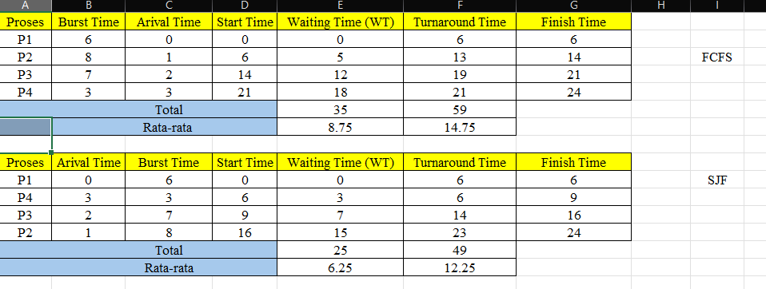

<<<<<<< HEAD
<<<<<<< HEAD
# Laporan Praktikum Minggu 5
Topik: Penjadwalan CPU – FCFS dan SJF
=======
# Laporan Praktikum Minggu [5]
Topik: [Penjadwalan CPU – FCFS dan SJF]
>>>>>>> fbd8316ebf0b48cd8652bea179300f780e5f8a29
=======
# Laporan Praktikum Minggu [5]
Topik: Penjadwalan CPU – FCFS dan SJF
>>>>>>> 4a10d10cc8320ad9a7866e6d4ecbc1d4ce45b3ae

---

## Identitas
<<<<<<< HEAD
<<<<<<< HEAD
- **Nama**  : Aster Rifani  
- **NIM**   : 250202915  
- **Kelas** : 1IKRB

---

## Tujuan  
=======
- **Nama**  : [Lutfi Khoeruniisa]  
- **NIM**   : [250202947]  
- **Kelas** : [1IKRB]
=======
- **Nama**  : Ani Ngismatul Hawa  
- **NIM**   : 250202914
- **Kelas** : 1IKRB
>>>>>>> 4a10d10cc8320ad9a7866e6d4ecbc1d4ce45b3ae

---

## Tujuan
<<<<<<< HEAD
Tuliskan tujuan praktikum minggu ini.  
>>>>>>> fbd8316ebf0b48cd8652bea179300f780e5f8a29
> Menghitung waiting time dan turnaround time untuk algoritma FCFS dan SJF.

> Menyajikan hasil perhitungan dalam tabel yang rapi dan mudah dibaca.

> Membandingkan performa FCFS dan SJF berdasarkan hasil analisis.

> Menjelaskan kelebihan dan kekurangan masing-masing algoritma.

> Menyimpulkan kapan algoritma FCFS atau SJF lebih sesuai digunakan.
=======

1. Menghitung waiting time dan turnaround time untuk algoritma FCFS dan SJF.
2. Menyajikan hasil perhitungan dalam tabel yang rapi dan mudah dibaca.
3. Membandingkan performa FCFS dan SJF berdasarkan hasil analisis.
4. Menjelaskan kelebihan dan kekurangan masing-masing algoritma.
5. Menyimpulkan kapan algoritma FCFS atau SJF lebih sesuai digunakan.
>>>>>>> 4a10d10cc8320ad9a7866e6d4ecbc1d4ce45b3ae

---

## Dasar Teori
<<<<<<< HEAD
<<<<<<< HEAD
Penjadwalan CPU (CPU Scheduling) merupakan proses penentuan urutan eksekusi berbagai proses yang berada dalam antrian siap (ready queue). Tujuan utama dari penjadwalan ini adalah untuk mengoptimalkan penggunaan prosesor serta meningkatkan kinerja sistem secara keseluruhan, seperti meminimalkan waktu tunggu (waiting time), waktu penyelesaian (turnaround time), dan waktu respons. Dalam sistem multiprogramming, penjadwalan CPU menjadi sangat penting karena beberapa proses dapat berada pada status siap secara bersamaan, sehingga sistem operasi harus menentukan proses mana yang dieksekusi terlebih dahulu berdasarkan kebijakan tertentu.

Salah satu algoritma penjadwalan yang paling sederhana adalah First Come First Served (FCFS), di mana proses dieksekusi sesuai urutan kedatangannya. FCFS bersifat non-preemptive sehingga proses yang sudah berjalan tidak dapat dihentikan sebelum selesai. Selain itu, terdapat algoritma Shortest Job First (SJF) yang memilih proses dengan waktu eksekusi (burst time) paling singkat untuk dijalankan terlebih dahulu. SJF dapat meningkatkan efisiensi sistem karena mampu meminimalkan rata-rata waktu tunggu, namun memiliki kelemahan yaitu kemungkinan terjadinya starvation pada proses dengan burst time yang panjang. Kedua algoritma ini menjadi dasar pemahaman dalam studi penjadwalan CPU sebelum mempelajari algoritma yang lebih kompleks seperti Priority Scheduling dan Round Robin.
=======
1. FCFS (First-Come, First-Served)
FCFS adalah algoritma penjadwalan non-preemptive yang paling sederhana, di mana CPU diberikan kepada proses yang pertama kali tiba di antrian siap (prinsip FIFO). Meskipun mudah diimplementasikan, kelemahan utamanya adalah rentan terhadap Efek Konvoi (Convoy Effect): jika proses yang sangat lama tiba di awal, semua proses singkat yang datang setelahnya harus menunggu hingga proses lama tersebut selesai, yang secara signifikan meningkatkan waktu tunggu rata-rata sistem.

2. SJF (Shortest Job First)
SJF adalah algoritma penjadwalan yang memilih proses dengan burst time (waktu eksekusi CPU) terkecil berikutnya dari antrian siap, dan dikenal sebagai algoritma optimal karena menghasilkan waktu tunggu rata-rata minimum. SJF dapat diimplementasikan sebagai non-preemptive, atau preemptive (dikenal sebagai SRTF), tetapi masalah utamanya adalah implementasi idealnya sulit karena sistem operasi harus memprediksi atau mengetahui secara akurat berapa lama proses akan berjalan di masa depan.

3. Perbedaan Kunci dan Tujuan Optimal
Perbedaan mendasar antara keduanya terletak pada kriteria pemilihan: FCFS memilih berdasarkan waktu kedatangan untuk memastikan keadilan sequential, sementara SJF memilih berdasarkan durasi burst time untuk mencapai optimasi kinerja (waktu tunggu terpendek). Eksperimen penjadwalan bertujuan membandingkan metrik seperti waktu tunggu, turnaround time, dan throughput untuk menunjukkan bagaimana kebijakan berbasis urutan (FCFS) cenderung menghasilkan kinerja yang lebih buruk dibandingkan kebijakan berbasis prioritas durasi (SJF).
>>>>>>> fbd8316ebf0b48cd8652bea179300f780e5f8a29
=======
- CPU

CPU adalah otak utama komputer yang bertugas menjalankan perintah dan mengolah data dari perangkat lunak. Semua proses dalam komputer, seperti menjalankan program, menghitung data, dan mengatur aliran informasi, dilakukan oleh CPU.
- FCFS (First Come, First Served)

FCFS adalah algoritma penjadwalan yang mengeksekusi proses berdasarkan urutan kedatangannya. Proses yang datang lebih dulu akan dijalankan lebih dulu tanpa bisa diganggu sebelum selesai. Cara ini sederhana dan bekerja seperti sistem antrian, namun bisa membuat proses yang datang belakangan menunggu lama jika proses pertama berjalan lama.

- SJF (Shortest Job First)

SJF adalah algoritma yang memilih proses dengan waktu eksekusi paling singkat untuk dijalankan lebih dulu. Tujuannya agar waktu tunggu semua proses jadi lebih efisien. Algoritma ini bisa bersifat non-preemptive atau preemptive (SRTF), tergantung apakah proses yang sedang berjalan bisa digantikan oleh proses baru yang lebih pendek.
>>>>>>> 4a10d10cc8320ad9a7866e6d4ecbc1d4ce45b3ae

---

## Langkah Praktikum
<<<<<<< HEAD
<<<<<<< HEAD
1. **Menyiapkan Data Proses** Gunakan tabel proses berikut sebagai contoh (boleh dimodifikasi dengan data baru):

| Proses | Burst Time | Arrival Time |
|--------|------------|--------------|
|   P1   |      6     |       0      |
|   P2   |      8     |       1      |
|   P3   |      7     |       2      |
|   P4   |      3     |       3      |
2. Eksperimen 1 – FCFS (First Come First Served)
   - Mengurutkan proses berdasarkan *Arrival Time*.
   - Menghitung nilai berikut untuk tiap proses :
   
   ```
   Waiting Time (WT) = waktu mulai eksekusi - Arrival Time
   Turnaround Time (TAT) = WT + Burst Time
   ```
   - Menghitung rata-rata *Waiting Time* dan *Turnaround Time*.
   - Membuat Gantt Chart sederhana :
    ```
   | P1 | P2 | P3 | P4 |
   0    6    14   21   24
   ```
3. Eksperimen 2 – SJF (Shortest Job First)
   - Mengurutkan proses berdasarkan *Burst Time* terpendek (dengan memperhatikan waktu kedatangan).
   - Melakukan perhitungan WT dan TAT seperti langkah sebelumnya.
   - Membandingkan hasil FCFS dan SJF dengan tabel berikut:

   | **Algoritma** | **Avg Waiting Time** | **Avg Turnaround Time** | **Kelebihan** | **Kekurangan** |
   |---|---|---|---|---|
   | FCFS | ... |...| Sederhana dan mudah diterapkan | Tidak efisien untuk proses panjang |
   | SJF | ... | ... | Optimal untuk job pendek | Menyebabkan *starvation* pada job panjang |
4. Eksperimen 3 – Visualisasi Spreadsheet (Opsional)

   - Menggunakan Excel/Google Sheets untuk membuat perhitungan otomatis:

      ~ Kolom: Arrival, Burst, Start, Waiting, Turnaround, Finish.

      ~ Menggunakan formula dasar penjumlahan/subtraksi.
   - Screenshot hasil perhitungan dan simpan di :
    ```
    praktikum/week5-scheduling-fcfs-sjf/screenshots/
    ```
5. Analisis
   - Membandingkan hasil rata-rata WT dan TAT antara FCFS & SJF.
   - Menjelaskan kondisi kapan SJF lebih unggul dari FCFS dan sebaliknya.
   - Menambahkan kesimpulan singkat di akhir laporan.
6. Commit & Push
   ```
   git add .
   git commit -m "Minggu 5 - CPU Scheduling FCFS & SJF"
   git push origin main
   ```
=======
1. Siapkan data proses dengan menggunakan tabel excel
2. Melakukan eksperimen pertama yaitu Urutkan proses berdasarkan Arrival Time,Hitung nilai berikut untuk tiap proses.Hitung rata-rata Waiting Time dan Turnaround Time.
Buat Gantt Chart sederhana.
3. Melakukan eksperimen kedua mengurutkan proses berdasarkan Burst Time terpendek (dengan memperhatikan waktu kedatangan).Lakukan perhitungan WT dan TAT seperti langkah sebelumnya.
4. Eksperimen ketiga Gunakan Excel/Google Sheets untuk membuat perhitungan otomatis.
5. Screenshot hasil eksperimen dan mengerjakan tugas dan perintah selanjutnya.
6. Upload hasil tepat waktu.
>>>>>>> fbd8316ebf0b48cd8652bea179300f780e5f8a29
=======
1. Siapkan Data Proses

2. Eksperimen 1 – FCFS (First Come First Served)

- Urutkan proses berdasarkan Arrival Time.
- Hitung nilai berikut untuk tiap proses:
> Waiting Time (WT) = waktu mulai eksekusi - Arrival Time

> Turnaround Time (TAT) = WT + Burst Time

- Hitung rata-rata Waiting Time dan Turnaround Time.
- Buat Gantt Chart sederhana:

3. Eksperimen 2 – SJF (Shortest Job First)

- Urutkan proses berdasarkan Burst Time terpendek (dengan memperhatikan waktu kedatangan).

- Lakukan perhitungan WT dan TAT seperti langkah sebelumnya.
- lakukan perbandingan

4. Eksperimen 3 – Visualisasi Spreadsheet (Opsional)

- Gunakan Excel/Google Sheets untuk membuat perhitungan otomatis:
Kolom: Arrival, Burst, Start, Waiting, Turnaround, Finish.
- Gunakan formula dasar penjumlahan/subtraksi.

>>>>>>> 4a10d10cc8320ad9a7866e6d4ecbc1d4ce45b3ae

---

## Kode / Perintah
<<<<<<< HEAD
<<<<<<< HEAD
- Hasil observasi dan perhitungan dimasukkan ke dalam `laporan.md`.
- Screenshot tabel atau Gantt Chart disimpan di `screenshots/`.
- Laporan lengkap berada di `laporan.md`.
- Eksperimen :  
   ```
   Waiting Time (WT) = waktu mulai eksekusi - Arrival Time
   Turnaround Time (TAT) = WT + Burst Time
   ```
=======
Tuliskan potongan kode atau perintah utama:
```bash
Waiting Time (WT) = waktu mulai eksekusi - Arrival Time
Turnaround Time (TAT) = WT + Burst Time
| P1 | P2 | P3 | P4 |
0    6    14   21   24
```
>>>>>>> fbd8316ebf0b48cd8652bea179300f780e5f8a29
=======
1. 
|Proses	|Burst Time	|Arrival Time|
|--------|-----------|------------|
|P1|	6	|0|
|P2|8|1|
|P3	|7	|2|
|P4|	3|	3|

2. FCFS

`Waiting Time (WT) = waktu mulai eksekusi- Arrival Time`

`Turnaround Time (TAT) = WT + Burst Time`

3. Buat Chant Sederhana 

| P1 | P2 | P3 | P4 |
0    6    14   21   24

4. push

`git add .
git commit -m "Minggu 5 - CPU Scheduling FCFS & SJF"
git push origin main`

>>>>>>> 4a10d10cc8320ad9a7866e6d4ecbc1d4ce45b3ae

---

## Hasil Eksekusi
<<<<<<< HEAD

1. Eksperimen 1 – FCFS (First Come First Served).


   - Berdasarkan hasil perhitungan menggunakan algoritma **FCFS**, proses dijalankan sesuai urutan kedatangan (*Arrival Time*). Proses pertama yang datang akan dieksekusi terlebih dahulu hingga selesai sebelum proses berikutnya dijalankan.
   - Hasil rata-rata nilai tabel **FCFS**:
      - Waiting Time (WT) : 
      - Turnaround Time (TAT) :
   - Gantt Chart :
   ```
    |  P1  |     P2     |    P3    | P4 |
   0       6            14         21   24
   ```
2. Eksperimen 2 – SJF (Shortest Job First)


   - Pada eksperimen ini, digunakan algoritma penjadwalan **Shortest Job First** (SJF) non-preemptive, yaitu algoritma yang memilih proses dengan *burst time* paling pendek dari kumpulan proses yang sudah tiba (ready queue). Tujuan dari algoritma ini adalah untuk meminimalkan rata-rata *Waiting Time (WT)* dan *Turnaround Time (TAT)*.
   - Perbandingan antara **SJF** dan **FCFS** :

   | **Algoritma** | **Avg Waiting Time** | **Avg Turnaround Time** | **Kelebihan** | **Kekurangan** |
   |---|---|---|---|---|
   | FCFS | 8,75 |14,75| Sederhana dan mudah diterapkan | Tidak efisien untuk proses panjang |
   | SJF | 6,25 | 12,25 | Optimal untuk job pendek | Menyebabkan *starvation* pada job panjang |
=======
Sertakan screenshot hasil percobaan atau diagram:
<<<<<<< HEAD


>>>>>>> fbd8316ebf0b48cd8652bea179300f780e5f8a29
=======

1. Eksperimen 1 – FCFS (First Come First Served)


- Gantt Chart sederhana

| P1 | P2 | P3 | P4 |

0    6    14   21   24

2. Eksperimen 2 – SJF (Shortest Job First)


|Algoritma	|Avg Waiting Time|	Avg Turnaround Time	|Kelebihan	|Kekurangan|
|------|------|------|-----|-----|
|FCFS	|8,75	|14,75|	Sederhana dan mudah diterapkan|	Tidak efisien untuk proses panjang|
|SJF|	6,25	|12,25|	Optimal untuk job pendek|	Menyebabkan starvation pada job panjang|

- Gantt Chart sederhana

| P1 | P2 | P3 | P4 |

0    6    19   16   24
>>>>>>> 4a10d10cc8320ad9a7866e6d4ecbc1d4ce45b3ae

---

## Analisis
<<<<<<< HEAD
<<<<<<< HEAD
   Berdasarkan hasil perhitungan, algoritma *SJF (Shortest Job First)* memiliki nilai rata-rata *Waiting Time (WT)* sebesar **6,25** dan *Turnaround Time (TAT)* sebesar **12,25**, sedangkan algoritma *FCFS (First Come First Served)* memiliki rata-rata *WT* sebesar **8,75** dan *TAT* sebesar **14,75**. Hal ini menunjukkan bahwa *SJF* lebih efisien dibandingkan *FCFS* karena mampu meminimalkan waktu tunggu dan waktu penyelesaian rata-rata dengan mengeksekusi proses *ber-burst time* pendek terlebih dahulu. *SJF* akan lebih unggul digunakan ketika terdapat variasi besar pada waktu eksekusi proses dan informasi *burst time* tersedia, sedangkan *FCFS* lebih unggul pada kondisi di mana keadilan (fairness) lebih diprioritaskan, *burst time* sulit diprediksi, atau sistem menghendaki algoritma yang sederhana tanpa *risiko starvation* pada proses yang panjang. 
=======
- Bandingkan hasil rata-rata WT dan TAT antara FCFS & SJF.
  **Algoritma SJF (Shortest Job First) menunjukkan kinerja yang jauh lebih unggul daripada FCFS (First-Come, First-Served), menghasilkan Rata-Rata Waiting Time (6,25) dan Turnaround Time (12,25) yang lebih rendah dibandingkan FCFS (8,75 dan 14,75), membuktikan bahwa SJF optimal dalam meminimalkan waktu tunggu dengan memprioritaskan proses pendek.**
- Jelaskan kondisi kapan SJF lebih unggul dari FCFS dan sebaliknya.
 **SJF lebih unggul ketika tujuannya adalah efisiensi waktu dan terdapat variasi durasi proses. Sebaliknya, FCFS lebih unggul karena kesederhanaan, implementasi yang mudah, dan keadilan mutlak berdasarkan urutan kedatangan, serta jaminan tidak adanya starvation (proses panjang tidak terabaikan).**
- Tambahkan kesimpulan singkat di akhir laporan.
 **Kesimpulan Singkat: Dalam hal efisiensi kinerja yang diukur dari rata-rata waktu tunggu dan penyelesaian, SJF jauh lebih unggul karena kemampuannya meminimalkan waktu eksekusi. Namun, FCFS unggul dalam hal kesederhanaan, keadilan, dan jaminan tidak adanya starvation, menjadikannya algoritma dasar yang andal.**

---
## Quiz
1. [Apa perbedaan utama antara FCFS dan SJF?]  
   **Jawaban:Perbedaan utama antara FCFS (First Come First Served) dan SJF (Shortest Job First) adalah metode penentuan proses mana yang dijalankan terlebih dahulu: FCFS melayani proses berdasarkan urutan kedatangannya, sedangkan SJF melayani proses dengan waktu eksekusi terpendek terlebih dahulu.**  
2. [Mengapa SJF dapat menghasilkan rata-rata waktu tunggu minimum?]  
   **Jawaban:karena pendekatannya yang memprioritaskan eksekusi proses dengan waktu layanan (burst time) terkecil terlebih dahulu.**  
3. [Apa kelemahan SJF jika diterapkan pada sistem interaktif?]  
   **Jawaban:Kelemahan utama SJF pada sistem interaktif adalah waktu tanggap (response time) yang buruk dan ketidakpraktisan implementasi. Sistem interaktif membutuhkan respons cepat, tetapi SJF akan membuat proses interaktif yang singkat harus menunggu hingga proses sebelumnya selesai (terjadi lag). Selain itu, SJF memerlukan prediksi waktu proses yang tidak mungkin diketahui secara akurat di sistem interaktif yang dinamis.**  
>>>>>>> fbd8316ebf0b48cd8652bea179300f780e5f8a29
=======

1. Bandingkan hasil rata-rata WT dan TAT antara FCFS & SJF.

SJF memiliki nilai rata-rata waktu tunggu (WT) dan waktu penyelesaian (TAT) lebih kecil dibanding FCFS. Ini berarti SJF bekerja lebih efisien dalam mengatur proses, karena total waktu tunggu dan penyelesaiannya lebih cepat.

2. Jelaskan kondisi kapan SJF lebih unggul dari FCFS dan sebaliknya.

- SJF lebih unggul saat proses memiliki burst time (lama eksekusi) yang berbeda-beda, karena algoritma ini mendahulukan proses yang lebih cepat sehingga total waktu tunggu berkurang.

- FCFS lebih baik digunakan jika semua proses memiliki burst time yang hampir sama atau saat sistem menekankan urutan kedatangan (fairness), karena FCFS tidak memerlukan perkiraan waktu proses.
>>>>>>> 4a10d10cc8320ad9a7866e6d4ecbc1d4ce45b3ae

---

## Kesimpulan
<<<<<<< HEAD
<<<<<<< HEAD
   Berdasarkan hasil percobaan yang telah dilakukan, dapat disimpulkan bahwa algoritma *Shortest Job First (SJF)* memberikan kinerja yang lebih baik dibandingkan dengan *First Come First Served (FCFS)*. Hal ini dibuktikan dengan nilai rata-rata *Waiting Time (WT)* dan *Turnaround Time (TAT)* yang lebih kecil pada SJF, yaitu **6,25** dan **12,25**, dibandingkan dengan FCFS yang memiliki **8,75** dan **14,75**.
=======
Secara umum, SJF lebih efisien dibanding FCFS dalam hal waktu tunggu dan waktu penyelesaian rata-rata, terutama jika waktu eksekusi proses berbeda-beda. Namun, FCFS lebih sederhana dan adil terhadap urutan kedatangan proses
>>>>>>> 4a10d10cc8320ad9a7866e6d4ecbc1d4ce45b3ae

   Algoritma SJF mampu meningkatkan efisiensi karena proses dengan waktu eksekusi lebih pendek dijalankan terlebih dahulu sehingga waktu tunggu total berkurang. Namun, algoritma ini dapat menyebabkan starvation pada proses dengan waktu eksekusi panjang.

   Sementara itu, FCFS memiliki keunggulan pada kesederhanaan dan keadilan (fairness), karena setiap proses dieksekusi berdasarkan urutan kedatangannya. Akan tetapi, algoritma ini kurang efisien jika terdapat variasi besar pada waktu eksekusi antar proses.

   Dengan demikian, dapat disimpulkan bahwa pemilihan algoritma penjadwalan harus disesuaikan dengan kebutuhan sistem: FCFS cocok untuk sistem yang mengutamakan keadilan dan kemudahan implementasi, sedangkan SJF lebih sesuai untuk sistem yang menuntut efisiensi dan waktu respons yang cepat
=======
>>>>>>> fbd8316ebf0b48cd8652bea179300f780e5f8a29

1. Metode Prioritas Penjadwalan: Perbedaan fundamental antara FCFS (First Come First Served) dan SJF (Shortest Job First) adalah cara mereka menentukan proses mana yang akan dieksekusi terlebih dahulu. FCFS menggunakan prinsip waktu kedatangan, di mana proses yang datang ke antrian lebih awal akan dilayani lebih dulu, menjamin tidak ada proses yang mengalami kelaparan (starvation). Sebaliknya, SJF mengabaikan waktu kedatangan dan memprioritaskan proses berdasarkan waktu layanan (burst time) terkecil, dengan tujuan utama untuk meminimalkan rata-rata waktu tunggu.

<<<<<<< HEAD
## Quiz
1. Apa perbedaan utama antara FCFS dan SJF?
<<<<<<< HEAD
   **Jawaban:**  FCFS menjalankan proses berdasarkan urutan kedatangan, sedangkan SJF memilih proses dengan waktu eksekusi *(burst time)* paling pendek. FCFS sederhana dan adil, sementara SJF lebih efisien dalam waktu tunggu.
2. Mengapa SJF dapat menghasilkan rata-rata waktu tunggu minimum?
   **Jawaban:**  Karena SJF mengeksekusi proses pendek terlebih dahulu, sehingga proses lain tidak perlu menunggu lama di belakang proses yang panjang.
3. Apa kelemahan SJF jika diterapkan pada sistem interaktif?
   **Jawaban:**  SJF sulit diterapkan karena *burst time* sulit diprediksi dan dapat menyebabkan *starvation* bagi proses panjang, sehingga respon sistem menjadi kurang cepat.
=======
2. Kelemahan Kinerja SJF pada Sistem Interaktif: Meskipun SJF secara teoritis efisien untuk mengurangi waktu tunggu rata-rata, algoritma ini menunjukkan kelemahan serius dalam konteks sistem interaktif (seperti antarmuka pengguna). Dalam sistem interaktif, respons cepat sangat penting, namun SJF dapat menyebabkan waktu tanggap (response time) yang buruk karena proses interaktif yang singkat mungkin harus menunggu di belakang proses yang lebih panjang yang telah tiba lebih dahulu, sehingga menciptakan efek "lag" dan menghambat pengalaman pengguna.

3. Kendala Implementasi SJF: Keterbatasan implementasi SJF terletak pada persyaratannya untuk mengetahui waktu eksekusi proses secara pasti di awal. Pada sistem interaktif yang dinamis, waktu eksekusi proses tidak mungkin diketahui secara akurat dan pasti di muka karena sifat interaktif dan variatif dari permintaan pengguna. Persyaratan prediksi waktu ini membuat SJF menjadi algoritma yang tidak praktis (tidak dapat diimplementasikan) di lingkungan sistem operasi modern yang berorientasi pada interaksi pengguna.
>>>>>>> fbd8316ebf0b48cd8652bea179300f780e5f8a29
=======
   **Jawaban:**  
   Perbedaan utamanya:

* **FCFS**: proses dikerjakan sesuai urutan datang.
* **SJF**: proses dengan waktu kerja paling cepat dikerjakan duluan.

2. Mengapa SJF dapat menghasilkan rata-rata waktu tunggu minimum?

   **Jawaban:**  

   Karena SJF mengerjakan proses paling cepat dulu, jadi antrian lebih efisien dan waktu tunggu rata-rata jadi paling kecil.

3. Apa kelemahan SJF jika diterapkan pada sistem interaktif?

   **Jawaban:**  
Kelemahan SJF di sistem interaktif adalah sulit menebak waktu proses yang akan datang, dan bisa membuat proses panjang terus tertunda kalau banyak proses pendek muncul terus.
>>>>>>> 4a10d10cc8320ad9a7866e6d4ecbc1d4ce45b3ae

---

## Refleksi Diri

Tuliskan secara singkat:
<<<<<<< HEAD
- Apa bagian yang paling menantang minggu ini?  
<<<<<<< HEAD
   Laptopnya bunyi bunyi kaya kipas padahal baru beli
- Bagaimana cara Anda mengatasinya?  
   Tidak tahu
=======
 **Pembuatan tabel excel**
- Bagaimana cara Anda mengatasinya? 
 **Mencoba** 
>>>>>>> fbd8316ebf0b48cd8652bea179300f780e5f8a29

=======
- Apa bagian yang paling menantang minggu ini? 
bingung saat mempelajari excel dan dalam menghitung agak salah
- Bagaimana cara Anda mengatasinya?  
mempelajari excel dengan benar dan meneliti dengan benar
>>>>>>> 4a10d10cc8320ad9a7866e6d4ecbc1d4ce45b3ae
---

**Credit:**  
_Template laporan praktikum Sistem Operasi (SO-202501) – Universitas Putra Bangsa_


[def]: screenshots/tabelFCFSvsSJF.png