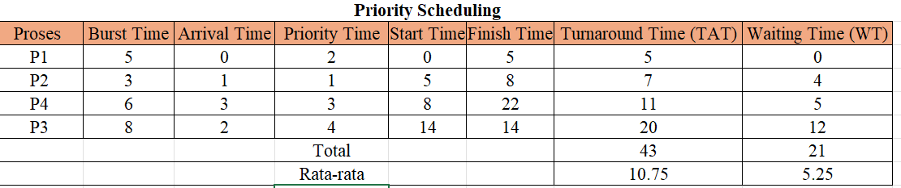

<<<<<<< HEAD

<<<<<<< HEAD
<<<<<<< HEAD
# Laporan Praktikum Minggu 6
Topik: Penjadwalan CPU – Round Robin (RR) dan Priority Scheduling  
=======
# Laporan Praktikum Minggu [6]
Topik: [Penjadwalan CPU – Round Robin (RR) dan Priority Scheduling]
>>>>>>> fbd8316ebf0b48cd8652bea179300f780e5f8a29
=======
# Laporan Praktikum Minggu [6]
Topik: Penjadwalan CPU – Round Robin (RR) dan Priority Scheduling

>>>>>>> 4a10d10cc8320ad9a7866e6d4ecbc1d4ce45b3ae
=======
# Tugas Praktikum Minggu 6  
Topik: Penjadwalan CPU – Round Robin (RR) dan Priority Scheduling  
>>>>>>> befbaf963505fb5abbac60c1e3be2a0e33e0857a

---
## Identitas
<<<<<<< HEAD
<<<<<<< HEAD
<<<<<<< HEAD
- **Nama**  : Aster Rifani 
- **NIM**   : 250202915  
- **Kelas** : 1IKRB
=======
- **Nama**  : [Lutfi Khoerunnisa]  
- **NIM**   : [250202947]  
- **Kelas** : [1IKRB]
>>>>>>> fbd8316ebf0b48cd8652bea179300f780e5f8a29
=======
- **Nama**  : Ani Ngismatul Hawa 
- **NIM**   : 250202914
- **Kelas** : 1IKRB
>>>>>>> 4a10d10cc8320ad9a7866e6d4ecbc1d4ce45b3ae

---

## Tujuan
<<<<<<< HEAD
<<<<<<< HEAD
> Menghitung *waiting time* dan *turnaround time* pada algoritma RR dan Priority.

> Menyusun tabel hasil perhitungan dengan benar dan sistematis.

> Membandingkan performa algoritma RR dan Priority.  

> Menjelaskan pengaruh *time quantum* dan prioritas terhadap keadilan eksekusi proses.

=======
Tuliskan tujuan praktikum minggu ini.  
> Menghitung waiting time dan turnaround time pada algoritma RR dan Priority.
> Menyusun tabel hasil perhitungan dengan benar dan sistematis.
> Membandingkan performa algoritma RR dan Priority.
> Menjelaskan pengaruh time quantum dan prioritas terhadap keadilan eksekusi proses.
>>>>>>> fbd8316ebf0b48cd8652bea179300f780e5f8a29
> Menarik kesimpulan mengenai efisiensi dan keadilan kedua algoritma.
=======
1. Menghitung waiting time dan turnaround time pada algoritma RR dan Priority.
2. Menyusun tabel hasil perhitungan dengan benar dan sistematis.
3. Membandingkan performa algoritma RR dan Priority.
4. Menjelaskan pengaruh time quantum dan prioritas terhadap keadilan eksekusi proses.
5. Menarik kesimpulan mengenai efisiensi dan keadilan kedua algoritma.

>>>>>>> 4a10d10cc8320ad9a7866e6d4ecbc1d4ce45b3ae

---

## Dasar Teori
<<<<<<< HEAD
<<<<<<< HEAD
   ***Penjadwalan CPU (CPU Scheduling)*** adalah salah satu fungsi utama dalam sistem operasi yang bertujuan untuk menentukan proses mana yang akan mendapatkan alokasi waktu CPU pada saat tertentu. Karena hanya satu proses yang dapat menggunakan CPU pada suatu waktu, maka sistem operasi perlu mengatur proses-proses yang sedang menunggu agar dapat dieksekusi secara efisien dan adil.
=======
- **Nama**  : [Dyah Retno Wulandari]  
- **NIM**   : [250202934]  
- **Kelas** : [1IKRB]


## A. Deskripsi Singkat
Pada praktikum minggu ini, mahasiswa akan mempelajari **dua algoritma lanjutan penjadwalan CPU**, yaitu:
- **Round Robin (RR)**  
- **Priority Scheduling**

Kedua algoritma ini banyak digunakan pada sistem modern karena mempertimbangkan **keadilan waktu eksekusi (time quantum)** dan **tingkat prioritas proses**.  
Mahasiswa akan melakukan simulasi perhitungan manual untuk menghitung *waiting time* dan *turnaround time*, serta menganalisis efek perbedaan *time quantum* dan prioritas terhadap performa CPU scheduling.

---

## B. Tujuan
Setelah menyelesaikan tugas ini, mahasiswa mampu:
1. Menghitung *waiting time* dan *turnaround time* pada algoritma RR dan Priority.  
2. Menyusun tabel hasil perhitungan dengan benar dan sistematis.  
3. Membandingkan performa algoritma RR dan Priority.  
4. Menjelaskan pengaruh *time quantum* dan prioritas terhadap keadilan eksekusi proses.  
5. Menarik kesimpulan mengenai efisiensi dan keadilan kedua algoritma.  

---

## C. Langkah Pengerjaan
1. **Siapkan Data Proses**
   Gunakan contoh data berikut (boleh dimodifikasi sesuai kebutuhan):
   | Proses | Burst Time | Arrival Time | Priority |
   |:--:|:--:|:--:|:--:|
   | P1 | 5 | 0 | 2 |
   | P2 | 3 | 1 | 1 |
   | P3 | 8 | 2 | 4 |
   | P4 | 6 | 3 | 3 |

2. **Eksperimen 1 – Round Robin (RR)**
   - Gunakan *time quantum (q)* = 3.  
   - Hitung *waiting time* dan *turnaround time* untuk tiap proses.  
   - Simulasikan eksekusi menggunakan Gantt Chart (manual atau spreadsheet).  
     ```
     | P1 | P2 | P3 | P4 | P1 | P3 | ...
     0    3    6    9   12   15   18  ...
     ```
   - Catat sisa *burst time* tiap putaran.

   Hasil Eksperimen 1
    

    Gantt Chart Round Robin (q=3)
     ```
     | P1 | P2 | P3 | P4 | P1 | P3 | P4 | P3 |
     0    3    6    9    12   14   17   20   22 
     ```

     Catatan Eksekusi sisa *burst time* tiap putaran :

      P1 = 5-3 = sisa 2
      
      P2 = 3-3 = sisa 0 (selesai)

      P3 = 8-3 = sisa 5

      P4 = 6-3 = sisa 3

      P1 = 2 (selesai)

      P3 = 5-3 = sisa 2

      P4 = 3-3 = sisa 0 (selesai)

      P3 = 2 (selesai)

3. **Eksperimen 2 – Priority Scheduling (Non-Preemptive)**
   - Urutkan proses berdasarkan nilai prioritas (angka kecil = prioritas tinggi).  
   - Lakukan perhitungan manual untuk:
     ```
     WT[i] = waktu mulai eksekusi - Arrival[i]
     TAT[i] = WT[i] + Burst[i]
     ```
   - Buat tabel perbandingan hasil RR dan Priority.

Hasil Eksperimen 2 

Gantt Chart :

      | P1 | P2 | P4 | P3 | 
      0    5    8   14    22

  WT[i] = waktu mulai eksekusi - Arrival[i]

   P1 = 0 - 0 = 0

   P2 = 5 - 1 = 4

   P3 = 14 - 2 = 12

   P4 = 8 - 3 = 5

   P1+P2+P3+P4 = 0 + 4 + 12 + 22 = 38

  TAT[i] = WT[i] + Burst[i]

   P1 = 0 + 5 = 5

   P2 = 4 + 3 = 7

   P3 = 12 + 8 = 20

   P4 = 5 + 6 = 11

   P1+P2+P3+P4 = 5 + 7 + 20 + 11 = 43
   

4. **Eksperimen 3 – Analisis Variasi Time Quantum (Opsional)**
   - Ubah *quantum* menjadi 2 dan 5.  
   - Amati perubahan nilai rata-rata *waiting time* dan *turnaround time*.  
   - Buat tabel perbandingan efek *quantum*.

Eksperimen 3 (quantum = 2)
   

   Gantt Chart:

       | P1 | P2 | P3 | P1 | P4 | P2 | P3 | P1 | P4 | P3 | P4 | P3 |
       0    2    4    6    8   10   11   13   14   16   18   20   22

Eksperimen 3 (quantum = 5)
    

    Gantt Chart :

      | P1 | P2 | P3 | P4 | P3 | P4 | 
       0    5    8   13   18   21   22  

Tabel perbandingan efek quantum

   | Quantum | Avg Waiting Time | Avg Turnaround Time
   |------------|------------------|----------------------
   | q = 2 | 9,75 | 15,25
   | q = 3 | 8,5 | 14
   | q = 5 | 7 | 12,5 

5. **Eksperimen 4 – Dokumentasi**
   - Simpan semua hasil tabel dan screenshot ke:
     ```
     praktikum/week6-scheduling-rr-priority/screenshots/
     ```
   - Buat tabel perbandingan seperti berikut:

     | Algoritma | Avg Waiting Time | Avg Turnaround Time | Kelebihan | Kekurangan |
     |------------|------------------|----------------------|------------|-------------|
     | RR | 8,5 | 14 | Adil terhadap semua proses | Tidak efisien jika quantum tidak tepat |
     | Priority | 9,5 | 10,75 | Efisien untuk proses penting | Potensi *starvation* pada prioritas rendah |

6. **Commit & Push**
   ```bash
   git add .
   git commit -m "Minggu 6 - CPU Scheduling RR & Priority"
   git push origin main
   ```
>>>>>>> befbaf963505fb5abbac60c1e3be2a0e33e0857a

   ***Round Robin (RR)*** merupakan salah satu algoritma penjadwalan yang paling umum digunakan dalam sistem time-sharing atau multitasking. Prinsip dasar algoritma ini adalah memberikan setiap proses jatah waktu eksekusi yang sama, yang disebut *time quantum*.

   ***Priority Scheduling*** adalah algoritma penjadwalan yang menentukan urutan eksekusi proses berdasarkan tingkat prioritas yang dimilikinya. Setiap proses diberikan nilai prioritas, dan CPU akan dialokasikan kepada proses dengan prioritas tertinggi terlebih dahulu.
=======
1. Tujuan dan Prinsip Dasar Preemption (Preemptive Scheduling): Tujuan utama penjadwalan CPU adalah memaksimalkan efisiensi sambil memastikan keadilan (fairness) dan responsif yang cepat. Baik Round Robin (RR) maupun Priority Scheduling sering menggunakan prinsip preemption, yaitu kemampuan untuk menginterupsi proses yang sedang berjalan (meskipun belum selesai) agar CPU dapat dialihkan ke proses lain. Hal ini krusial untuk lingkungan time-sharing modern di mana banyak proses harus berbagi sumber daya CPU secara responsif dan adil.
>>>>>>> fbd8316ebf0b48cd8652bea179300f780e5f8a29

2. Mekanisme Round Robin (Fairness melalui Time Quantum): Round Robin (RR) mencapai keadilan dengan memberikan setiap proses time quantum (unit waktu CPU yang kecil dan tetap) secara bergantian dalam antrian melingkar. Jika proses tidak selesai dalam quantum waktunya, proses tersebut akan diinterupsi (preempted) dan diletakkan di akhir antrian. Keuntungan utama RR adalah respons time yang baik dan mencegah starvation, namun kelemahannya adalah tingginya overhead context switch jika quantum terlalu kecil.

3. Mekanisme Priority Scheduling (Starvation dan Aging): Priority Scheduling mengalokasikan CPU ke proses dengan prioritas tertinggi. Prioritas ini dapat bersifat statis atau dinamis. Masalah signifikan dari algoritma ini adalah starvation, yaitu proses dengan prioritas rendah mungkin tidak pernah mendapatkan CPU jika terus-menerus ada proses prioritas tinggi yang masuk. Solusi umum untuk mengatasi starvation adalah Aging, di mana prioritas proses yang telah menunggu lama dalam sistem secara bertahap ditingkatkan.
---

<<<<<<< HEAD
## Langkah Praktikum
<<<<<<< HEAD
1. **Menyiapkan Data Proses**
   Menggunakan contoh data berikut (boleh dimodifikasi sesuai kebutuhan):
   | Proses | Burst Time | Arrival Time | Priority |
   |:--:|:--:|:--:|:--:|
   | P1 | 5 | 0 | 2 |
   | P2 | 3 | 1 | 1 |
   | P3 | 8 | 2 | 4 |
   | P4 | 6 | 3 | 3 |
=======
- **Penjadwalan CPU** itu seperti sistem antrian tugas di komputer. Saat banyak program ingin dijalankan, CPU tidak bisa mengerjakan semuanya sekaligus, jadi sistem operasi mengatur urutannya.
penjadwalan CPU menentukan proses mana yang dikerjakan dulu, mana yang menunggu, dan berapa lama setiap proses mendapat giliran. Tujuannya biar komputer tetap cepat, adil, dan tidak ada tugas yang terlalu lama menunggu.
- **Round Robin** adalah cara penjadwalan CPU yang membagi waktu secara bergiliran dan adil untuk setiap proses.
Setiap proses diberi jatah waktu singkat yang disebut quantum. Kalau proses belum selesai saat waktunya habis, dia harus antre lagi di belakang barisan dan menunggu giliran berikutnya.
- **Priority Scheduling** adalah cara penjadwalan CPU yang memilih proses berdasarkan tingkat prioritasnya.
Artinya, proses yang punya prioritas lebih tinggi akan dijalankan lebih dulu, sedangkan yang prioritasnya rendah harus menunggu.
---

## Langkah Praktikum
1. Siapkan Data Proses
2. Eksperimen 1 Round Robin
- Gunakan time quantum (q) = 3.
- Hitung waiting time dan turnaround time untuk tiap proses.
- Simulasikan eksekusi menggunakan Gantt Chart (manual atau spreadsheet).
- Catat sisa burst time tiap putaran.
3. Eksperimen 2 – Priority Scheduling (Non-Preemptive)
- urutkan proses berdasarkan nilai prioritas (angka kecil = prioritas tinggi).
- Lakukan perhitungan manual untuk:

`WT[i] = waktu mulai eksekusi - Arrival[i]`
`TAT[i] = WT[i] + Burst[i]`
- Buat tabel perbandingan hasil RR dan Priority.
4. Eksperimen 3 – Analisis Variasi Time Quantum (Opsional)

-  Ubah quantum menjadi 2 dan 5.
- Amati perubahan nilai rata-rata waiting time dan turnaround time.
- Buat tabel perbandingan efek quantum.
5. Eksperimen 4 – Dokumentasi

- Simpan semua hasil tabel dan screenshot ke:

`praktikum/week6-scheduling-rr-priority/screenshots/`

6. Commit & Push

`git add .`

`git commit -m "Minggu 6 - CPU Scheduling RR & Priority"`

`git push origin main`
>>>>>>> 4a10d10cc8320ad9a7866e6d4ecbc1d4ce45b3ae

2. **Eksperimen 1 – Round Robin (RR)**
   - Menggunakan *time quantum (q)* = 3.  
   - Menghitung *waiting time* dan *turnaround time* untuk tiap proses.  
   - Simulasikan eksekusi menggunakan Gantt Chart (manual atau spreadsheet).  
     ```
     | P1 | P2 | P3 | P4 | P1 | P3 | ...
     0    3    6    9   12   15   18  ...
     ```
   - Catat sisa *burst time* tiap putaran.

3. **Eksperimen 2 – Priority Scheduling (Non-Preemptive)**
   - Mngurutkan proses berdasarkan nilai prioritas (angka kecil = prioritas tinggi).  
   - Melakukan perhitungan manual untuk:
     ```
     WT[i] = waktu mulai eksekusi - Arrival[i]
     TAT[i] = WT[i] + Burst[i]
     ```
   - Membuat tabel perbandingan hasil RR dan Priority.

4. **Eksperimen 3 – Analisis Variasi Time Quantum (Opsional)**
   - Mengubah *quantum* menjadi 2 dan 5.  
   - Mengamati perubahan nilai rata-rata *waiting time* dan *turnaround time*.  
   - Membuat tabel perbandingan efek *quantum*.

5. **Eksperimen 4 – Dokumentasi**
   - Menyimpan semua hasil tabel dan screenshot ke:
     ```
     praktikum/week6-scheduling-rr-priority/screenshots/
     ```
   - Membuat tabel perbandingan sebagai berikut:

     | Algoritma | Avg Waiting Time | Avg Turnaround Time | Kelebihan | Kekurangan |
     |------------|------------------|----------------------|------------|-------------|
     | RR | ... | ... | Adil terhadap semua proses | Tidak efisien jika quantum tidak tepat |
     | Priority | ... | ... | Efisien untuk proses penting | Potensi *starvation* pada prioritas rendah |

6. **Commit & Push**
   ```bash
   git add .
   git commit -m "Minggu 6 - CPU Scheduling RR & Priority"
   git push origin main
   ```

---

## Kode / Perintah
1. Hasil perhitungan dan analisis dimasukkan ke `laporan.md`.  
2. Screenshot tabel atau Gantt Chart disimpan di folder `screenshots/`.  
3. Laporan lengkap berada di `laporan.md`. 
4. Melakukan perhitungan manual untuk:
     ```
     WT[i] = waktu mulai eksekusi - Arrival[i]
     TAT[i] = WT[i] + Burst[i]
     ```
=======
1. Siapkan Data Proses Gunakan contoh data berikut (boleh dimodifikasi sesuai kebutuhan)
2. Gunakan time quantum (q) = 3.
Hitung waiting time dan turnaround time untuk tiap proses.
Simulasikan eksekusi menggunakan Gantt Chart (manual atau spreadsheet).
| P1 | P2 | P3 | P4 | P1 | P3 | ...
0    3    6    9   12   15   18  ...
3. Urutkan proses berdasarkan nilai prioritas (angka kecil = prioritas tinggi).
Lakukan perhitungan manual untuk:
WT[i] = waktu mulai eksekusi - Arrival[i]
TAT[i] = WT[i] + Burst[i]
Buat tabel perbandingan hasil RR dan Priority.
4. Buat tabel perbandingan
5. Mengerjakan tugas dan quiz
6. Update tugas tepat waktu 
---

## Kode / Perintah
<<<<<<< HEAD
Tuliskan potongan kode atau perintah utama:
```bash
| P1 | P2 | P3 | P4 | P1 | P3 | ...
0    3    6    9   12   15   18  ...
WT[i] = waktu mulai eksekusi - Arrival[i]
TAT[i] = WT[i] + Burst[i]
```
>>>>>>> fbd8316ebf0b48cd8652bea179300f780e5f8a29
=======

- Data proses

|Proses|Burst Time|	Arrival Time|	Priority|
|-----|-------|-----|----|
|P1|	5|	0|	2|
|P2|3|	1|	1|
|P3|	8|	2|	4|
|P4|	6|	3|	3|

-  Gunakan time quantum (q) = 3.
-  Gantt Chart

`| P1 | P2 | P3 | P4 | P1 | P3 | ...`

`0    3    6    9   12   15   18  ...`

- Lakukan perhitungan manual untuk:

`WT[i] = waktu mulai eksekusi - Arrival[i]`
`TAT[i] = WT[i] + Burst[i]`

- Hasil perhitungan dan analisis dimasukkan ke `laporan.md.`
- Screenshot tabel atau Gantt Chart disimpan di folder `screenshots/.`
- Laporan lengkap berada di laporan.md.
- Semua hasil telah di-commit ke GitHub tepat waktu.
>>>>>>> 4a10d10cc8320ad9a7866e6d4ecbc1d4ce45b3ae

---

## Hasil Eksekusi
<<<<<<< HEAD
1. **Eksperimen 1 – Round Robin (RR)**
.png)
   Sisa burst time dicatat setiap kali proses selesai menjalankan time quantum. Data ini digunakan untuk menentukan proses mana yang masih perlu dijalankan pada putaran berikutnya.

   - Sisa Burst time tiap putaran sebagai berikut :

   | Proses | Burst Time Awal | Sisa Burst Time setelah Putaran 1 | Sisa Burst Time Setelah Putaran 2 | Sisa Burst Time setelah Putaran 3 |
   |---|---|---|---|---|
   | P1 | 5 | 2 | 0 | - |
   | P2 | 3 | 0 | - | - |
   | P3 | 8 | 5 | 2 | 0 |
   | P4 | 6 | 3 | 0 | - |

   - Gantt Chart
    ```
     | P1 | P2 | P3 | P4 | P1 | P3 | P4 | P3 |
    0    3    6    9    12   14   17   20   22 
    ```

2. **Eksperimen 2 – Priority Scheduling (Non-Preemptive)**

   Algoritma ini memilih proses berdasarkan prioritas, proses dengan prioritas lebih tinggi (angka kecil) mendapatkan layanan lebih cepat. Pada percobaan ini P1 dieksekusi paling dulu karena tiba di waktu 0 dan termasuk prioritas tinggi relatif (2). P2 tiba setelah P1 tetapi memiliki prioritas 1 (tertinggi) — namun karena non-preemptive, P2 baru dieksekusi setelah P1 selesai.

   - Gantt Chart
    ```
     | P1 | P2 | P4 | P3 |
    0    5    8   14   22
    ```
3. **Eksperimen 3 – Analisis Variasi Time Quantum (Opsional)**
   - Round Robin (q=3)
      Gantt Chart :
     ```
      | P1 | P2 | P3 | P4 | P1 | P3 | P4 | P3 | P3 |
     0    2    4    6    8   10   12   14   16   18   20   22
     ```
   - Round Robin (q=5)
      Gantt Chart :
     ```
      | P1 | P2 | P3 | P4 | P3 |
     0    5    8    13   18   21   22
     ```
4. **Eksperimen 4 – Dokumentasi**
   Tabel perbandingan antara Round Robin & Priority Scedulling :

   | Algoritma | Avg Waiting Time | Avg Turnaround Time | Kelebihan | Kekurangan |
     |------------|------------------|----------------------|------------|-------------|
     | RR | 8,5 | 14 | Adil terhadap semua proses | Tidak efisien jika quantum tidak tepat |
     | Priority | 5,25 | 10,75 | Efisien untuk proses penting | Potensi *starvation* pada prioritas rendah |
=======
Sertakan screenshot hasil percobaan atau diagram:
<<<<<<< HEAD

Eksperimen 1 Round Robin

| P1 | P2 | P3 | P4 | P1 | P3 | P4 | P3 |
0    3    6    9   12   14  17  20  22

Eksperimen 2 Priority Scheduling

| P1 | P2 | P4 | P3 | 
0    5    8    14   22   
Tabel Perbandingan Round Robin dan Priority Scheduling

>>>>>>> fbd8316ebf0b48cd8652bea179300f780e5f8a29
=======
>>>>>>> 4a10d10cc8320ad9a7866e6d4ecbc1d4ce45b3ae


1. **Eksperimen 1 Round Robin**


- Gantt Chart

 | P1 | P2 | P3 | P4 | P1 | P3 | P4 | P3 |
0    3    6    9    12   14   17   20   22 

2. **Eksperimen 2 Priority Scheduling**


- Gantt Chart

 | P1 | P2 | P4 | P3 |
0    5    8   14   22

3. **Perbandingan antara Round Robin & Priority Scedulling** :

|Algoritma|	Avg Waiting Time|	Avg Turnaround Time|	Kelebihan|	Kekurangan|
|---------|----------|--------|--------|-------|
|RR|	8,5	|14|	Adil terhadap semua proses	|Tidak efisien jika quantum tidak tepat|
|Priority	|5,25|	10,75|	Efisien untuk proses penting|	Potensi starvation pada prioritas rendah|
---

## Analisis
<<<<<<< HEAD
<<<<<<< HEAD
   Dengan demikian,hasil eksperimen dapat menunjukkan bahwa :
   -  **Priority Scheduling** memberikan waktu rata-rata (waiting time dan turnaround time) yang lebih rendah karena eksekusi difokuskan pada proses penting.
   -  **Round Robin (RR)** lebih unggul dari sisi keadilan dan responsivitas, terutama pada sistem dengan banyak proses interaktif.
=======
- Round Robin = Proses berjalan bergantian (seperti estafet), di mana setiap proses mendapat jatah waktu kecil yang sama (Time Quantum).
- Priority Scheduling = menentukan urutan eksekusi berdasarkan tingkat Prioritas dan kemudian mengukur seberapa lama proses menunggu dan menyelesaikan tugas.
>>>>>>> fbd8316ebf0b48cd8652bea179300f780e5f8a29
=======
- **Round Robin (RR)**: Setiap proses dapat waktu sama (quantum 3). Hasilnya adil tapi waktu tunggu dan selesai rata-rata lebih lama (TAT 14, WT 8.5).

- **Priority Scheduling**: Proses dijalankan sesuai prioritas. Lebih cepat (TAT 10.75, WT 5.25) tapi tidak adil karena proses prioritas rendah bisa lama menunggu.
>>>>>>> 4a10d10cc8320ad9a7866e6d4ecbc1d4ce45b3ae

---

## Kesimpulan
<<<<<<< HEAD
<<<<<<< HEAD
   Berdasarkan hasil eksperimen penjadwalan CPU menggunakan algoritma Round Robin (RR) dan Priority Scheduling, dapat disimpulkan bahwa:
=======

Dari percobaan di atas, penjadwalan *Round Robin* memberikan waktu yang adil untuk semua proses tetapi membuat waktu tunggu dan selesai jadi lebih lama. Sedangkan *Priority Scheduling* lebih cepat karena menjalankan proses berdasarkan tingkat prioritas, meski proses prioritas rendah harus menunggu lebih lama. Jadi, Round Robin cocok untuk sistem yang butuh keadilan, sementara Priority Scheduling lebih efisien untuk menyelesaikan proses penting lebih dulu.

>>>>>>> 4a10d10cc8320ad9a7866e6d4ecbc1d4ce45b3ae

   1. **Round Robin (RR)** memberikan keadilan yang lebih baik karena setiap proses mendapatkan jatah waktu eksekusi secara bergiliran. Algoritma ini cocok untuk sistem interaktif dan multitasking, meskipun performanya sangat bergantung pada besar kecilnya nilai time quantum.

   2. **Priority Scheduling** mampu menghasilkan waktu rata-rata eksekusi yang lebih cepat pada proses penting, namun berpotensi menimbulkan starvation bagi proses dengan prioritas rendah.
=======
1. Keunggulan RR dan Isu Overhead: Percobaan Round Robin (RR) membuktikan bahwa algoritma ini optimal untuk mencapai keadilan (fairness) dan respons time yang cepat. Dengan menggunakan jatah waktu tetap (Time Quantum), RR mencegah starvation dan cocok untuk sistem time-sharing. Namun, kelemahannya adalah tingginya overhead context switch yang terjadi akibat seringnya perpindahan antar proses, yang dapat mengurangi efisiensi CPU secara keseluruhan.
>>>>>>> fbd8316ebf0b48cd8652bea179300f780e5f8a29

2. Efektivitas Priority Scheduling dan Risiko Starvation: Priority Scheduling unggul dalam memastikan tugas-tugas kritis (berprioritas tinggi) diselesaikan dengan cepat. Algoritma ini memberikan turnaround time yang minimal bagi proses penting, sering kali menggunakan preemption untuk segera mengambil alih CPU. Namun, risiko terbesarnya adalah starvation, di mana proses berprioritas rendah mungkin tidak pernah dieksekusi, sehingga memerlukan implementasi teknik Aging untuk menjaga keadilan minimum.

3. Kompromi Pilihan Algoritma: Kesimpulannya, tidak ada algoritma yang sempurna; pemilihan didasarkan pada tujuan sistem. RR dikhususkan untuk keadilan merata dan responsifitas (mengorbankan sedikit efisiensi), sedangkan Priority Scheduling dikhususkan untuk mengutamakan tugas penting (mengorbankan keadilan bagi proses prioritas rendah).
---

## Quiz
<<<<<<< HEAD
<<<<<<< HEAD
1. Apa perbedaan utama antara Round Robin dan Priority Scheduling? 
   **Jawaban:**  *Round Robin* lebih menekankan keadilan serta pembagian waktu yang merata.Sedangkan,*Priority Schedulling* menekankan urutan berdasarkan tingkat kepentingan proses.
2. Apa pengaruh besar/kecilnya *time quantum* terhadap performa sistem?
   **Jawaban:**  Jika nilai quantum kecil maka dapat membuat sistem sering berpindah proses/tidak efisien.Sedangkan kalau terlalu besar nilai quantum nya akan mengakibatkan proses lain menunggu lama/kurang responsif.
3. Mengapa algoritma Priority dapat menyebabkan *starvation*?  
   **Jawaban:**  Karena cara kerjanya yang memprioritaskan proses dengan prioritas tinggi.
=======
1. [Apa perbedaan utama antara Round Robin dan Priority Scheduling?]  
   **Jawaban: Perbedaan utama antara Round Robin (RR) dan Priority Scheduling terletak pada dasar penentuan proses mana yang didahulukan dan tujuan utama yang ingin dicapai. RR beroperasi berdasarkan Time Quantum (jatah waktu tetap), di mana proses berjalan secara bergantian dan adil, sehingga RR dirancang untuk mencapai respons time yang cepat dan fairness di antara semua pengguna, namun memiliki kelemahan berupa potensi overhead context switch yang tinggi. Sebaliknya, Priority Scheduling beroperasi berdasarkan nilai Prioritas yang ditetapkan pada setiap proses, di mana proses prioritas tertinggi selalu dieksekusi terlebih dahulu. Algoritma ini bertujuan untuk memastikan tugas kritis diselesaikan secepat mungkin, namun memiliki risiko utama berupa starvation pada proses berprioritas rendah.**  
2. [Apa pengaruh besar/kecilnya time quantum terhadap performa sistem?]  
   **Jawaban: Pengaruh utama ukuran Jatah Waktu (Time Quantum) adalah menciptakan pertukaran (trade-off) penting antara responsifitas dan efisiensi sistem. Jika Jatah Waktu terlalu kecil, sistem menjadi sangat responsif dan adil karena proses sering berganti, namun hal ini meningkatkan biaya pergantian konteks (Context Switch) secara drastis, sehingga Unit Pemroses Sentral (CPU) menghabiskan lebih banyak waktu untuk mengelola pergantian daripada menjalankan pekerjaan nyata, yang pada akhirnya menurunkan efisiensi sistem. Sebaliknya, jika Jatah Waktu terlalu besar, biaya pergantian konteks menjadi minimal, yang meningkatkan efisiensi, tetapi responsifitas dan keadilan menurun tajam, menyebabkan algoritma Round Robin berperilaku mirip First-Come, First-Served karena proses di depan dapat memonopoli CPU untuk jangka waktu yang lama.**  
3. [Mengapa algoritma Priority dapat menyebabkan starvation?]  
   **Jawaban:Starvation pada algoritma Priority Scheduling terjadi karena kedatangan proses berprioritas tinggi yang terus-menerus. Karena CPU harus selalu memilih proses dengan prioritas tertinggi, proses prioritas rendah yang sudah siap akan terus ditunda tanpa batas waktu (preempted), sebab selalu ada proses yang lebih penting yang baru tiba atau sedang berjalan. Hal ini membuat proses berprioritas rendah "kelaparan" dari alokasi CPU. .**  
>>>>>>> fbd8316ebf0b48cd8652bea179300f780e5f8a29
=======
1. Apa perbedaan utama antara Round Robin dan Priority Scheduling?  
   **Jawaban:**  
*Round Robin* memberi giliran sama untuk semua proses, sedangkan *Priority Scheduling* menjalankan proses berdasarkan tingkat pentingnya.

2. Apa pengaruh besar/kecilnya time quantum terhadap performa sistem? 

   **Jawaban:**  
Kalau time quantum terlalu kecil, CPU sering berganti proses, jadi sistem jadi lambat karena terlalu banyak waktu terbuang untuk pergantian (overhead).
Kalau terlalu besar, proses panjang bisa mendominasi CPU, sehingga sistem terasa tidak adil dan responnya lambat
3. Mengapa algoritma Priority dapat menyebabkan starvation?

   **Jawaban:**  
Algoritma Priority bisa menyebabkan starvation karena proses dengan prioritas rendah terus tertunda.
Kalau selalu ada proses dengan prioritas tinggi yang masuk, proses prioritas rendah tidak pernah mendapat giliran untuk dijalankan.
>>>>>>> 4a10d10cc8320ad9a7866e6d4ecbc1d4ce45b3ae

---

## Refleksi Diri
Tuliskan secara singkat:
<<<<<<< HEAD
<<<<<<< HEAD
- Apa bagian yang paling menantang minggu ini?  Motor rusak.
- Bagaimana cara Anda mengatasinya?  Dengan sabar dan memakai motor yang lain.
=======
- Apa bagian yang paling menantang minggu ini? Menghitung Round Robin dan Priority Scheduling 
- Bagaimana cara Anda mengatasinya?  
Mencoba dan mencari referensi
>>>>>>> fbd8316ebf0b48cd8652bea179300f780e5f8a29

=======
- Apa bagian yang paling menantang minggu ini?  
menghitung start dan finish setiap eksperimen.
- Bagaimana cara Anda mengatasinya?  
mengatasi dengan mempelajari dengan cermat.
>>>>>>> 4a10d10cc8320ad9a7866e6d4ecbc1d4ce45b3ae
---

**Credit:**  
_Template laporan praktikum Sistem Operasi (SO-202501) – Universitas Putra Bangsa_
=======
## D. Tugas & Quiz
### Tugas
1. Hitung *waiting time* dan *turnaround time* untuk algoritma RR dan Priority. 

   Jawab : 

   Round Robin (q=3) : 

   WT = P1+P2+P3+P4 = 9+2+11+12= 34

   TAT = P1+P2+P3+P4 = 14+5+20+17= 56

   Priority Scheduling :

   WT = P1+P2+P3+P4 = 0+4+12+22= 38

   TAT = P1+P2+P3+P4= 5+7+20+11= 43


2. Sajikan hasil perhitungan dan Gantt Chart dalam `laporan.md`.  
3. Bandingkan performa dan jelaskan pengaruh *time quantum* serta prioritas. 

   Jawab : 
   Performa priority lebih cepat karena proses dupilih berdasarkan prioritas dan hasil WT dan TAT jauh lebih kecil dibanding RR. Sedangkan performa Round Robin lebih adil karena semua proses mendapat jatah CPU secara bergilir.

   Pengaruh time quantum apabila time quantum kecil overhead tinggi karena waiting timenya cenderung besar, sedangkan time quantum besar WT dan TAT membaik, tetapi fairness menurun. Dapat disimpulkan : 

   Quantum kecil = responsivitas tinggi tetapi waiting time lebih buruk

   Quantum besar = perfoma batch lebih baik tetapi fairness menurun.

   Pengaruh penggunaan priority yaitu proses prioritas tinggi selesai lebih cepat meskipun datang terakhir.

4. Simpan semua bukti (tabel, grafik, atau gambar) ke folder `screenshots/`.  

### Quiz
Tuliskan jawaban di bagian **Quiz** pada laporan:
1. Apa perbedaan utama antara Round Robin dan Priority Scheduling? 

   Jawab : 
- Round Robin (RR): Menggunakan konsep time-sharing dengan memberikan waktu eksekusi yang sama (time slice) secara bergantian ke setiap proses, tanpa memandang prioritas.
- Priority Scheduling: Proses dengan prioritas tertinggi dieksekusi terlebih dahulu, tanpa menggunakan time slice, dan proses dengan prioritas rendah mungkin memiliki waktu tunggu yang lebih lama.

2. Apa pengaruh besar/kecilnya *time quantum* terhadap performa sistem?  
  
   Jawab: 

    **Time Quantum Besar:**
   
   - Mengurangi overhead switching konteks: Proses memiliki waktu lebih lama untuk dieksekusi sebelum digantikan oleh proses lain, sehingga mengurangi jumlah switching konteks.
   -  Meningkatkan throughput: Proses dapat menyelesaikan tugasnya lebih cepat karena memiliki waktu lebih lama untuk dieksekusi.
   - Mengurangi responsifitas: Proses lain harus menunggu lebih lama untuk mendapatkan giliran, sehingga responsifitas sistem menurun.

   **Time Quantum Kecil:**
   - Meningkatkan responsifitas: Proses lain dapat mendapatkan giliran lebih cepat, sehingga responsifitas sistem meningkat.
   - Meningkatkan overhead switching konteks: Proses harus sering digantikan oleh proses lain, sehingga meningkatkan jumlah switching konteks dan overhead.
   - Mengurangi throughput: Proses memiliki waktu lebih singkat untuk dieksekusi, sehingga throughput sistem menurun.

3. Mengapa algoritma Priority dapat menyebabkan *starvation*?  
   Jawab : Karena proses dengan prioritas rendah mungkin tidak pernah mendapatkan kesempatan untuk dieksekusi jika ada proses lain dengan prioritas yang lebih tinggi yang terus-menerus masuk ke dalam antrian, sehingga proses dengan prioritas rendah diabaikan dan tidak dapat menyelesaikan tugasnya.
---

## E. Output yang Diharapkan
- Hasil perhitungan dan analisis dimasukkan ke `laporan.md`.  
- Screenshot tabel atau Gantt Chart disimpan di folder `screenshots/`.  
- Laporan lengkap berada di `laporan.md`.  
- Semua hasil telah di-*commit* ke GitHub tepat waktu.  

---

## F. Referensi
1. Abraham Silberschatz, Peter Baer Galvin, Greg Gagne. *Operating System Concepts*, 10th Edition, Wiley, 2018.  
2. Andrew S. Tanenbaum, Herbert Bos. *Modern Operating Systems*, 4th Edition, Pearson, 2015.  
3. OSTEP – *Operating Systems: Three Easy Pieces*, 2018.  
4. Linux Manual Pages – *Scheduling & Process Control*.  
>>>>>>> befbaf963505fb5abbac60c1e3be2a0e33e0857a
