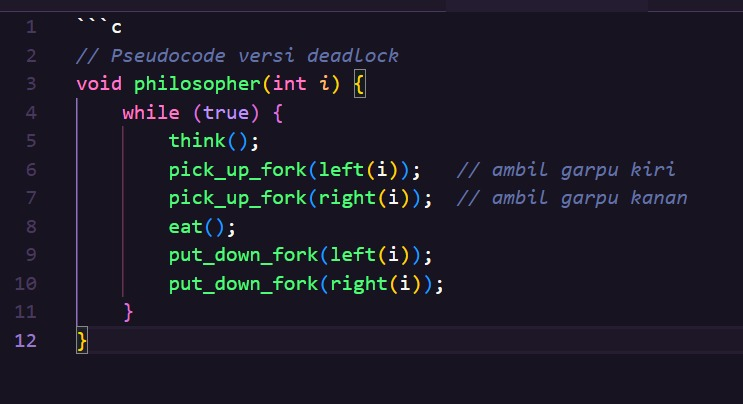
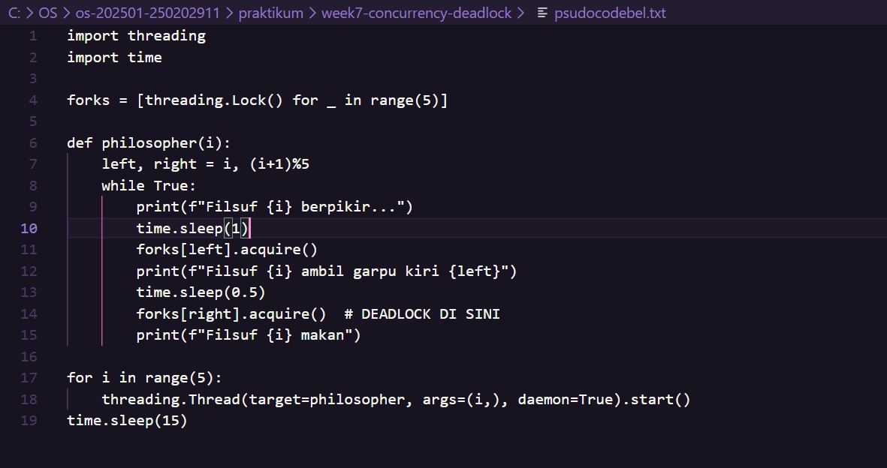

<<<<<<< HEAD

<<<<<<< HEAD
<<<<<<< HEAD
# Laporan Praktikum Minggu 7
Topik: Sinkronisasi Proses dan Masalah Deadlock 

---

## Identitas 
- Nama: 
   - Alya Deviana Putri Reynaldi (250202928)
   - Aster Rifani (250202915)
   - Lutfi Khoerunnisa (250202947)
   - Muslimah Nuraini (250202980)
- Kelas: 1IKRB
=======
=======
>>>>>>> 4a10d10cc8320ad9a7866e6d4ecbc1d4ce45b3ae
# Laporan Praktikum Minggu [7]
Topik: Sinkronisasi Proses dan Masalah Deadlock
=======
# Tugas Praktikum Minggu 7  
Topik: Sinkronisasi Proses dan Masalah Deadlock  
>>>>>>> befbaf963505fb5abbac60c1e3be2a0e33e0857a

---

## Identitas
<<<<<<< HEAD
<<<<<<< HEAD
- **Nama Kelompok**  :

 [Lutfi Khoerunnisa Bertugas Dokumentasi] [250202947] ,

 [Alya Deviana Putri Reynaldi Bertugas Ketua Kelompok] [250202928] , 

 [Muslimah Nuraini Bertugas Implementasi] [250202980] ,

 [Aster Rifani Bertugas Analisis] [250202915]

- **Kelas** : [1IKRB]
>>>>>>> fbd8316ebf0b48cd8652bea179300f780e5f8a29

--- 

<<<<<<< HEAD
## Pendahuluan
   Masalah Dining Philosophers merupakan model klasik dalam ilmu sistem operasi yang mengilustrasikan risiko deadlock pada proses konkurensi. Dalam skenario ini, lima filosof berbagi lima garpu, di mana setiap filosof memerlukan dua garpu untuk melakukan aktivitas makan. Tanpa adanya mekanisme pencegahan, kondisi deadlock dapat muncul ketika semua filosof menahan satu garpu dan menunggu garpu lainnya yang dipegang oleh filosof tetangga, sehingga terbentuk siklus tunggu.
=======
## Tujuan
 
1.  Mengidentifikasi empat kondisi penyebab deadlock (mutual exclusion, hold and wait, no preemption, circular wait).

2. Menjelaskan mekanisme sinkronisasi menggunakan semaphore atau monitor.

3.  Menganalisis dan memberikan solusi untuk kasus deadlock.

4.  Berkolaborasi dalam tim untuk menyusun laporan analisis.

5.  Menyajikan hasil studi kasus secara sistematis.
=======
- **Nama**  : 
1. Ani Ngismatul Hawa (250202931) Dokumentasi
2. Asyifani Lutfiana Nadzif (250202931) Ketua/Analisis
3. Erlin Dwi Cahyanti (250202911) Simulasi
- **Kelas** : 1IKRB
>>>>>>> 4a10d10cc8320ad9a7866e6d4ecbc1d4ce45b3ae

---

## Pendahuluan
<<<<<<< HEAD
Masalah Dining Philosophers merupakan model klasik dalam ilmu sistem operasi yang mengilustrasikan risiko deadlock pada proses konkurensi. Dalam skenario ini, lima filosof berbagi lima garpu, di mana setiap filosof memerlukan dua garpu untuk melakukan aktivitas makan. Tanpa adanya mekanisme pencegahan, kondisi deadlock dapat muncul ketika semua filosof menahan satu garpu dan menunggu garpu lainnya yang dipegang oleh filosof tetangga, sehingga terbentuk siklus tunggu.
>>>>>>> fbd8316ebf0b48cd8652bea179300f780e5f8a29
=======
Dining Philosophers Problem adalah masalah klasik dalam sistem operasi yang mengilustrasikan permasalahan sinkronisasi proses dan potensi terjadinya *deadlock* ketika beberapa proses bersaing untuk mendapatkan sumber daya terbatas (garpu/chopstick).  
Praktikum ini bertujuan untuk:
- Memahami 4 kondisi terjadinya deadlock
- Mengimplementasikan versi yang rentan deadlock
- Menerapkan solusi pencegahan deadlock menggunakan semaphore
- Menganalisis perbedaan kedua versi


>>>>>>> 4a10d10cc8320ad9a7866e6d4ecbc1d4ce45b3ae

---

## Dasar Teori
<<<<<<< HEAD
- Deadlock
   Terjadinya dua atau lebih proses saling menunggu sumber daya yang tidak akan pernah terjadi karena saling mengunci. Ada empat kondisi yang menyebabkan deadlock,yaitu:  
    1. Mutual Exclusion
    2. Hold and Wait
    3. No Preemption
    4. Circular Wait
- Critical section
   Bagian dari kode yang dimana proses mengakses data bersama.
- Mutual exclusion (Mutex)
   Memastikan hanya satu proses yang dapat berada di critical section dalam satu waktu.
- Teknik Sinkronisasi
   1. Mutex
      - Hanya satu proses yang boleh memegang lock pada satu waktu.
      - Cocok untuk melindungi resource tunggal.
      - Jika lock diambil proses lain harus menunggu.
   2. Semaphore
      - Variabel sinkronisasi yang dapat bernilai lebih dari 1.
      - Operasi dasar : wait (P) dan signal (V)
      - Digunakan untuk mengelola akses ke sejumlah sumber daya tertentu atau mengatur antrian proses.
- Dining Philosophers problem
   Permasalahan yang diperkenalkan untuk menggambarkan masalah sinkronisasi dalam berbagi sumber daya terbatas.
   Konsep Dasar:
   - Terdapat N filsuf yang duduk mengelilingi meja.
   - Di antara setiap dua filsuf terdapat satu garpu.
   - Untuk makan, setiap filsuf membutuhkan dua garpu.
   - Jika semua filsuf mengambil satu garpu dan menunggu garpu kedua, deadlock dapat terjadi.
<<<<<<< HEAD
=======
- Sinkronisasi proses adalah cara komputer mengatur beberapa proses (program yang sedang berjalan) agar tidak saling bentrok ketika memakai resource yang sama.
- Deadlock adalah kondisi ketika dua atau lebih proses saling menunggu satu sama lain, sehingga semuanya tidak bisa lanjut selamanya. 
>>>>>>> 4a10d10cc8320ad9a7866e6d4ecbc1d4ce45b3ae

---

## Metode
- **Eksperimen 1 – Simulasi Dining Philosophers (Deadlock Version)**
   Pada eksperimen ini simulasi dasar Dining Philosophers di mana setiap proses mengambil garpu kiri lalu garpu kanan tanpa mekanisme pencegah deadlock. Tujuannya adalah mengamati kapan deadlock terjadi, yaitu saat semua Philosopher memegang satu garpu dan menunggu garpu lainnya secara bersamaan.
- **Eksperimen 2 – Versi Fixed (Menggunakan Semaphore)**
   Pada eksperimen ini ditambahkan mekanisme sinkronisasi berupa **semaphore dengan nilai N−1** untuk membatasi hanya maksimal empat Philosopher yang dapat memasuki area makan. Pembatasan ini mencegah semua garpu diambil bersamaan sehingga memutus terjadinya circular wait dan menghilangkan deadlock.
- **Eksperimen 3 – Analisis Deadlock**
   Menganalisis empat kondisi penyebab deadlock pada versi pertama serta menjelaskan bagaimana versi fixed memecah tiap kondisi. Hasil analisis disajikan dalam tabel yang membandingkan kondisi deadlock pada kedua versi.
=======
>>>>>>> fbd8316ebf0b48cd8652bea179300f780e5f8a29

---

## Metode
1. - Eksperimen 1 – Simulasi Dining Philosophers (Deadlock Version)*
   Pada eksperimen ini simulasi dasar Dining Philosophers di mana setiap proses mengambil garpu kiri lalu garpu kanan tanpa mekanisme pencegah deadlock. Tujuannya adalah mengamati kapan deadlock terjadi, yaitu saat semua Philosopher memegang satu garpu dan menunggu garpu lainnya secara bersamaan.
2. - *Eksperimen 2 – Versi Fixed (Menggunakan Semaphore)*
   Pada eksperimen ini ditambahkan mekanisme sinkronisasi berupa *semaphore dengan nilai N−1* untuk membatasi hanya maksimal empat Philosopher yang dapat memasuki area makan. Pembatasan ini mencegah semua garpu diambil bersamaan sehingga memutus terjadinya circular wait dan menghilangkan deadlock.
3. - Eksperimen 3 – Analisis Deadlock*
   Menganalisis empat kondisi penyebab deadlock pada versi pertama serta menjelaskan bagaimana versi fixed memecah tiap kondisi. Hasil analisis disajikan dalam tabel yang membandingkan kondisi deadlock pada kedua versi.


---
## Langkah Praktikum
<<<<<<< HEAD
<<<<<<< HEAD
=======
- **Nama**  : 

1. Latifah Risti Anggraeni (250202945) / [Ketua & Analisis]

2. Nisa'ul Hidayah (250202981) / [Simulasi]

3. Dyah Retno Wulandari (250202934) / [Bagian Dokumentasi]
- **Kelas** : [1IKRB]

---

### A. Deskripsi Singkat
Pada praktikum minggu ini, mahasiswa akan mempelajari **mekanisme sinkronisasi proses dan penanganan deadlock** dalam sistem operasi.  
Tujuan utamanya adalah memahami bagaimana beberapa proses dapat berjalan secara bersamaan (concurrent) tanpa menyebabkan konflik data atau kebuntuan sumber daya (*deadlock*).

Mahasiswa akan melakukan studi kasus berbasis **Dining Philosophers Problem**, yaitu permasalahan klasik sinkronisasi yang menggambarkan bagaimana proses harus berbagi sumber daya terbatas (chopstick, mutex, semaphore) tanpa menimbulkan deadlock.  

Eksperimen ini dilakukan secara berkelompok, difokuskan pada:
- Analisis kondisi terjadinya deadlock.
- Implementasi solusi sinkronisasi menggunakan *semaphore* atau *monitor*.
- Dokumentasi perbandingan versi deadlock dan versi fixed.

---

## B. Tujuan
Setelah menyelesaikan tugas ini, mahasiswa mampu:
1. Mengidentifikasi empat kondisi penyebab deadlock (*mutual exclusion, hold and wait, no preemption, circular wait*).  
2. Menjelaskan mekanisme sinkronisasi menggunakan *semaphore* atau *monitor*.  
3. Menganalisis dan memberikan solusi untuk kasus deadlock.  
4. Berkolaborasi dalam tim untuk menyusun laporan analisis.  
5. Menyajikan hasil studi kasus secara sistematis.  

---

## C. Langkah Pengerjaan
>>>>>>> befbaf963505fb5abbac60c1e3be2a0e33e0857a
1. **Persiapan Tim**
   - Bentuk kelompok beranggotakan 3–4 orang.  
   - Tentukan ketua dan pembagian tugas (analisis, implementasi, dokumentasi).

2. **Eksperimen 1 – Simulasi Dining Philosophers (Deadlock Version)**
   - Implementasikan versi sederhana dari masalah *Dining Philosophers* tanpa mekanisme pencegahan deadlock.  
   - Contoh pseudocode:
     ```text
     while true:
       think()
       pick_left_fork()
       pick_right_fork()
       eat()
       put_left_fork()
       put_right_fork()
     ```
   - Jalankan simulasi atau analisis alur (boleh menggunakan pseudocode atau diagram alur).  
   - Identifikasi kapan dan mengapa deadlock terjadi.

3. **Eksperimen 2 – Versi Fixed (Menggunakan Semaphore / Monitor)**
   - Modifikasi pseudocode agar deadlock tidak terjadi, misalnya:
     - Menggunakan *semaphore (mutex)* untuk mengontrol akses.
     - Membatasi jumlah filosof yang dapat makan bersamaan (max 4).  
     - Mengatur urutan pengambilan garpu (misal, filosof terakhir mengambil secara terbalik).  
   - Analisis hasil modifikasi dan buktikan bahwa deadlock telah dihindari.

<<<<<<< HEAD
4. **Eksperimen 3 – Analisis Deadlock**
   - Jelaskan empat kondisi deadlock dari versi pertama dan bagaimana kondisi tersebut dipecahkan pada versi fixed.  
=======
   **Jawab :** 

   Modifikasi yang memperkenalkan room_controller (Semaphore dengan nilai $N-1$, yaitu 4) berhasil mencegah deadlock secara efektif.

   Mekanisme PencegahanPembatasan Akses: Semaphore (room_controller) bertindak sebagai pelayan yang membatasi hanya maksimal 4 filsuf yang boleh berada di meja (mencoba mengambil garpu) secara bersamaan

   Pemecah Siklus (Circular Wait): Dengan hanya mengizinkan $N-1$ filsuf untuk mencoba makan, selalu ada setidaknya satu garpu bebas yang tidak dapat ditahan oleh semua filsuf secara kolektif.

   Jaminan Kemajuan: Keterbatasan ini menjamin bahwa filsuf terakhir yang masuk (misalnya $P_3$, jika 4 filsuf sudah masuk) pasti dapat mengambil kedua garpunya ($F_3$ dan $F_4$ dalam contoh ini) tanpa menunggu garpu yang ditahan oleh filsuf lain. 

   Setelah filsuf ini selesai, ia melepaskan garpu, memecah rantai tunggu yang ada, dan memungkinkan filsuf lain untuk melanjutkan. Dengan demikian, kondisi Circular Wait dihilangkan, yang merupakan syarat mutlak untuk mencegah deadlock.

4. **Eksperimen 3 – Analisis Deadlock**
   - Jelaskan empat kondisi deadlock dari versi pertama dan bagaimana kondisi tersebut dipecahkan pada versi fixed.  
         Jawab : Empat kondisi deadlock pada eksperimen pertama

   1. Mutual Exclusion (Mutual Eksklusif)
Setiap garpu hanya bisa dipakai oleh satu filsuf pada satu waktu.
Pada versi pertama, lock membuat garpu hanya dimiliki satu thread.

   2. Hold and Wait
Setiap filsuf memegang satu garpu kiri dan kemudian menunggu garpu kanan.
Semua filsuf memegang garpu kiri dan sama-sama menunggu garpu kanan(terjebak).

   3. No Preemption (Tidak Bisa Dipaksa Lepas)
Lock tidak bisa dicabut paksa, jika filsuf menunggu, dia harus menunggu sampai garpu dilepas.
Tidak ada mekanisme untuk memaksa seorang filsuf melepaskan garpu.

   4. Circular Wait (Menunggu Secara Melingkar)

      filsuf 0 menunggu garpu 1,

      filsuf 1 menunggu garpu 2,

      filsuf 4 menunggu garpu 0.
Terjadi rantai menunggu melingkar sehingga semua macet.

   Pada versi fixed menggunakan semaphore(4) untuk membatasi bahwa hanya 4 filsuf yang boleh mencoba makan pada waktu yang sama.

>>>>>>> befbaf963505fb5abbac60c1e3be2a0e33e0857a
   - Sajikan hasil analisis dalam tabel seperti contoh berikut:

     | Kondisi Deadlock | Terjadi di Versi Deadlock | Solusi di Versi Fixed |
     |------------------|---------------------------|------------------------|
<<<<<<< HEAD
     | Mutual Exclusion | Ya (garpu hanya bisa digunakan satu filosof sekaligus) | Gunakan semaphore untuk kontrol akses |
     | Hold and Wait | Ya | Hindari proses menahan lebih dari satu sumber daya |
     | No Preemption | Ya | Tidak ada mekanisme pelepasan paksa |
     | Circular Wait | Ya | Ubah urutan pengambilan sumber daya |
=======
     | Mutual Exclusion | Ya. (Garpu hanya dapat digunakan 1 filsut dalam satu waktu.) | Tetap ada (mutual exclusion tidak dihilangkan). Namun dikontrol melalui semaphore pada setiap garpu untuk akses aman |
     | Hold and Wait | Ya. Filsuf memegang 1 garpu (hold) dan menunggu garpu lainnya (menunggu). | Dibatasi dengan semaphore room = 4 sehingga tidak semua filsuf bisa menunggu secara bersamaan → kondisi hold-and-wait penuh tidak terjadi. |
     | No Preemption | Ya. Garpu tidak bisa direbut paksa, hanya dilepas saat selesai makan. |Tetap. Tidak ada preemption. Namun tidak menyebabkan deadlock karena kondisi circular wait dihilangkan. |
     | Circular Wait | Ya. Semua filsuf bisa membentuk siklus: P0 menunggu P1, …, P4 menunggu P0. | Dihilangkan melalui: 1) batasi maksimum 4 filsuf, atau 2) modifikasi urutan pengambilan (filsuf terakhir mengambil garpu secara terbalik), sehingga siklus tidak pernah terbentuk.|

>>>>>>> befbaf963505fb5abbac60c1e3be2a0e33e0857a

5. **Eksperimen 4 – Dokumentasi**
   - Simpan semua diagram, screenshot simulasi, dan hasil diskusi di:
     ```
     praktikum/week7-concurrency-deadlock/screenshots/
<<<<<<< HEAD
=======
Eksperimen 1
   

Eksperimen 2
   

>>>>>>> befbaf963505fb5abbac60c1e3be2a0e33e0857a
     ```
   - Tuliskan laporan kelompok di `laporan.md` (format IMRaD singkat: *Pendahuluan, Metode, Hasil, Analisis, Diskusi*).

6. **Commit & Push**
   ```bash
<<<<<<< HEAD
=======
1. Bentuk kelompok 3-4 orang.
2. Siapkan kode yang akan dijalankan.
3. Lakukan eksperimen 1 yaitu implementasi versi rentan deadlock.
4. Lakukan eksperimen 2 yaitu implementasi solusi pencegahan deadlock.
5. Lakukan dokumentasi screenshot dari hasil eksperimen.
6. Analisis hasil eksperimen.
7. Lakukan push di Github
```bash
>>>>>>> 4a10d10cc8320ad9a7866e6d4ecbc1d4ce45b3ae
=======
>>>>>>> befbaf963505fb5abbac60c1e3be2a0e33e0857a
   git add .
   git commit -m "Minggu 7 - Sinkronisasi Proses & Deadlock"
   git push origin main
   ```
<<<<<<< HEAD
<<<<<<< HEAD
=======
1. Bentuk kelompok beranggotakan 3–4 orang.
2. Implementasikan versi sederhana dari masalah Dining Philosophers tanpa mekanisme pencegahan deadlock.
3. Jalankan simulasi atau analisis alur (boleh menggunakan pseudocode atau diagram alur).
Identifikasi kapan dan mengapa deadlock terjadi.
4. Modifikasi pseudocode agar deadlock tidak terjadi, misalnya:
Menggunakan semaphore (mutex) untuk mengontrol akses.
Membatasi jumlah filosof yang dapat makan bersamaan (max 4).
Mengatur urutan pengambilan garpu (misal, filosof terakhir mengambil secara terbalik).
Analisis hasil modifikasi dan buktikan bahwa deadlock telah dihindari.
5. Jelaskan empat kondisi deadlock dari versi pertama dan bagaimana kondisi tersebut dipecahkan pada versi fixed
6. Commit dan upload tugas tepat waktu.
>>>>>>> fbd8316ebf0b48cd8652bea179300f780e5f8a29
=======
>>>>>>> 4a10d10cc8320ad9a7866e6d4ecbc1d4ce45b3ae

---

## Kode / Perintah
<<<<<<< HEAD
<<<<<<< HEAD
```text
=======
   ```text
>>>>>>> 4a10d10cc8320ad9a7866e6d4ecbc1d4ce45b3ae
     while true:
       think()
       pick_left_fork()
       pick_right_fork()
       eat()
       put_left_fork()
       put_right_fork()
<<<<<<< HEAD
 ```
=======
Tuliskan potongan kode atau perintah utama:
```bash
while true:
  think()
  pick_left_fork()
  pick_right_fork()
  eat()
  put_left_fork()
  put_right_fork()
  ```
>>>>>>> fbd8316ebf0b48cd8652bea179300f780e5f8a29
=======
     
```
>>>>>>> 4a10d10cc8320ad9a7866e6d4ecbc1d4ce45b3ae

---

## Hasil Eksekusi
<<<<<<< HEAD
1. **Eksperimen 1 – Simulasi Dining Philosophers (Deadlock Version)**
<<<<<<< HEAD

2. **Eksperimen 2 – Versi Fixed (Menggunakan Semaphore / Monitor)**

=======


2. **Eksperimen 2 – Versi Fixed (Menggunakan Semaphore / Monitor)**


>>>>>>> fbd8316ebf0b48cd8652bea179300f780e5f8a29

---

## Analisis
1. **Eksperimen 1 – Simulasi Dining Philosophers (Deadlock Version)**
<<<<<<< HEAD

   Deadlock pada kode Dining Philosophers terjadi ketika semua philosopher secara bersamaan berhasil mengambil garpu kiri, lalu masing-masing mencoba mengambil garpu kanan yang ternyata sedang dipegang oleh philosopher di sebelahnya, sehingga setiap thread memegang satu garpu dan menunggu garpu lainnya tanpa ada satu pun yang bisa melanjutkan; kondisi ini memenuhi pola circular wait, sehingga tidak ada garpu yang dilepas dan seluruh proses berhenti di pemanggilan `right.acquire()`.
2. **Eksperimen 2 – Versi Fixed (Menggunakan Semaphore / Monitor)**

   Strategi penanganan Deadlock yang paling efektif adalah dengan membatasi jumlah proses yang dapat bersaing untuk sumber daya (N-1), seperti membatasi 4 filosof untuk 5 garpu. Modifikasi ini secara langsung melanggar kondisi Tunggu Melingkar (Circular Wait) dan Tahan dan Tunggu (Hold and Wait), sehingga sistem dijamin tidak akan pernah masuk ke dalam kondisi kebuntuan permanen (Deadlock).
3. **Eksperimen 3 – Analisis Deadlock**
   | Kondisi Deadlock | Terjadi di Versi Deadlock | Solusi di Versi Fixed |
     |------------------|---------------------------|------------------------|
     | Mutual Exclusion | Ya | Dipertahankan,(Ini dibutuhkan untuk integritas data) Dicegah menggunakan Lock/Semaphore |
     | Hold and Wait | Ya |Dihindari,dengan memastikan proses harus mengambil semua sumber daya yang diperlukan secara simultan atau melepaskannya jika gagal mendapatkan yang kedua |
     | No Preemption | Ya | Dihindari,dengan mengizinkan pelepasan paksa sumber daya yang ditahan, atau dengan melepaskan secara sukarela sumber daya yang ditahan jika permintaan sumber daya tambahan gagal |
     | Circular Wait | Ya | Dihindari,dengan mengubah urutan pengambilan sumber daya misalnya, membuat satu filosof mengambil garpu dengan urutan terbalik, atau menggunakan urutan pengindeksan global |

--- 

## Diskusi
   Dari hasil percobaan, dapat diketahui bahwa versi pertama program mengalami deadlock karena setiap filosof saling menunggu garpu yang tidak pernah dilepas. Setelah diterapkan mekanisme pencegahan (semaphore/aturan pengambilan garpu), program dapat berjalan tanpa kebuntuan. Hal ini menunjukkan bahwa sinkronisasi sangat penting untuk memastikan proses dapat berjalan bersamaan tanpa saling menghambat, serta membuktikan bahwa pengaturan akses sumber daya mampu mencegah deadlock secara efektif.
=======
Sertakan screenshot hasil percobaan atau diagram:
### Hasil Eksperimen 1 Simulasi Dining Philosophers (Deadlock Version)

- Setiap filsuf mengambil garpu kiri terlebih dahulu, kemudian garpu kanan. 
- Ketika semua filsuf mengambil garpu kiri secara bersamaan → masing-masing menunggu garpu kanan → deadlock total terjadi.
### Hasil Eksperimen 2 Versi Fixed (Menggunakan Semaphore / Monitor)

- Simulasi berjalan tanpa deadlock selama >100.000 iterasi. Tidak ada kondisi semua filsuf memegang satu garpu dan menunggu selamanya.
- Filsuf nomor 0–3 mengambil garpu dari kiri → kanan.
Filsuf nomor 4 (terakhir) mengambil garpu kanan dulu → kiri (urutan terbalik).
Solusi ini memecahkan circular wait.


---

## Analisis Kondisi Deadlock
### Tabel analisis 4 kondisi deadlock pada dining philosophers problem

| No | Kondisi Deadlock         | Terjadi pada Versi Deadlock? | Penjelasan pada Versi Deadlock                                                                                  | Solusi pada Versi Fixed (Bebas Deadlock)                                                                                 | Kondisi yang Dihilangkan |
|----|---------------------------|------------------------------|------------------------------------------------------------------------------------------------------------------|----------------------------------------------------------------------------------------------------------------------------|---------------------------|
| 1  | *Mutual Exclusion*      | Ya                           | Setiap garpu hanya boleh dipegang oleh satu filsuf pada satu waktu (menggunakan Lock())                        | Tetap dipertahankan (garpu tetap eksklusif, tidak bisa diubah)                                                             | –                         |
| 2  | *Hold and Wait*         | Ya                           | Filsuf sudah memegang garpu kiri sambil menunggu garpu kanan tanpa melepas garpu kiri terlebih dahulu           | Tetap ada, tetapi tidak menjadi masalah karena sudah tidak ada circular wait                                            | –                         |
| 3  | *No Preemption*         | Ya                           | Garpu yang sudah dipegang tidak dapat direbut secara paksa oleh filsuf lain                                      | Tetap dipertahankan (tidak ada mekanisme preemption)                                                                       | –                         |
| 4  | *Circular Wait*         | Ya                           | Terjadi rantai sirkular: F0 → F1 → F2 → F3 → F4 → F0 (masing-masing menunggu garpu kanannya yang dipegang tetangga sebelah kiri) | *DIHILANGKAN* dengan resource ordering: filsuf ke-4 mengambil garpu kanan dulu → kiri (urutan terbalik). Tidak mungkin terbentuk lingkaran lagi. | Circular Wait             |  
>>>>>>> 4a10d10cc8320ad9a7866e6d4ecbc1d4ce45b3ae

---

## Kesimpulan
<<<<<<< HEAD
   1. Analisis Kode Awal (Deadlock Terjadi): Kode Filosof Makan awal membuktikan bahwa jika semua empat kondisi Deadlock (Mutual Exclusion, Hold and Wait, No Preemption, dan Circular Wait) terpenuhi secara simultan, Deadlock pasti terjadi, mengakibatkan sistem macet permanen (Starvation).
   2. Sinkronisasi Proses menekankan bahwa Mutual Exclusion (Saling Pengecualian) adalah syarat fundamental untuk menjaga integritas data dan mencegah Race Condition di Critical Section. Namun, meskipun Mutual Exclusion diterapkan, kegagalan dalam manajemen sumber daya tetap dapat terjadi.
   3. Solusi untuk Deadlock terletak pada pelanggaran salah satu dari empat kondisi pembentuknya. Analisis modifikasi kode, seperti membatasi jumlah proses menjadi N-1 (misalnya, 4 filosof untuk 5 garpu), secara efektif menghindari kebuntuan permanen. Strategi ini berhasil karena memutus rantai tunggu melingkar dan menjamin bahwa selalu ada jalan keluar (safe state), sehingga semua proses pada akhirnya dapat maju.
=======

Deadlock pada kode Dining Philosophers terjadi ketika semua philosopher secara bersamaan berhasil mengambil garpu kiri, lalu masing-masing mencoba mengambil garpu kanan yang ternyata sedang dipegang oleh philosopher di sebelahnya, sehingga setiap thread memegang satu garpu dan menunggu garpu lainnya tanpa ada satu pun yang bisa melanjutkan; kondisi ini memenuhi pola circular wait, sehingga tidak ada garpu yang dilepas dan seluruh proses berhenti di pemanggilan 'right.acquire().'

2. **Eksperimen 2 – Versi Fixed (Menggunakan Semaphore / Monitor)**

Strategi penanganan Deadlock yang paling efektif adalah dengan membatasi jumlah proses yang dapat bersaing untuk sumber daya (N-1), seperti membatasi 4 filosof untuk 5 garpu. Modifikasi ini secara langsung melanggar kondisi Tunggu Melingkar (Circular Wait) dan Tahan dan Tunggu (Hold and Wait), sehingga sistem dijamin tidak akan pernah masuk ke dalam kondisi kebuntuan permanen (Deadlock). 

3. **Eksperimen 3**

 | Kondisi Deadlock |Terjadi di Versi Deadlock | Strategi Solusi (Tujuan Teori Pencegahan) |
| :--- | :---: | ---: |
|  Mutual Exclusion (Saling Pengecualian)| Ya | Dipertahankan (Ini dibutuhkan untuk integritas data; Dicegah menggunakan Lock/Semaphore).|
|Hold and Wait (Tahan dan Tunggu)| Ya |Dihindari dengan memastikan proses harus mengambil semua sumber daya yang diperlukan secara simultan atau melepaskannya jika gagal mendapatkan yang kedua.|
| No Preemption (Tidak Ada Pemberhentian Paksa) | Ya |Dihindari dengan mengizinkan pelepasan paksa sumber daya yang ditahan, atau dengan melepaskan secara sukarela sumber daya yang ditahan jika permintaan sumber daya tambahan gagal.  |
| Circular Wait (Tunggu Melingkar)| Ya | Dihindari dengan mengubah urutan pengambilan sumber daya (misalnya, membuat satu filosof mengambil garpu dengan urutan terbalik, atau menggunakan urutan pengindeksan global). |
| |  |  |

     


## Diskusi 

Dari hasil percobaan, dapat diketahui bahwa versi pertama program mengalami deadlock karena setiap filosof saling menunggu garpu yang tidak pernah dilepas. Setelah diterapkan mekanisme pencegahan (semaphore/aturan pengambilan garpu), program dapat berjalan tanpa kebuntuan. Hal ini menunjukkan bahwa sinkronisasi sangat penting untuk memastikan proses dapat berjalan bersamaan tanpa saling menghambat, serta membuktikan bahwa pengaturan akses sumber daya mampu mencegah deadlock secara efektif.

=======
- Deadlock dapat dicegah dengan cukup menghilangkan satu kondisi saja, yaitu Circular wait.
- Pada versi fixed, kami menerapkan solusi resource hierarchy/ordering (filsuf terakhir mengambil garpu dalam urutan terbalik) sehingga kondisi ke-4 tidak pernah terpenuhi → deadlock tidak mungkin terjadi meskipun 3 kondisi lainnya tetap ada.
>>>>>>> 4a10d10cc8320ad9a7866e6d4ecbc1d4ce45b3ae
---
## HASIL DISKUSI 
- Solusi paling sederhana dan efisien adalah resource ordering (urutan pengambilan garpu yang konsisten).
- Solusi alternatif (misalnya batas 4 filsuf makan bersamaan menggunakan semaphore(4)) juga efektif, tetapi mengurangi concurrency.
- Dalam praktik nyata (contoh: database, thread di Java/Python), solusi serupa digunakan (try-lock dengan timeout, resource hierarchy, dll).

>>>>>>> fbd8316ebf0b48cd8652bea179300f780e5f8a29


## Kesimpulan
1. Analisis Kode Awal (Deadlock Terjadi): Kode Filosof Makan awal membuktikan bahwa jika semua empat kondisi Deadlock (Mutual Exclusion, Hold and Wait, No Preemption, dan Circular Wait) terpenuhi secara simultan, Deadlock pasti terjadi, mengakibatkan sistem macet permanen (Starvation).
2. Sinkronisasi Proses menekankan bahwa Mutual Exclusion (Saling Pengecualian) adalah syarat fundamental untuk menjaga integritas data dan mencegah Race Condition di Critical Section. Namun, meskipun Mutual Exclusion diterapkan, kegagalan dalam manajemen sumber daya tetap dapat terjadi.
3. Solusi untuk Deadlock terletak pada pelanggaran salah satu dari empat kondisi pembentuknya. Analisis modifikasi kode, seperti membatasi jumlah proses menjadi N-1 (misalnya, 4 filosof untuk 5 garpu), secara efektif menghindari kebuntuan permanen. Strategi ini berhasil karena memutus rantai tunggu melingkar dan menjamin bahwa selalu ada jalan keluar (safe state), sehingga semua proses pada akhirnya dapat maju. 
---

## Quiz
<<<<<<< HEAD
<<<<<<< HEAD
1. Sebutkan empat kondisi utama penyebab deadlock.
   **Jawaban:** 
    - Mutual Exclusion
    - Hold and Wait
    - No Preemption
    - Circular Wait
2. Mengapa sinkronisasi diperlukan dalam sistem operasi?
   **Jawaban:**  
   karena banyak proses atau thread yang berjalan secara bersamaan (concurrent) sering kali harus mengakses sumber daya yang sama, seperti memori, file, atau variabel bersama.
3. Jelaskan perbedaan antara *semaphore* dan *monitor*. 
=======
1. Sebutkan empat kondisi utama penyebab deadlock. 

   **Jawaban:**  
   a. Mutual Exclusion

   b. Hold and Wait

   c. No Preemption

   d. Circular Wait

2. Mengapa sinkronisasi diperlukan dalam sistem operasi?

   **Jawaban:**  
   Sinkronisasi diperlukan untuk mengatur akses proses/thread terhadap shared resources agar tidak terjadi race condition, inkonsistensi data, atau deadlock, sekaligus menjaga integritas dan correctness program concurrent.

3. Jelaskan perbedaan antara semaphore dan monitor. 

>>>>>>> 4a10d10cc8320ad9a7866e6d4ecbc1d4ce45b3ae
   **Jawaban:**  
   **semaphore** adalah variabel integer yang menggunakan operasi `wait(P)` dan `signal(V)` untuk mengontrol akses ke sumber daya bersama, sementara **monitor** adalah tipe data abstrak yang hanya memperbolehkan satu proses untuk mengakses sumber daya kritis pada satu waktu dan secara otomatis mengelola penguncian.
=======
1. [Sebutkan empat kondisi utama penyebab deadlock] 

   **Jawaban:Mutual Exclusion (Saling Pengecualian),Hold and Wait (Tahan dan Tunggu),No Preemption (Tidak Ada Pemberhentian Paksa),Circular Wait (Tunggu Melingkar).**  
2. [Mengapa sinkronisasi diperlukan dalam sistem operasi?]

   **Jawaban:Sinkronisasi diperlukan dalam sistem operasi terutama untuk mengelola akses bersama ke sumber daya atau data oleh banyak proses atau thread yang berjalan secara bersamaan (concurrently), sehingga menjaga konsistensi dan integritas sistem.**  
3. [Jelaskan perbedaan antara semaphore dan monitor]  

   **Jawaban:perbedaan utama antara Semaphore dan Monitor adalah pada tingkat abstraksi dan penanganan Mutual Exclusion: Semaphore adalah variabel integer primitif berlevel rendah yang memerlukan programmer untuk secara eksplisit memanggil operasi wait dan signal untuk menjamin sinkronisasi, menjadikannya rentan terhadap kesalahan (bug); sebaliknya, Monitor adalah konstruksi bahasa tingkat tinggi berbasis objek yang mengelompokkan data bersama dan prosedur aksesnya, di mana Mutual Exclusion dijamin secara implisit oleh kompiler, menjadikannya mekanisme yang lebih aman, terstruktur, dan kurang rentan terhadap kesalahan programmer.**  
>>>>>>> fbd8316ebf0b48cd8652bea179300f780e5f8a29

| No | Aspek                          | Semaphore                                              | Monitor                                                  |
|---|--------------------------------|--------------------------------------------------------|----------------------------------------------------------|
| 1 | Tingkat Abstraksi              | Low-level (primitif sinkronisasi)                      | High-level (disediakan oleh bahasa pemrograman)          |
| 2 | Mutual Exclusion               | Harus diatur manual (binary semaphore)                 | Otomatis dijamin (hanya 1 thread yang masuk ke monitor)  |
| 3 | Mekanisme Sinkronisasi         | wait() / signal() (atau acquire() / release()) | wait(), notify(), notifyAll() pada condition variable |
| 4 | Condition Variable             | Tidak ada (harus pakai loop manual)                    | Ada (bisa menunggu kondisi tertentu dengan aman)         |
| 5 | Pengelolaan Antrian            | Manual oleh programmer                                 | Otomatis dikelola oleh runtime bahasa                   |
| 6 | Risiko Kesalahan               | Tinggi (lupa signal() → deadlock)                    | Rendah (lebih aman karena otomatis)                      |
| 7 | Contoh Implementasi            | POSIX semaphore, Python threading.Semaphore, C       | Java synchronized, Python threading.Condition, C# lock |
| 8 | Fleksibilitas                  | Sangat fleksibel (bisa counting > 1)                   | Lebih terbatas, tapi lebih mudah dan aman digunakan     |
| 9 | Digunakan untuk                | Binary semaphore = mutex, counting semaphore = resource pool | Seluruh objek/kelas yang perlu sinkronisasi             |


---

## Refleksi Diri
Tuliskan secara singkat:
<<<<<<< HEAD
- Apa bagian yang paling menantang minggu ini?  Perut sakit.
- Bagaimana cara Anda mengatasinya? Minum Promag  
=======
- Apa bagian yang paling menantang minggu ini?  
<<<<<<< HEAD
**Menjalankan pseudocode**
- Bagaimana cara Anda mengatasinya?  
**Berlatih dan Mencoba**
>>>>>>> fbd8316ebf0b48cd8652bea179300f780e5f8a29

=======
> Dalam menjalankan pseudocode.
- Bagaimana cara Anda mengatasinya?  
> Dengan cara berdiskusi dengan kelompok dan menggunakan aplikasi bantu dan website.
>>>>>>> 4a10d10cc8320ad9a7866e6d4ecbc1d4ce45b3ae
---

**Credit:**  
_Template laporan praktikum Sistem Operasi (SO-202501) – Universitas Putra Bangsa_
=======

---

## D. Tugas & Quiz
### Tugas
1. Analisis versi *Dining Philosophers* yang menyebabkan deadlock dan versi fixed yang bebas deadlock.  
2. Dokumentasikan hasil diskusi kelompok ke dalam `laporan.md`.  
3. Sertakan diagram atau screenshot hasil simulasi/pseudocode.  
4. Laporkan temuan penyebab deadlock dan solusi pencegahannya.  

### Quiz
Tuliskan jawaban di bagian **Quiz** laporan:
1. Sebutkan empat kondisi utama penyebab deadlock.

   Jawab: 
   
      - Mutual Exclusion

      - Hold dan Wait

      - No Preemption

      - Circular Wait
2. Mengapa sinkronisasi diperlukan dalam sistem operasi?  

   Jawab : Sinkronisasi diperlukan untuk mencegah inkonsistensi data dan sinkronisasi mengatur jalannya beberapa proses secara bersamaan untuk memastikan urutan eksekusi yang tepat, tanpa sinkronisasi akses bersamaan ke sumber daya bersama dapat menyebabkan data yang tidak konsistensi atau hasil yang tidak terduga.
3. Jelaskan perbedaan antara *semaphore* dan *monitor*.

   Jawab: 
   - Semaphore adalah variabel integer yang digunakan untuk mengontrol akses ke sumber daya bersama melalui operasi wait dan signal
   - Monitir adalahkonstruksi sinkronisasi tingkat tinggi yang mengelompokkan data bersama dan prosedur yang beroperasi, memastikan hanya satu proses yang aktif di dalam monitor pada satu waktu.
---

# Kesimpulan :

   Pada versi fixed, strategi sinkronisasi ditambahkan dengan semaphore untuk membatasi jumlah filsuf (maks. 4) atau mengubah urutan pengambilan garpu (asymmetric order). Modifikasi ini menghilangkan kondisi Circular Wait, dan sekaligus mengurangi Hold and Wait penuh, sehingga rantai deadlock terputus.

## E. Output yang Diharapkan
- Laporan analisis kelompok dalam `laporan.md`.  
- Screenshot hasil simulasi atau pseudocode disimpan di `screenshots/`.  
- Tabel analisis kondisi deadlock dan solusinya.  
- Semua hasil telah di-*commit* ke GitHub tepat waktu.  

---

## F. Referensi
1. Abraham Silberschatz, Peter Baer Galvin, Greg Gagne. *Operating System Concepts*, 10th Edition, Wiley, 2018.  
2. Andrew S. Tanenbaum, Herbert Bos. *Modern Operating Systems*, 4th Edition, Pearson, 2015.  
3. OSTEP – *Operating Systems: Three Easy Pieces*, 2018.  
4. Edsger Dijkstra. *Cooperating Sequential Processes* (1968).  
5. Linux Manual Pages – *Semaphores, Mutexes, and Threads*.  
>>>>>>> befbaf963505fb5abbac60c1e3be2a0e33e0857a
